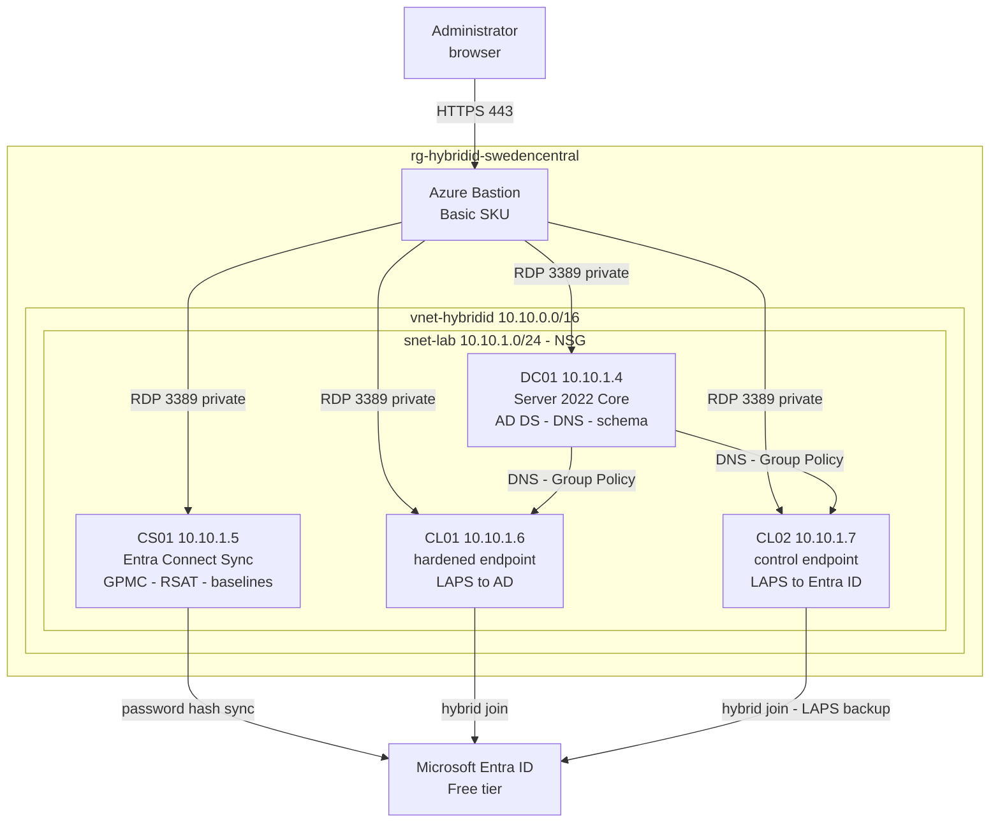

# Hybrid Identity and Windows Endpoint Hardening

An Active Directory forest in Azure, synchronised to Microsoft Entra ID, with
hybrid-joined endpoints managed and hardened through Group Policy, Microsoft
security baselines and Windows LAPS.

Two halves that meet at the end. The first connects an on-premises-style forest to
the cloud. The second manages the machines inside it. They join in the final phase,
where a Group Policy delivered on-premises stores its secret in Entra ID.

Reproducible by design. The Azure footprint is Terraform, the directory is
idempotent PowerShell, and the endpoint configuration is Group Policy backed up to
XML. Nothing is clicked together by hand except the tooling Microsoft ships only as
a wizard.

Companion documents: `PLAN.md` (phased roadmap and status) and `docs/` for the
per-phase walkthroughs, decisions log, risk register and troubleshooting log.

> **Everything here runs on Entra ID Free.** Connect Sync, hybrid Entra join and
> Windows LAPS are all free features. The lab stops deliberately before Conditional
> Access (P1) and PIM (P2), which are unobtainable for this tenant. Designing to the
> licences you actually have, and saying where the boundary is, is the point rather
> than an apology. See [decisions.md](docs/decisions.md).

---

## 1. Architecture

A single VNet with no internet-facing surface. Access is via Azure Bastion, and the
only inbound NSG rule permits RDP from inside the VNet.



No VM holds a public IP. Outbound internet comes from the subnet's default outbound
access rather than an attached address.

| VM | Image | Private IP | Role |
|---|---|---|---|
| DC01 | Server 2022 Core | 10.10.1.4 | Domain controller, DNS, schema master |
| CS01 | Server 2022 Desktop | 10.10.1.5 | Entra Connect Sync, GPMC, RSAT, Security Compliance Toolkit |
| CL01 | Server 2022 Desktop | 10.10.1.6 | Hybrid-joined endpoint. Security baseline applied, LAPS to AD |
| CL02 | Server 2022 Desktop | 10.10.1.7 | Hybrid-joined endpoint. Baseline control, LAPS to Entra ID |

All `Standard_B2ls_v2`, 2 vCPU and 4 GB, with static private IPs and daily
auto-shutdown. Clients are gated behind `enable_client`.

Two clients exist so Phase 5 can compare a hardened machine against an untouched
one, and Phase 6 can demonstrate both LAPS storage backends side by side.

---

## 2. Why these tools

| Layer | Tool | Reasoning |
|---|---|---|
| Azure infrastructure | Terraform `azurerm` | Declarative, diffable, destroys cleanly |
| Forest, OUs, users, groups | PowerShell | Terraform cannot promote a forest, and the `hashicorp/ad` provider is dormant. Idempotent committed scripts are the honest answer |
| Directory synchronisation | Entra Connect Sync | Cloud Sync cannot do device sync, so it cannot do hybrid join |
| Endpoint configuration | Group Policy, backed up to XML | The native mechanism. `Backup-GPO` puts the estate in the repo rather than only in SYSVOL |
| Security baselines | Microsoft Security Compliance Toolkit | Microsoft ships these as GPO backups, not as code. Imported, then measured with Policy Analyzer |

Deliberately not used:

| Item | Why not |
|---|---|
| Entra Cloud Sync | No device synchronization, therefore no hybrid join. Microsoft recommends it for everything else |
| Microsoft Intune | Licence-gated. Group Policy delivers the LAPS policy on hybrid-joined devices without it |
| `hashicorp/ad` provider | v0.5.0, March 2024, dormant, and needs WinRM the Bastion-only design removes |
| VM public IPs | Removed once Bastion was in place. A domain controller with an internet-facing RDP port is the wrong thing to publish |

---

## 3. Repository layout

| Path | Contents |
|---|---|
| `terraform/azure/` | Infrastructure root: network, VMs, Bastion |
| `scripts/ad-bootstrap/` | Idempotent PowerShell for the directory layer |
| `docs/decisions.md` | Choices made, alternatives rejected, what was given up |
| `docs/risk-and-limitations.md` | What this does not do safely, and why |
| `docs/99-troubleshooting.md` | Every failure hit during the build, with error strings |
| `docs/images/phaseN/` | Evidence per phase |
| `PLAN.md` | Phased roadmap and current status |

Phase walkthroughs, with status:

| Doc | Phase | Status |
|---|---|---|
| [00-infrastructure.md](docs/00-infrastructure.md) | Azure footprint: network, VMs, Bastion | **Completed** |
| [01-ad-environment.md](docs/01-ad-environment.md) | Forest, DNS, domain join, directory | **Completed** |
| [02-entra-connect.md](docs/02-entra-connect.md) | Entra Connect Sync, scoped to one OU | **Completed** |
| [03-hybrid-join.md](docs/03-hybrid-join.md) | Hybrid Entra join on both clients | Ready to start |
| [04-group-policy.md](docs/04-group-policy.md) | Central Store, linked GPOs, backed up to XML | Pending |
| [05-security-baselines.md](docs/05-security-baselines.md) | Microsoft baselines, hardened against control | Pending |
| [06-windows-laps.md](docs/06-windows-laps.md) | LAPS to Active Directory and to Entra ID | Pending |
| [07-tiered-administration.md](docs/07-tiered-administration.md) | Tier 0/1/2 with enforced logon boundaries | Stretch |

Pending docs are written from documented behaviour and marked as such at the top.
They get rewritten as records, with screenshots, as each phase is actually run.
That is how Phase 1 was written, and the failures it contains are the reason the
format is worth keeping.

---

## 4. Status

Phases 0 and 1 are complete and deployed: the Azure footprint is up, the forest
runs, a member server is domain-joined, and five seed users exist in a scoped OU
structure with routable UPNs.

Phase 2, Entra Connect Sync, is ready to start and needs no licence. Phases 3 to 7
are documented ahead of execution and marked pending. See [PLAN.md](PLAN.md).

One change is staged in Terraform and not yet applied: `CL02` is added alongside
`CL01`, both still gated behind `enable_client`. It takes effect on the next
`terraform apply`.

---

## 5. Running it

Requires Terraform and the Azure CLI. Run from WSL.

```bash
cd terraform/azure
az login
```

Set `subscription_id` in `terraform.tfvars`. The admin password is deliberately not
in any file:

```bash
read -rsp 'VM admin password: ' TF_VAR_admin_password && export TF_VAR_admin_password && echo
```

```bash
terraform init && terraform apply
```

Connect with `terraform output bastion_connect_urls`. Tear down with
`terraform destroy`.

**Start DC01 first, every session.** Once the VNet points at 10.10.1.4 for DNS,
starting another VM while DC01 is deallocated leaves it with no name resolution at
all, including for the internet.

**Bastion bills hourly.** Set `enable_bastion = false` and apply when you finish a
session. **State holds the admin password in plaintext**, so `terraform.tfstate` and
`terraform.tfvars` are gitignored and must stay that way.
