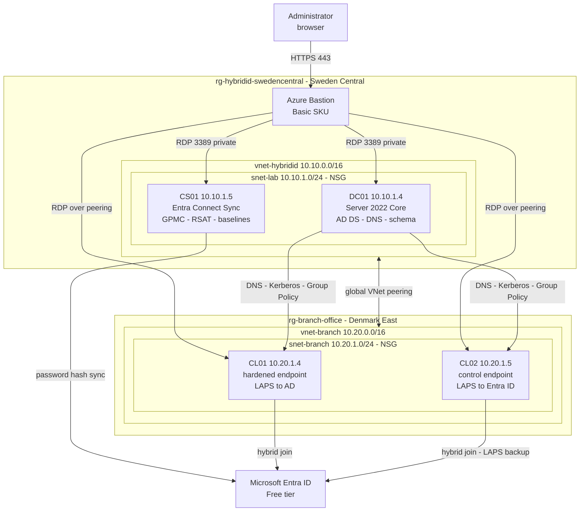

# Hybrid Identity, Two-Site Networking and Endpoint Hardening

An Active Directory forest in Azure, synchronised to Microsoft Entra ID, serving a
branch office in a second region over virtual network peering, with hybrid-joined
endpoints managed and hardened through Group Policy, Microsoft security baselines
and Windows LAPS.

**See (/docs) for documented setup, troubleshooting, decisions etc.**

Two halves that meet at the end. The first connects an on-premises-style forest to
the cloud. The second manages the machines inside it. They join in the final phase,
where a Group Policy delivered on-premises stores its secret in Entra ID.

**The second site was not in the original design.** The clients would not fit inside
the first region's vCPU quota and a free trial cannot raise it. Splitting them into
a peered branch office turned a dead end into the layer the lab was missing: two
sites, cross-region DNS and Kerberos, and a reason for AD Sites and Services to
exist. Constraints producing better architecture than the plan did is worth
recording rather than tidying away.

Reproducible by design. The Azure footprint is Terraform, the directory is
idempotent PowerShell, and the endpoint configuration is Group Policy backed up to
XML. Nothing is clicked together by hand except the tooling Microsoft ships only as
a wizard.

Companion documents: `PLAN.md` (phased roadmap and status) and `docs/` for the
per-phase walkthroughs, decisions log, risk register and troubleshooting log.

> **Everything here runs on Entra ID Free.** Connect Sync, hybrid Entra join and
> Windows LAPS are all free features. The lab stops deliberately before Conditional
> Access (P1) and PIM (P2), which are unobtainable for this tenant. Designing to the
> licences you actually have, and saying where the boundary is, is the point rather
> than an apology. See [decisions.md](docs/decisions.md).

---

## 1. Architecture

Two sites in two regions, joined by global virtual network peering. Neither has an
internet-facing surface. Access is via Azure Bastion, and the only inbound NSG rule
in each site permits RDP from inside the virtual network.



No VM holds a public IP. Outbound internet comes from each subnet's default
outbound access rather than an attached address.

| VM | Site | Image | Private IP | Role |
|---|---|---|---|---|
| DC01 | HQ | Server 2022 Core | 10.10.1.4 | Domain controller, DNS, schema master |
| CS01 | HQ | Server 2022 Desktop | 10.10.1.5 | Entra Connect Sync, GPMC, RSAT, Security Compliance Toolkit |
| CL01 | Branch | Server 2022 Desktop | 10.20.1.4 | Hybrid-joined endpoint. Security baseline applied, LAPS to AD |
| CL02 | Branch | Server 2022 Desktop | 10.20.1.5 | Hybrid-joined endpoint. Baseline control, LAPS to Entra ID |

All `Standard_B2ls_v2`, 2 vCPU and 4 GB, with static private IPs. Keeping the branch
machines on the same size as HQ is what constrained the region choice: the free
trial offers that size in only three regions, and the first one was full.

Two clients exist so Phase 5 can compare a hardened machine against an untouched
one, and Phase 6 can demonstrate both LAPS storage backends side by side.

**One Bastion serves both sites.** The Basic SKU reaches VMs in peered networks, so
the host in Sweden Central connects to the branch clients without a second
deployment. Only the Developer SKU lacks that, which is the difference between one
hourly charge and two.

**Auto-shutdown covers HQ only.** It is a `Microsoft.DevTestLab` resource and that
provider is not published in the branch region, so the clients have to be
deallocated by hand. See [decisions.md](docs/decisions.md).

---

## 2. Why these tools

| Layer | Tool | Reasoning |
|---|---|---|
| Azure infrastructure | Terraform `azurerm` | Declarative, diffable, destroys cleanly |
| Forest, OUs, users, groups | PowerShell | Terraform cannot promote a forest, and the `hashicorp/ad` provider is dormant. Idempotent committed scripts are the honest answer |
| Directory synchronisation | Entra Connect Sync | Cloud Sync cannot do device sync, so it cannot do hybrid join |
| Endpoint configuration | Group Policy | The native mechanism, and the only one available without Intune |
| Security baselines | Microsoft Security Compliance Toolkit | Microsoft ships these as GPO backups, not as code. Imported, then measured with Policy Analyzer |

Deliberately not used:

| Item | Why not |
|---|---|
| Entra Cloud Sync | No device synchronization, therefore no hybrid join. Microsoft recommends it for everything else |
| Microsoft Intune | Licence-gated. Group Policy delivers the LAPS policy on hybrid-joined devices without it |
| `hashicorp/ad` provider | v0.5.0, March 2024, dormant, and needs WinRM the Bastion-only design removes |
| VM public IPs | Removed once Bastion was in place. A domain controller with an internet-facing RDP port is the wrong thing to publish |

---

## 3. Repository layout

| Path | Contents |
|---|---|
| `.github/workflows/` | CI: `terraform fmt` and `validate` on every push, no credentials needed |
| `terraform/azure/` | HQ root: network, DC01, CS01, Bastion |
| `terraform/azure-denmarkeast/branch/` | Branch root: its own resource group, network, both peering objects, the clients |
| `terraform/modules/windows-vm/` | One VM plus the NIC, disk and shutdown schedule that travel with it |
| `scripts/ad-bootstrap/` | Idempotent PowerShell for the directory layer |
| `cmd-sheets/` | Every command the lab uses, grouped by tool and task |
| `docs/troubleshooting/` | Failures hit during the build, one file per phase, with verbatim error strings |
| `docs/decisions.md` | Choices made, alternatives rejected, what was given up |
| `docs/risk-and-limitations.md` | What this does not do safely, and why |
| `docs/images/phaseN/` | Evidence per phase |
| `PLAN.md` | Phased roadmap and current status |

Three ways to read the same build. The phase documents are narratives of the path
that worked. [`cmd-sheets/`](cmd-sheets/README.md) is the copy-pasteable version,
grouped by tool rather than by chronology. And
[`docs/troubleshooting/`](docs/troubleshooting/README.md) is everything that went
wrong, with the error strings verbatim so they are searchable. Keeping them apart
means each can be read for its own purpose rather than one document trying to be
all three.

Phase walkthroughs, with status:

| Doc | Phase | Status |
|---|---|---|
| [00-infrastructure.md](docs/00-infrastructure.md) | Azure footprint: network, VMs, Bastion | **Completed** |
| [01-ad-environment.md](docs/01-ad-environment.md) | Forest, DNS, domain join, directory | **Completed** |
| [02-entra-connect.md](docs/02-entra-connect.md) | Entra Connect Sync, scoped to one OU | **Completed** |
| [03-branch-network.md](docs/03-branch-network.md) | Second region, peered branch office | **Completed** |
| [04-hybrid-join.md](docs/04-hybrid-join.md) | AD sites, domain join, hybrid Entra join | **Completed** |
| [05-group-policy.md](docs/05-group-policy.md) | Central Store, linked GPOs, verified on the clients | Completed |
| [06-security-baselines.md](docs/06-security-baselines.md) | Microsoft baselines, hardened against control | Pending |
| [07-windows-laps.md](docs/07-windows-laps.md) | LAPS to Active Directory and to Entra ID | Pending |
| [08-tiered-administration.md](docs/08-tiered-administration.md) | Tier 0/1/2 with enforced logon boundaries | Stretch |

Pending docs are written from documented behaviour and marked as such at the top.
They get rewritten as records, with screenshots, as each phase is actually run.
That is how Phase 1 was written, and the failures it contains are the reason the
format is worth keeping.

---

## 4. Status

**Phases 0 to 4 are complete and deployed.** The Azure footprint is up across two
regions, the forest runs, five seed users synchronise into Entra ID with the
`NoSync` OU correctly absent, and both branch clients are Microsoft Entra hybrid
joined: an identity in Active Directory and a registration in the cloud at the same
time.

The directory knows it spans two sites. `nltest` from a branch client reports
`Our Site Name: Branch-DenmarkEast` against `Dc Site Name: HQ-SwedenCentral`, and
the domain controller answers across the peering at roughly 16 ms.

**Phase 5 is complete.** The Central Store serves the whole domain, three GPOs are
linked against the OU structure, and one is filtered to a single client to rehearse
what Phase 7 needs. Policy is measured rather than asserted: a ping across the
peering that failed before the refresh answers at 16 ms after, while the same ping in
the opposite direction still fails, because the management server sits outside the OU
and receives nothing. The loopback demonstration is deliberately deferred, with the
reason recorded rather than glossed.

Phases 6 to 8 are documented ahead of execution and marked pending. See
[PLAN.md](PLAN.md).

---

## 5. Running it

Requires Terraform and the Azure CLI. Run from WSL.

```bash
cd terraform/azure
az login
```

Set `subscription_id` in `terraform.tfvars`. The admin password is deliberately not
in any file:

```bash
read -rsp 'VM admin password: ' TF_VAR_admin_password && export TF_VAR_admin_password && echo
```

```bash
terraform init && terraform apply
```

Then the branch, which has its own state and its own `terraform.tfvars`. Copy it
from the example and set the same subscription and password:

```bash
cd ../branch && cp terraform.tfvars.example terraform.tfvars && terraform init && terraform apply
```

Apply HQ first. The branch reads the HQ network through a data source and creates
both peering objects, so it needs that network to exist.

Connect with `terraform output bastion_connect_urls` from either root. Tear down
with `terraform destroy`, branch first.

**Start DC01 first, every session.** Both networks point at 10.10.1.4 for DNS, so
starting any other VM while DC01 is deallocated leaves it with no name resolution at
all, including for the internet.

**Deallocate the branch clients when you finish.** They have no auto-shutdown
schedule, because the region does not publish `Microsoft.DevTestLab`. Stopping from
inside Windows still bills:

```bash
az vm deallocate --ids $(az vm list -g rg-branch-office --query "[].id" -o tsv)
```

**Bastion bills hourly.** Set `enable_bastion = false` and apply when you finish a
session. **Both state files hold the admin password in plaintext**, so
`terraform.tfstate` and `terraform.tfvars` are gitignored in every root and must stay
that way.
