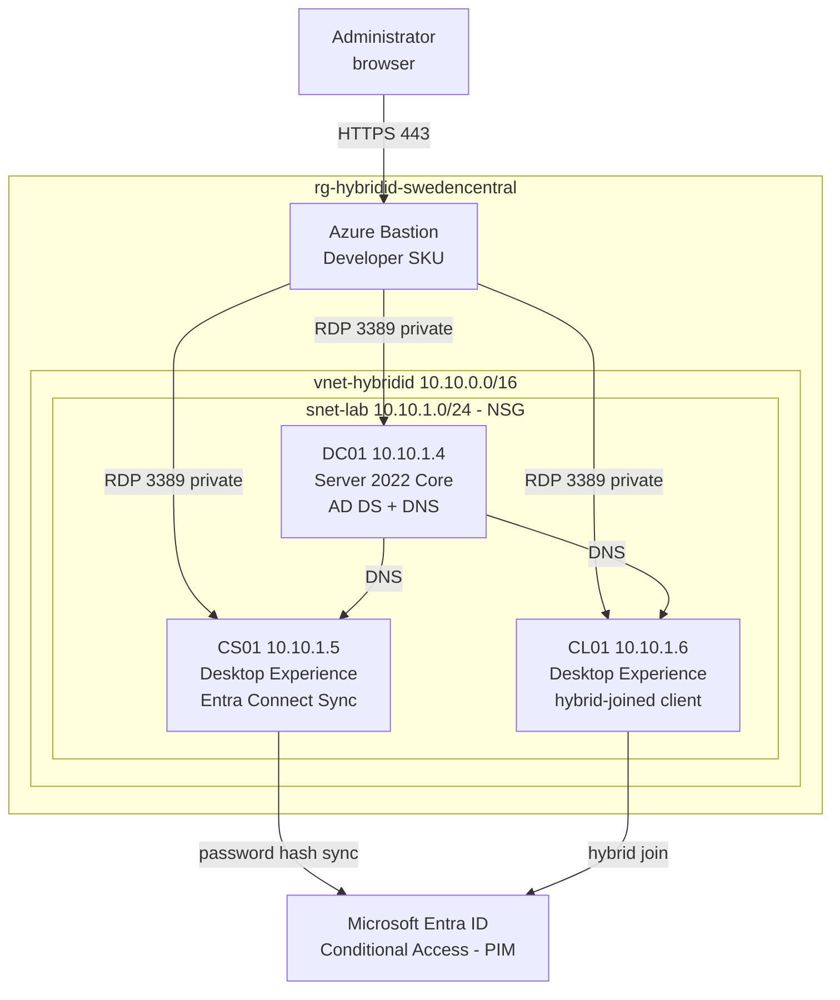

# Hybrid Identity Lab: Active Directory to Microsoft Entra ID

An on-premises-style Active Directory forest in Azure, synchronised to Microsoft
Entra ID, used to exercise hybrid Entra join and Conditional Access.

Reproducible by design. The Azure footprint is Terraform, the directory is
idempotent PowerShell, and the Entra layer is Terraform again. Nothing is clicked
together by hand except the two things Microsoft does not expose as code.

Companion documents: `PLAN.md` (phased roadmap and status) and `docs/` for the
per-phase walkthroughs, decisions log, risk register and troubleshooting log.

---

## 1. Architecture

Two planes. The **infrastructure plane** is a single VNet with no internet-facing
surface: access is via Azure Bastion, and the only inbound NSG rule permits RDP
from inside the VNet. The **identity plane** is the forest on DC01, synchronised
outward to Entra ID by Connect Sync on CS01, with CL01 as the device that proves
hybrid join and gets tested against Conditional Access.



No VM holds a public IP. Outbound internet, which Entra Connect needs to reach
Entra ID, comes from the subnet's default outbound access rather than an attached
address.

| VM | Size | vCPU / RAM | Image | Private IP | Role |
|---|---|---|---|---|---|
| DC01 | `Standard_B2ls_v2` | 2 / 4 GB | Server 2022 Core | 10.10.1.4 | Domain controller, DNS |
| CS01 | `Standard_B2ls_v2` | 2 / 4 GB | Server 2022 Desktop | 10.10.1.5 | Entra Connect Sync |
| CL01 | `Standard_B2ls_v2` | 2 / 4 GB | Server 2022 Desktop | 10.10.1.6 | Hybrid-joined test client |

All private IPs are static, deliberately. See the dynamic allocation race in
`docs/99-troubleshooting.md` for what happens otherwise. CL01 is gated behind
`enable_client` and off by default, so the idle lab is two VMs rather than three.

---

## 2. Why these tools

No single tool covers all three layers well, so the stack is split by layer.

| Layer | Tool | Reasoning |
|---|---|---|
| Azure infrastructure | Terraform `azurerm` | Declarative, diffable, destroys cleanly |
| On-prem AD: forest, OUs, users, groups | PowerShell | Terraform cannot promote a forest at all. The `hashicorp/ad` provider is v0.5.0, last published March 2024, and needs WinRM to a DC that has no public IP. Idempotent committed scripts are the honest answer |
| Entra ID objects and Conditional Access | Terraform `azuread` | Where Terraform earns its place in IAM. `azuread_conditional_access_policy` supports report-only state, so policies ship without risking lockout |
| Entra Connect Sync install | Wizard, documented | Not meaningfully codeable. The decisions get recorded instead of the clicks |

Choosing Terraform for the directory layer purely to claim "all IaC" would mean
fighting a dormant provider to do something it was never designed for. The split
is the defensible call, not a shortcut.

Deliberately not used:

| Item | Why not |
|---|---|
| `hashicorp/ad` provider | v0.5.0, March 2024, effectively dormant. Requires WinRM reachability that the Bastion-only design removes |
| Bastion Basic SKU | $0.19/hour, about $139/month billed 24/7 with no auto-shutdown. Roughly ten times the VM bill for concurrent sessions this lab does not need |
| Public IPs on VMs | Removed once Bastion was in place. A domain controller with an internet-facing RDP port is the wrong lesson to publish |
| Remote state backend | Solo prototype, single operator. Recorded as a known gap rather than pretended away |

---

## 3. Repository layout

| Path | Contents |
|---|---|
| `terraform/azure/` | Infrastructure root: network, VMs, Bastion |
| `terraform/entra/` | Entra root: Conditional Access, groups, break-glass. Phase 4 |
| `scripts/ad-bootstrap/` | Idempotent PowerShell for the directory layer |
| `docs/00-infrastructure.md` | Phase 0 walkthrough and deployment steps |
| `docs/01-ad-environment.md` | Phase 1 walkthrough: forest, DNS, domain join, directory |
| `docs/decisions.md` | Choices made, alternatives rejected, what was given up |
| `docs/risk-and-limitations.md` | What this does not do safely, and why |
| `docs/99-troubleshooting.md` | Every failure hit during the build, with error strings |
| `docs/images/phaseN/` | Evidence per phase |
| `PLAN.md` | Phased roadmap and current status |

The two Terraform roots have separate state deliberately. A bad Conditional
Access apply can lock every administrator out of the tenant, and that plan must
never be able to rebuild a domain controller as well. Full reasoning in
`docs/decisions.md`.

---

## 4. Status

Phase 0, the Azure infrastructure, is complete and deployed. Phase 1, the AD
environment, is in progress. Phases 2 onward are blocked on an Entra ID P2 trial:
the tenant currently has zero subscribed SKUs, and Conditional Access requires P1
while PIM and access reviews require P2.

See `PLAN.md` for the full sequence and exit criteria.

---

## 5. Running it

Requires Terraform, the Azure CLI, and an Azure subscription. Ran from WSL.

```bash
cd terraform/azure
az login
```

Set `subscription_id` in `terraform.tfvars`. The admin password is deliberately
not in any file:

```bash
read -rsp 'VM admin password: ' TF_VAR_admin_password && export TF_VAR_admin_password && echo
```

```bash
terraform init && terraform apply
```

Connect with `terraform output bastion_connect_urls`, which returns a portal deep
link per VM. Tear down with `terraform destroy`.

**State holds the admin password in plaintext.** `terraform.tfstate` and
`terraform.tfvars` are gitignored and will stay that way.
