# Phase 1. Active Directory environment

**Goal:** promote DC01 to a new forest, point the virtual network at it, join CS01
to the domain, and build a directory structure realistic enough that scoped
synchronisation is a meaningful thing to demonstrate in Phase 2.

> The three scripts live in `scripts/ad-bootstrap/`. See
> [Install a new Active Directory forest](https://learn.microsoft.com/windows-server/identity/ad-ds/deploy/install-a-new-windows-server-2012-active-directory-forest--level-200-)
> and [Microsoft Entra Connect prerequisites](https://learn.microsoft.com/entra/identity/hybrid/connect/how-to-connect-install-prerequisites).

**Why this matters.** Everything after this depends on it. Entra Connect has
nothing to synchronise without a directory, hybrid join has no domain to join, and
Conditional Access has no on-premises identities to make decisions about. The
directory structure also decides what Phase 2 can show: an unfiltered sync of five
users proves very little, whereas a scoped sync that deliberately excludes service
accounts demonstrates a real design choice.

**Trade-off from best practice.** Two things here are weaker than production.
`sindredg.local` is not routable and cannot be verified in Entra, so the forest
domain and the UPN suffix differ and the users need retargeting before sync; see
[decisions](decisions.md). And a single local administrator credential is reused
across all three VMs and becomes Domain Admin after promotion, which is the flat
credential pattern hybrid identity work exists to argue against; see
[risk and limitations](risk-and-limitations.md).

**This phase did not go cleanly.** Three of the sections below are failures and
their fixes, kept in the order they happened rather than tidied away. Two of them
were bugs in our own scripts.

---

## What gets created

| Object | Name | Purpose |
|---|---|---|
| Forest | `sindredg.local` (NetBIOS `SINDREDG`) | The domain, with DNS on DC01 |
| OU | `OU=Sync` | Everything Entra Connect will be scoped to |
| OU | `OU=Users,OU=Sync` | Synced user accounts |
| OU | `OU=Groups,OU=Sync` | Synced security groups |
| OU | `OU=Workstations,OU=Sync` | Domain-joined devices, used in Phase 3 |
| OU | `OU=NoSync` | Deliberately outside the sync scope |
| OU | `OU=ServiceAccounts,OU=NoSync` | Proves filtering works by being absent from Entra |

| Group | Intended use |
|---|---|
| `sg-finance` | Conditional Access target in Phase 4 |
| `sg-it-admins` | Will require a hybrid joined device |
| `sg-helpdesk` | Access review target in Phase 5 |
| `sg-contractors` | Stricter policy target |

| User | Department | Title | Group |
|---|---|---|---|
| `alindqvist` | Finance | Financial Controller | `sg-finance` |
| `bkarlsson` | Finance | Analyst | `sg-finance` |
| `cdubois` | IT | Systems Engineer | `sg-it-admins` |
| `dvolkov` | IT | Service Desk Analyst | `sg-helpdesk` |
| `erossi` | External | Contractor | `sg-contractors` |

Departments and titles are populated deliberately. Entra Connect synchronises
them, and Phase 4 can then target Conditional Access on an attribute rather than a
hand-maintained group.

---

## 1. Promoting DC01

**1.** We connect to DC01 over Bastion. There are no public IPs, so this is a
browser session. DC01 runs Server Core, so we land on a command prompt rather than
a desktop, which is the image working as intended.

Bastion has no file transfer below the Standard SKU, but the web client supports
copy and paste, so we paste the script in and run it. It checks the primary IPv4
address matches the `10.10.1.4` pinned in Terraform, then installs the AD DS role.

```powershell
.\promote.ps1
```

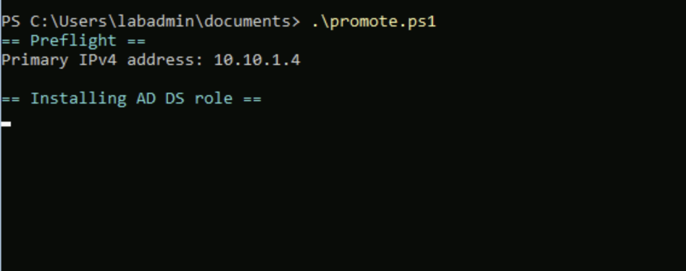

**2.** The promotion fails. `Install-ADDSForest` prompts for a Directory Services
Restore Mode password and rejects the one we give it:

> The Directory Services Restore Mode password does not meet the password
> complexity requirements of the password policy.

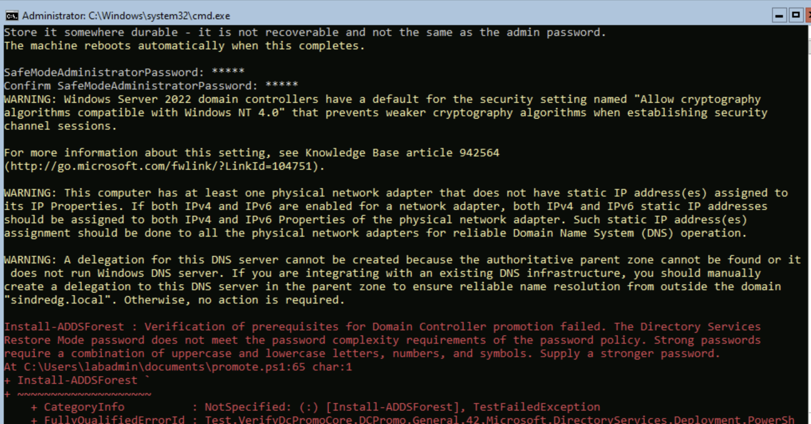

We had entered five characters. DSRM is a separate credential from the
administrator password, used only for offline directory recovery, and it has to
satisfy the same policy: 12 or more characters mixing uppercase, lowercase, digits
and symbols. It is also not recoverable, so it goes in the password manager.

The useful detail is that this fails at the **prerequisite check**, so nothing was
changed and the retry costs nothing.

Three warnings appear above the error, and all three are benign:

| Warning | Why it is safe to ignore |
|---|---|
| NT 4.0 cryptography | Informational. Server 2022 refuses weak algorithms by default, which is what we want |
| DNS delegation cannot be created | Expected for a `.local` root. There is no authoritative parent zone to delegate from, and the message itself says no action is required |
| No static IP assigned to the adapter | **Must** be ignored on an Azure VM. The address is static in the Azure fabric; the guest has to stay on DHCP to receive it. Hard-coding it inside Windows is a well-known way to lose connectivity entirely |

**3.** We re-run the script with a stronger password, and it refuses to do
anything at all:

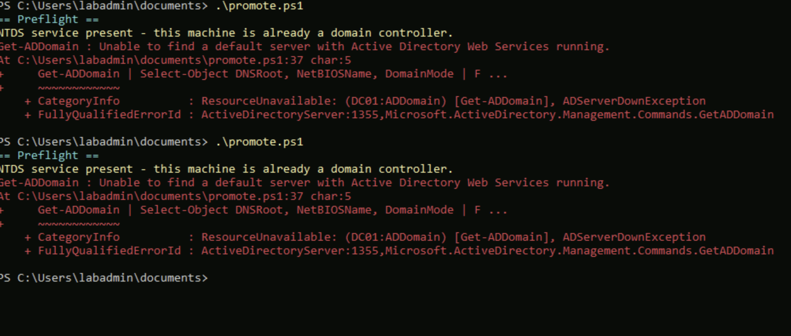

> NTDS service present - this machine is already a domain controller.

It was not. The preflight tested whether the **NTDS service exists**, and
installing the AD DS role in step 1 had registered that service in a Stopped and
Disabled state long before any promotion. So the guard fired on a plain standalone
server and exited before attempting the work it exists to protect.

`Get-CimInstance Win32_ComputerSystem` settled it: `DomainRole: 2`, a standalone
server, with NTDS and ADWS both Stopped and Disabled.

The script now tests `DomainRole` and treats only 4 or 5 as a domain controller.
The general lesson is worth more than the fix: **the presence of a service is not
evidence the feature is configured**, and a guard that fails closed is
indistinguishable from success.

**4.** With the role already installed, we run the promotion directly.

```powershell
Install-ADDSForest -DomainName sindredg.local -DomainNetbiosName SINDREDG -InstallDns -DomainMode WinThreshold -ForestMode WinThreshold -Force
```

`-InstallDns` matters more than it looks. A domain controller has to answer the SRV
record lookups clients use to find it. A machine that only knows the name
`sindredg.local` has no way to discover DC01's address unless something
authoritative for that zone answers. That is why section 3 points the whole virtual
network at 10.10.1.4, and why the DC has to be its own DNS server first.

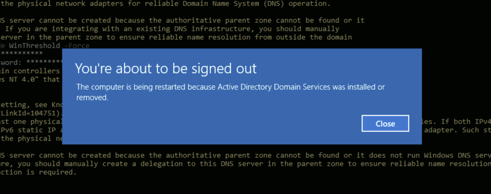

The machine reboots itself and the Bastion session drops with it.

---

## 2. Logon hangs at the Group Policy Client

**1.** After the reboot, logon never completes:

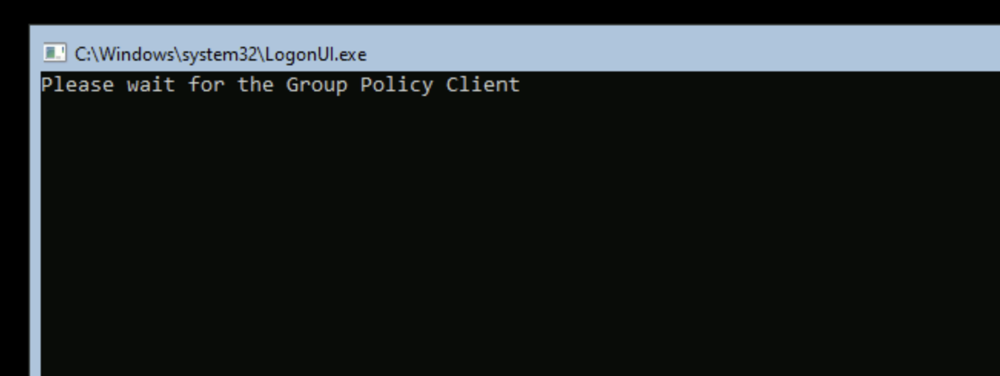

**2.** Azure Run Command reaches the guest through the VM agent rather than the
network, so we can inspect a machine we cannot log into. The promotion had in fact
**succeeded**: `sindredg.local`, `DomainRole: 5`, with NTDS, DNS, ADWS, Netlogon
and gpsvc all Running.

But `net share` returned only `C$`, `IPC$` and `ADMIN$`. **SYSVOL and NETLOGON were
missing**, and a healthy domain controller shares both. The Group Policy Client was
waiting for policy that had no share to come from.

**3.** The cause was in the DFS Replication log, 40 seconds after boot:

> The DFS Replication service failed to contact domain controller to access
> configuration information. Replication is stopped. The service will try again
> during the next configuration polling cycle, which will occur in 60 minutes.
> Error: 160

Note the blank domain controller name. DFSR could not determine which DC to ask,
because it started before AD DS had finished coming up on that first
post-promotion boot. It set `SysvolReady = 0`, Netlogon consequently refused to
create the shares, and DFSR would not retry for an hour.

**4.** Restarting the two services in order fixed it. DFSR first so it can read its
configuration with AD now up, then Netlogon so it re-evaluates the flag and
publishes the shares:

```powershell
Restart-Service DFSR -Force
Restart-Service Netlogon -Force
```

`SysvolReady` flipped to 1 and both shares appeared.

**5.** Because auto-shutdown stops the VMs nightly, every morning is another cold
boot and the same race. We made DFSR start after AD DS rather than alongside it:

```powershell
sc.exe config DFSR start= delayed-auto
```

**6.** The forest, confirmed from the DC:

```powershell
Get-ADDomain | Select-Object DNSRoot, NetBIOSName, DomainMode
```

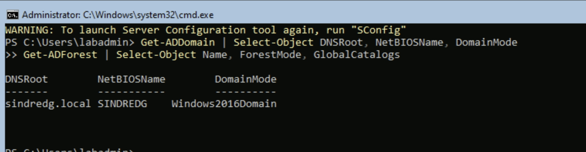

---

## 3. Pointing the virtual network at the DC

This is the step that silently breaks the lab if skipped. Azure-provided DNS at
168.63.129.16 knows nothing about `sindredg.local`, so a join attempted before this
fails with a "domain not found" message that reads like a credentials problem and
sends you looking in the wrong place.

**1.** From the workstation rather than the VM, we set the VNet DNS servers to the
domain controller in `terraform/azure/terraform.tfvars`:

```hcl
dns_servers = ["10.10.1.4"]
```

```bash
terraform apply
```

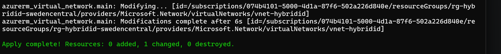

One resource changed, nothing added or destroyed.

**2.** We restart CS01. This is required rather than advisable: a VNet DNS change
is only picked up when the NIC re-reads DHCP, and in practice that means a reboot.
Applying the Terraform change alone leaves CS01 still pointed at Azure DNS.

```bash
az vm restart -g rg-hybridid-swedencentral -n CS01
```

**3.** We verify from inside CS01:

```powershell
ipconfig /all
```

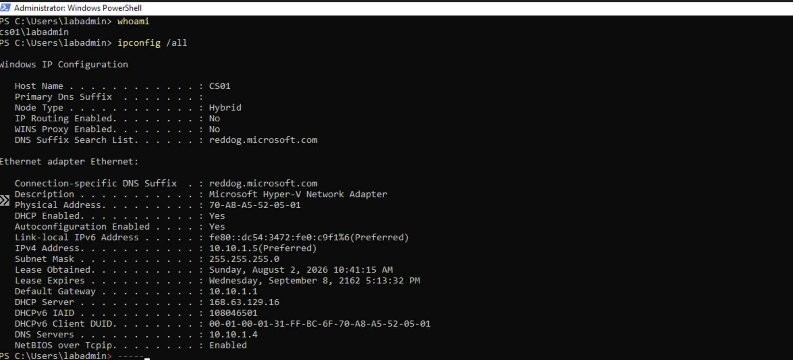

`DNS Servers: 10.10.1.4` rather than `168.63.129.16` is the confirmation. The blank
Primary DNS Suffix shows it is not joined yet.

**4.** DNS resolving is not the same as the domain being usable, so we check that
CS01 can locate a domain controller through the SRV records, which is the same
lookup the join itself will use:

```powershell
Resolve-DnsName sindredg.local
nltest /dsgetdc:sindredg.local
```

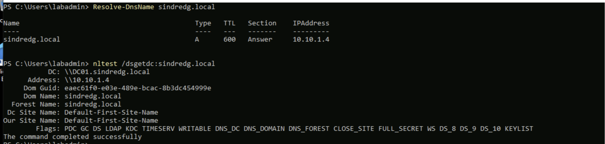

`DC01.sindredg.local` at `10.10.1.4`, advertising `PDC GC DS LDAP KDC TIMESERV
WRITABLE`. Ready to join.

> **Start DC01 first, every session.** The auto-shutdown schedule stops all three
> VMs nightly. Now that the VNet points at 10.10.1.4 for DNS, starting CS01 while
> DC01 is deallocated leaves it with no name resolution at all, including for the
> internet. It presents as a comprehensively broken machine rather than a missing
> domain controller.

---

## 4. Joining CS01 to the domain

**1.** The credential has a non-obvious answer. Promotion migrated the local
`labadmin` account into the directory and made it the **sole member of Domain
Admins**, so that is what we authenticate with.

```powershell
Add-Computer -DomainName sindredg.local -Credential (Get-Credential SINDREDG\labadmin) -Restart
```

**2.** After the reboot:

```powershell
Get-ComputerInfo -Property CsDomain, CsDomainRole
```

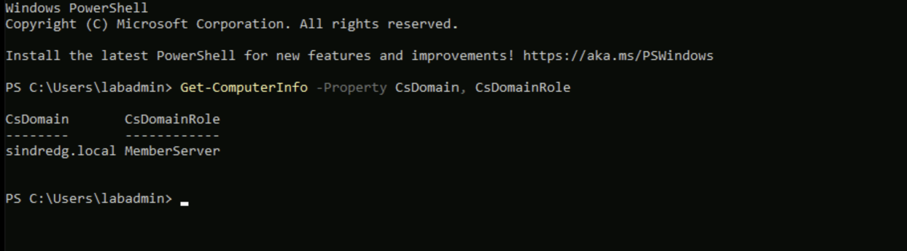

`sindredg.local` and `MemberServer`. CS01 now has RSAT available, which is the
comfortable way to administer a Server Core domain controller from here on.

---

## 5. Building the directory

**1.** We run the structure script on DC01. The initial password is prompted for
rather than passed on the command line, so it does not land in shell history.

```powershell
.\02-ad-structure.ps1 -DomainName sindredg.local -InitialPassword (Read-Host -AsSecureString 'Initial user password')
```

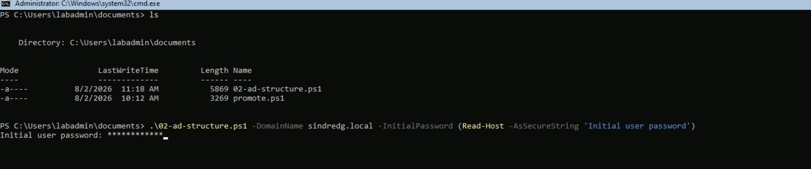

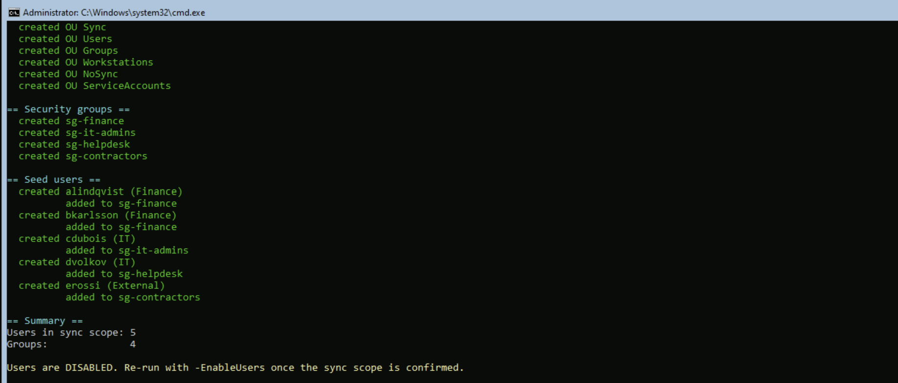

Six OUs, four groups, five users, each added to its group. Users are created
**disabled** on purpose, so the sync scope can be reviewed before any account is
usable.

**2.** We re-run it with `-EnableUsers`, as the script's own closing message
instructs.

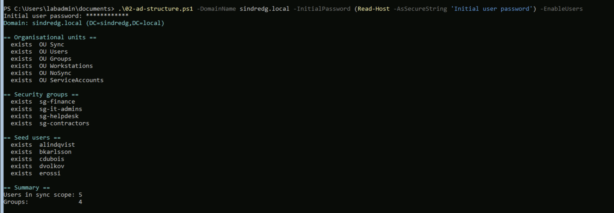

Every object reports `exists` and nothing is created. That is the idempotency
working, and it is the closest thing the PowerShell layer has to `terraform plan`.

**3.** Except it was not working. Checking the result:

```powershell
Get-ADUser -Filter * -SearchBase 'OU=Users,OU=Sync,DC=sindredg,DC=local' -Properties Department, Title |
    Format-Table SamAccountName, Name, Department, Title, Enabled
```

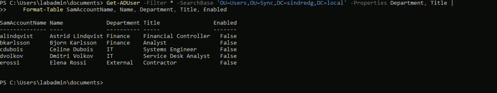

All five still `Enabled: False`, after a run that explicitly passed `-EnableUsers`.

The bug was that `-Enabled` existed only as an argument to `New-ADUser`. On a
re-run every user hits the `exists` branch, the create call never happens, and the
switch is ignored. The script was printing advice it could not honour.

Group membership was already handled correctly, as a separate check that repairs
drift on every run. Enabled state had simply not been given the same treatment. It
now is:

```powershell
if ($EnableUsers) {
    $acct = Get-ADUser -Identity $sam -Properties Enabled
    if (-not $acct.Enabled) {
        Enable-ADAccount -Identity $sam
    }
}
```

**An idempotency guard has to cover every attribute the script claims to manage,
not just whether the object exists.** The live directory was corrected directly:

```powershell
Get-ADUser -Filter * -SearchBase 'OU=Users,OU=Sync,DC=sindredg,DC=local' | Enable-ADAccount
```

---

## 6. Preparing the directory for sync

The forest is `sindredg.local`. The tenant's only verified domain is
`sindredemitriohotmail.onmicrosoft.com`. Because `.local` cannot be verified in
Entra, users created with a `@sindredg.local` UPN would sync under the tenant
default anyway. We fix that on-premises first, which is exactly the remediation a
real `.local` migration performs.

**1.** The pre-flight runs in report-only mode first. Nothing changes without
`-Apply`.

```powershell
.\03-prep-sync.ps1 -UpnSuffix sindredemitriohotmail.onmicrosoft.com -DomainName sindredg.local
```

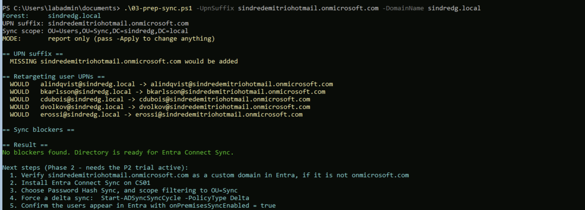

`MISSING` for the suffix and `WOULD` for each user, with no blockers listed. The
bad-suffix check is deliberately suppressed in report mode: before `-Apply` every
user is legitimately still on `@sindredg.local`, so flagging them would be noise.

**2.** Then applied, which adds the onmicrosoft domain as an alternative UPN suffix
on the forest and retargets each seed user.

```powershell
.\03-prep-sync.ps1 -UpnSuffix sindredemitriohotmail.onmicrosoft.com -DomainName sindredg.local -Apply
```

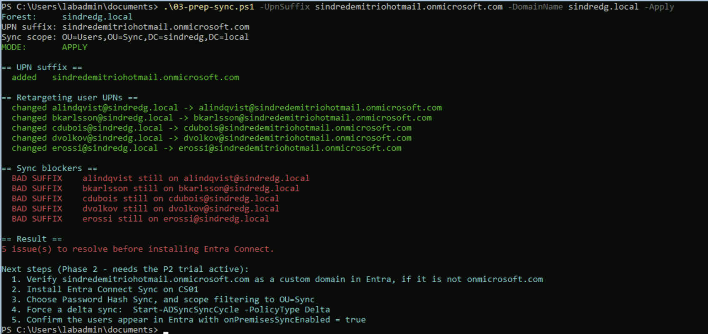

**3.** The output contradicts itself. It reports all five UPNs successfully
changed to `@sindredemitriohotmail.onmicrosoft.com`, then immediately flags all
five:

```
BAD SUFFIX    alindqvist still on alindqvist@sindredg.local
...
5 issue(s) to resolve before installing Entra Connect.
```

Checking the directory directly showed the retargeting had worked perfectly. All
five users were on the new suffix, and the forest carried the alternative suffix:

```powershell
Get-ADUser -Filter * -SearchBase 'OU=Users,OU=Sync,DC=sindredg,DC=local' |
  Select-Object SamAccountName, UserPrincipalName
```

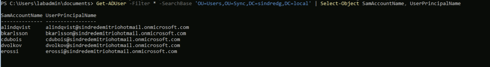

The bug was ours again, and the same shape as the `-EnableUsers` one. The user
collection was fetched with `Get-ADUser` **before** the retargeting loop ran. The
blocker check then filtered that same in-memory collection, whose
`UserPrincipalName` values were still the pre-change ones. The script was
reporting failures it had itself just fixed.

The fix is a re-query between changing and verifying:

```powershell
$users = Get-ADUser -Filter * -SearchBase $syncBase -Properties UserPrincipalName, Surname, GivenName, proxyAddresses
```

**A script that both changes and verifies has to re-read in between, or it is
checking its own assumptions rather than the system.** That is the second time
this phase the same mistake appeared in a different disguise.

**5.** Re-running the fixed script against an already-correct directory gives the
convergence result we want: the suffix reports `exists`, every user reports `ok`,
and the blockers section is empty.

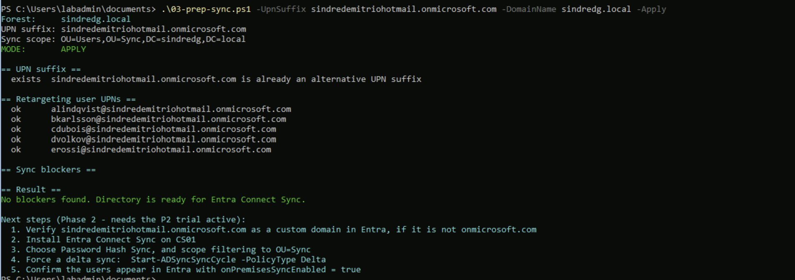

That is the real idempotency test, and the one all three scripts now pass. Not
"does a second run error" but "does a second run converge and say so honestly".

**4.** The pre-flight also checks the three things that most commonly cause a user
to fail synchronisation later, when the error surfaces hours after the cause:

| Check | Why it blocks sync |
|---|---|
| Missing `givenName` or `sn` | Some Entra Connect sync rules reject the object outright |
| Duplicate `proxyAddresses` | Entra treats the address as tenant-unique. The single most common cause of a user silently not appearing |
| UPN suffix not verified in Entra | The account falls back to the tenant default, which is confusing rather than broken |

---

## Exit criteria

| Criterion | Command | Status |
|---|---|---|
| Forest healthy | `dcdiag /q` returns nothing | Done |
| SYSVOL shared | `net share` lists SYSVOL and NETLOGON | Done |
| DNS answering | `Resolve-DnsName sindredg.local` from CS01 | Done |
| CS01 joined | `Get-ComputerInfo -Property CsDomainRole` reads `MemberServer` | Done |
| Users present and enabled | `Get-ADUser -Filter * -SearchBase 'OU=Users,OU=Sync,DC=sindredg,DC=local'` | Done |
| UPNs routable | Every seed user ends `@sindredemitriohotmail.onmicrosoft.com` | Done |
| No sync blockers | `03-prep-sync.ps1` reports zero issues | Done, after the re-query fix |

`dcdiag /q` printing nothing at all is success. It only reports failures.

---

## What this phase cost us

Four failures, three of them ours:

| Failure | Root cause | Ours? |
|---|---|---|
| DSRM password rejected | Five characters against the policy | No, user error |
| "Already a domain controller" on a standalone server | Preflight tested for service existence, not `DomainRole` | Yes |
| Logon hung at Group Policy Client | DFSR started before AD DS, left `SysvolReady = 0` | No, a Windows startup race |
| `-EnableUsers` silently did nothing | Enabled set only in the create branch | Yes |
| `BAD SUFFIX` reported for users just retargeted | Blocker check filtered a collection read before the change | Yes |

Two of our three share one root cause: **the script trusted state it had read
earlier instead of re-reading after acting.** Once as an idempotency guard that
never re-checked, once as a verification step that never refreshed. Worth naming,
because it is the kind of mistake that produces confident, wrong output rather
than an error.

Full write-ups with the verbatim error strings are in
[99-troubleshooting.md](99-troubleshooting.md).

---

## Next

Phase 2 installs Entra Connect Sync on CS01 and is blocked on licensing: the
tenant currently holds zero subscribed SKUs, and the P2 trial should be started
before that phase rather than during it.
