# Phase 2. Entra Connect Sync

**Goal:** synchronise the five seeded users from `sindredg.local` into Microsoft
Entra ID, scoped to one OU, so hybrid join in Phase 3 has identities to attach
devices to.

> Installed on CS01. Downloaded from the
> [Microsoft Entra admin center](https://entra.microsoft.com/#view/Microsoft_AAD_Connect_Provisioning/AADConnectMenuBlade/~/GetStarted),
> which is now the only distribution point. See
> [Prerequisites for Microsoft Entra Connect](https://learn.microsoft.com/entra/identity/hybrid/connect/how-to-connect-install-prerequisites).

**Why this matters.** This is the join between the two halves of the lab. Until it
runs, the forest and the tenant are unrelated directories that happen to share a
UPN suffix. Afterwards there is one identity with two representations, which is
what hybrid join in Phase 3 and the Entra-backed LAPS in Phase 6 both build on.

**Status: complete.** All five users synced with correct UPNs, nothing from the
excluded OU present, zero errors.

**This phase fought back.** Four separate blockers, none of them the thing the
documentation warns you about. They are kept in order below rather than tidied
into an appendix, because the sequence is the useful part.

---

## 1. Two corrections carried into this phase

**Phase 2 is not blocked on licensing.** An earlier version of `PLAN.md` said it
was. Microsoft is explicit: *"License requirements for using Microsoft Entra
Connect V2: Using this feature is free and included in your Azure subscription."*
What does need licences is Conditional Access (P1), PIM and access reviews (P2),
and Entra Connect **Health** (P1), which is the monitoring add-on rather than sync.

**Connect Sync, not Cloud Sync.** Microsoft recommends Cloud Sync for new
deployments. Cloud Sync cannot do device synchronization, and therefore cannot do
hybrid Entra join, which is Phase 3 and the precondition for Phase 6. Full
comparison in [decisions.md](decisions.md).

---

## 2. Starting the lab and checking prerequisites

**1.** Both VMs were deallocated. DC01 starts first, always: CS01 has no DNS
without it, and starting the member server alone gives you a machine that cannot
resolve anything, including the internet.

```bash
az vm start -g rg-hybridid-swedencentral -n DC01
az vm start -g rg-hybridid-swedencentral -n CS01
```

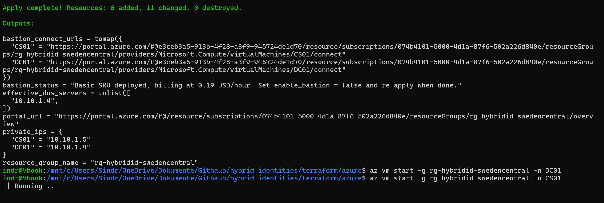

The apply also reports `bastion_status`, a reminder that the Basic SKU bills
hourly whether or not anything is connected to it.

**2.** Prerequisites on CS01, checked before downloading anything:

```powershell
(Get-ItemProperty 'HKLM:\SOFTWARE\Microsoft\NET Framework Setup\NDP\v4\Full').Release
$PSVersionTable.PSVersion
Get-ComputerInfo -Property CsDomain, CsDomainRole
```

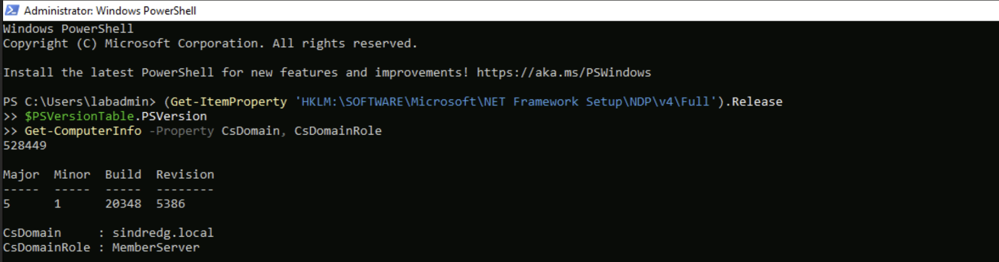

`528449` is .NET 4.8, comfortably past the 461808 floor for 4.7.2. PowerShell
5.1, and `MemberServer` on `sindredg.local` confirming the Phase 1 domain join.

**3.** TLS next, since Connect Sync talks to Entra over 1.2 exclusively.

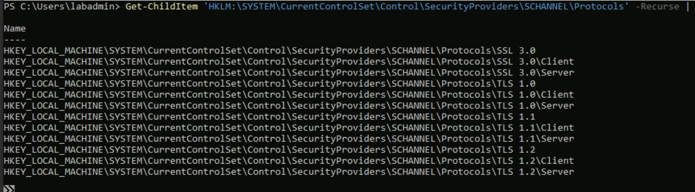

**This output does not answer the question**, which is the point of including it.
`Get-ChildItem` lists *keys*. A key named `SSL 3.0` existing says nothing about
whether SSL 3.0 works; the state lives in the `Enabled` DWORD inside the `Client`
and `Server` subkeys. Reading the values instead:

```powershell
reg query "HKLM\SYSTEM\CurrentControlSet\Control\SecurityProviders\SCHANNEL\Protocols" /s
```

SSL 3.0, TLS 1.0 and TLS 1.1 all `Enabled = 0x0`. TLS 1.2 `Enabled = 0x1`. Only
1.2 is on, which is what we needed.

This is the third time in this project that **presence has been mistaken for
configuration**. The others were the NTDS service check and the group-existence
check, both in `99-troubleshooting.md`. It is a reliable way to produce a
confident wrong answer.

---

## 3. Installing

**1.** Downloaded from the Entra admin center, which replaced the Download Center
as the only source.

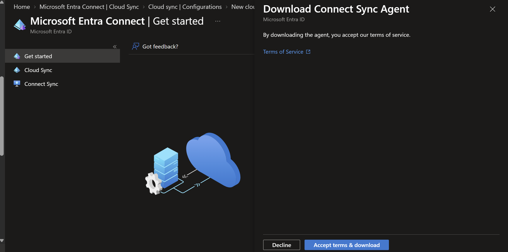

Version 2.6.84.0. Anything below **2.5.79.0 stops synchronising on 30 September
2026**, so the version is worth checking rather than assuming.

**2.** Custom settings rather than express, because express syncs the entire
directory and the OU scoping is the whole point.

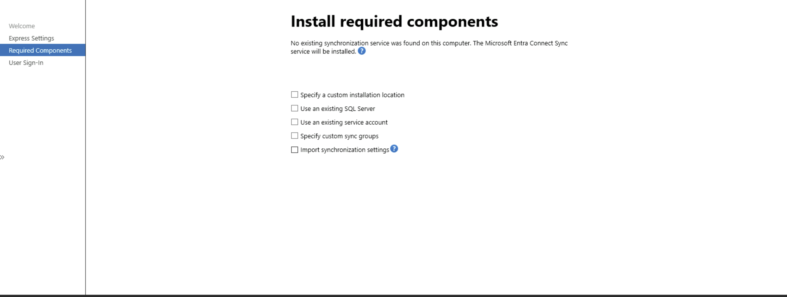

All five boxes left unticked. Each is a default being accepted deliberately:

| Option | What the default gives you |
|---|---|
| Custom installation location | `C:\Program Files\Microsoft Azure AD Sync` |
| Use an existing SQL Server | SQL Express LocalDB, capped at 10 GB and roughly 100,000 objects |
| Use an existing service account | A **virtual service account**, with no password to store or rotate |
| Custom sync groups | Four local groups: `ADSyncAdmins`, `ADSyncOperators`, `ADSyncBrowse`, `ADSyncPasswordSet` |
| Import synchronization settings | For migrating config from another Connect server |

The virtual service account matters more than it looks. For a lab whose risk
register already complains about shared credentials, taking the passwordless
default is the right instinct.

**3.** Password Hash Synchronization, with Seamless SSO enabled.

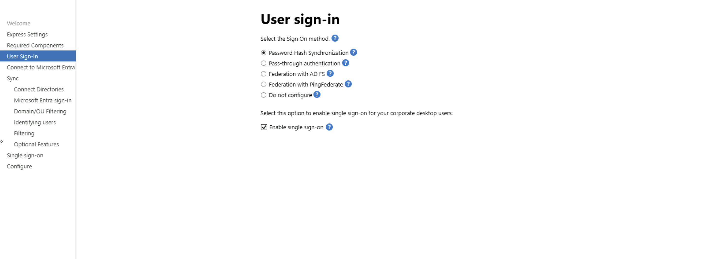

PHS survives an on-premises outage, which for a lab whose domain controller is
deallocated most of the time is not hypothetical. Reasoning in
[decisions.md](decisions.md).

Seamless SSO is arguably redundant here, since hybrid-joined devices get SSO via
the Primary Refresh Token anyway. It was enabled because it is free and because
it gives Phase 4 a genuinely real Group Policy task: Seamless SSO only works if
`https://autologon.microsoftazuread-sso.com` is in the browser's Intranet zone,
which is a GPO. It also creates an obligation, recorded in
[risk-and-limitations.md](risk-and-limitations.md).

---

## 4. Blocker one: Internet Explorer ESC

**1.** The Entra sign-in page failed to load inside the wizard.

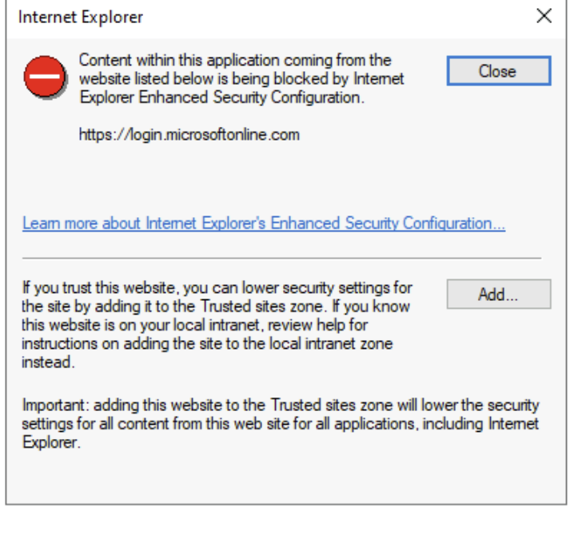

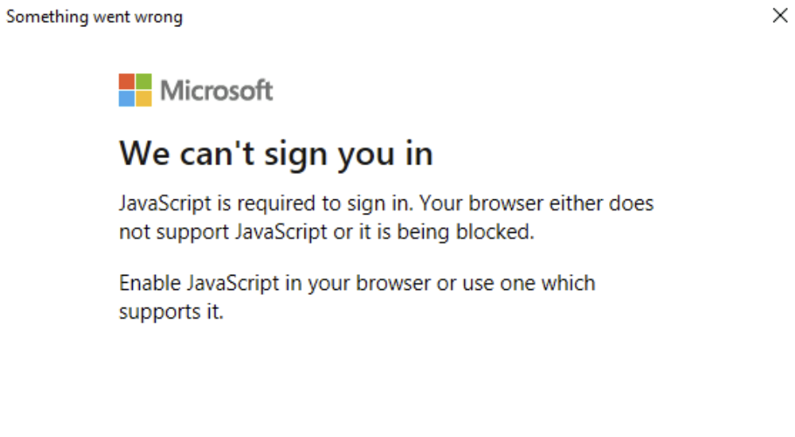

**Two errors, two layers apart.** The visible failure says JavaScript is blocked.
The cause is **Internet Explorer Enhanced Security Configuration**, which strips
scripting from untrusted zones and is on by default on Windows Server. The wizard
uses an embedded browser control, so it inherits that policy.

**2.** Disabled for Administrators, then relaunched:

```powershell
Set-ItemProperty -Path 'HKLM:\SOFTWARE\Microsoft\Active Setup\Installed Components\{A509B1A7-37EF-4b3f-8CFC-4F3A74704073}' -Name IsInstalled -Value 0
Stop-Process -Name Explorer -Force
```

Restarting Explorer alone was not enough. The wizard is a separate process and
read its zone settings at launch, so it had to be **closed and reopened**, not
just the shell restarted.

**3.** Signed in with a dedicated cloud service account rather than a personal
admin.

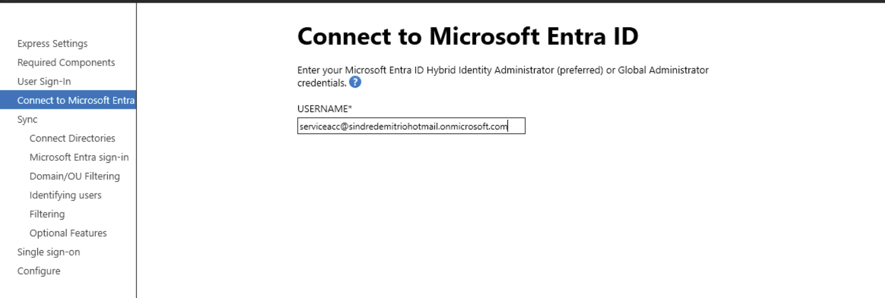

**Re-enable ESC once the wizard is done.** It is off for an installer, not
forever.

---

## 5. Blocker two: the wizard refuses a Domain Admin

**1.** The AD forest account dialog, with an existing Domain Admin supplied:

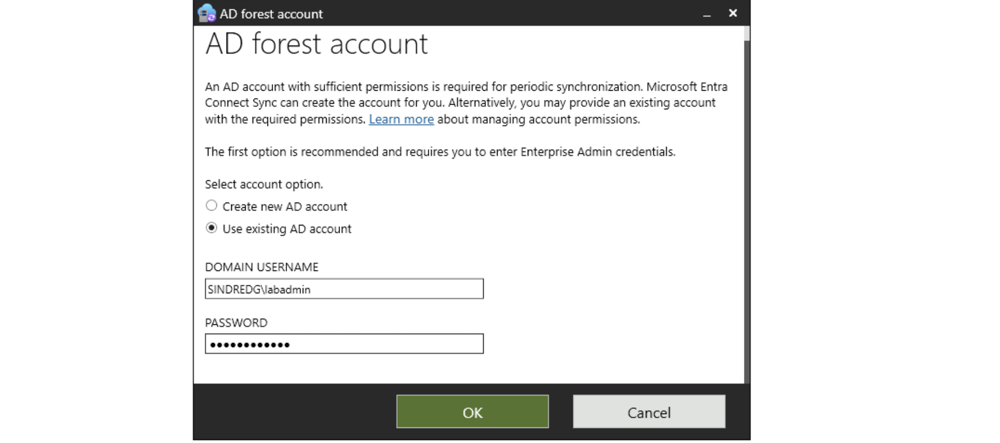


> Using an Enterprise or Domain administrator account for your AD forest account
> is not allowed.

**This refusal is correct, and worth dwelling on.** Two different things were
being conflated:

| Credential | Used when | Lives where |
|---|---|---|
| Enterprise Admin | Once, to create things | Typed at install, never stored |
| AD DS connector account | Every 30 minutes, forever | **Stored on CS01** |

If the sync server is ever compromised, a stored Domain Admin credential hands
over the forest. A stored `MSOL_` credential hands over directory read access.
Connect Sync will not let you make that mistake.

**2.** Switching to **Create new AD account** and supplying the Enterprise Admin
credential there lets the wizard mint a least-privilege connector account instead.

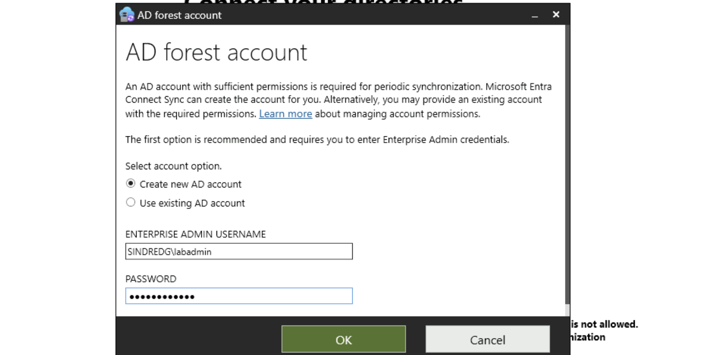

It creates `MSOL_<hex>` with Replicate Directory Changes and Replicate Directory
Changes All, and nothing else. It lands in the domain's default `Users` container,
which sits outside `OU=Sync` and therefore never syncs to the cloud.

**This is the Phase 7 argument arriving early.** The risk register already flags
that `labadmin` is local admin everywhere, Domain Admin, and the account used for
routine work. Microsoft's own installer refused to extend that pattern to a
service account before the lab got round to fixing it.

---

## 6. Blocker three: a lost password, recovered from state

**1.** A later attempt failed to authenticate to the forest at all:

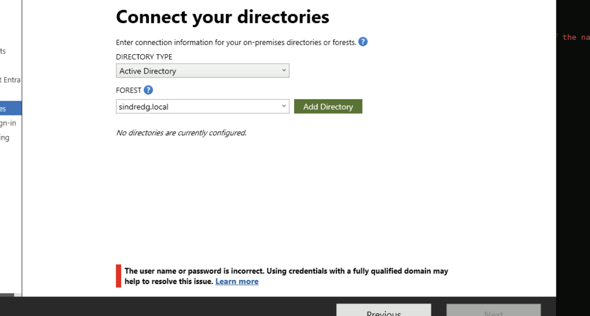

> The user name or password is incorrect. Using credentials with a fully qualified
> domain may help to resolve this issue.

**2.** Checking what had actually installed, to work out how far it got:

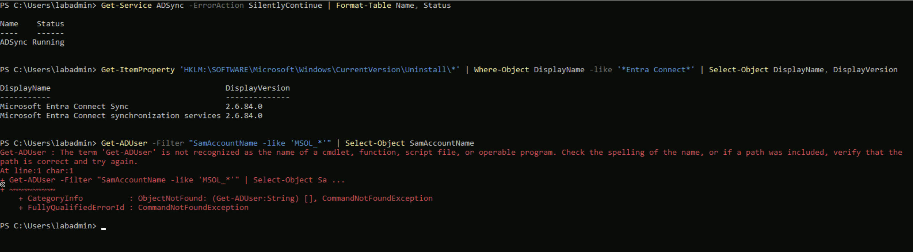

`ADSync` running, version 2.6.84.0, and an `MSOL_3ac06f5648e4` account already in
AD from an earlier attempt, so the AD side had succeeded at least once and the
credential had been valid. The `Get-ADUser` failure was unrelated: the AD
PowerShell module is not installed on a member server by default.

```powershell
Install-WindowsFeature RSAT-AD-PowerShell, RSAT-AD-AdminCenter, GPMC
```

GPMC installed at the same time, since Phase 4 needs it on this box anyway.

**3.** The password had simply been lost. Three separate credentials are in play
in this lab and it is easy to reach for the wrong one:

| Password | Origin | Used for |
|---|---|---|
| `admin_password` | `TF_VAR_admin_password` at deploy | Local admin on every VM, then Domain Admin after promotion |
| DSRM password | Typed during `Install-ADDSForest` | Directory restore mode only |
| Seed user password | `-InitialPassword` on `02-ad-structure.ps1` | The five test users |

It was recovered from Terraform state, where it sits in plaintext:

```bash
grep -o '"admin_password": "[^"]*"' terraform.tfstate | head -1
```

**The risk register stopped being theoretical here.** It has said since Phase 0
that state is the only durable record of this credential and that a copy belongs
in a password manager. That entry earned itself.

---

## 7. Blocker four: "Not Added", unresolved

**1.** With the forest connected, the sign-in configuration page reported both UPN
suffixes as unmatched:

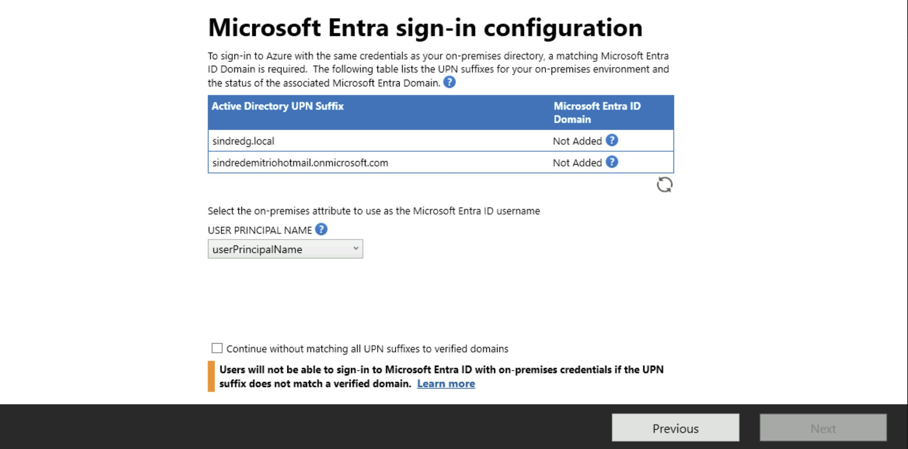

**`sindredg.local` showing Not Added is correct and permanent.** A `.local` suffix
can never be verified in Entra, because ownership is proved with a public DNS TXT
record and `.local` has no public DNS. That is exactly why Phase 1 retargeted the
users onto the onmicrosoft suffix.

**`sindredemitriohotmail.onmicrosoft.com` showing Not Added is wrong.** Queried
directly against Graph, outside the wizard:

```
sindredemitriohotmail.onmicrosoft.com   Verified: True   Default: True   Initial: True
```

**2.** Refreshing did nothing. Re-authenticating did nothing. **This was never
explained**, and it is recorded that way rather than given a tidy invented cause.
The best remaining hypothesis is the token obtained while ESC was blocking
JavaScript, but the wizard offers no way to inspect it.

**3.** Proceeded by ticking "Continue without matching all UPN suffixes to
verified domains", on the reasoning that the display was wrong rather than the
tenant:

- All five synced users are already on the onmicrosoft suffix
- That domain is genuinely verified, per Graph
- The only accounts still on `@sindredg.local` are `labadmin`, `krbtgt`, `Guest`
  and `sindreg`, none of which are in `OU=Sync`
- The outcome is cheap to verify afterwards and cheap to correct

Proceeding on external evidence rather than the tool's word, with a plan to check
the result, beat staying stuck.

---

## 8. Scoping the sync

The page that justifies the whole OU structure from Phase 1:

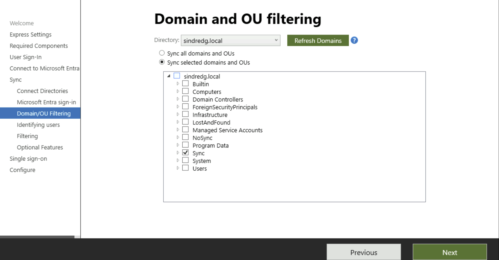

`Sync` ticked, everything else clear. `Builtin`, `Computers`, `Domain
Controllers`, `ForeignSecurityPrincipals`, `Infrastructure`, `LostAndFound`,
`Managed Service Accounts`, `NoSync`, `Program Data`, `System` and `Users` all
excluded.

| In scope | Contains |
|---|---|
| `OU=Users,OU=Sync` | The five seed users |
| `OU=Groups,OU=Sync` | The four security groups |
| `OU=Workstations,OU=Sync` | Empty now. Phase 3 needs computer objects here for hybrid join |

| Excluded | Why it matters |
|---|---|
| `OU=ServiceAccounts,OU=NoSync` | The point of the exercise. Proves filtering is real |
| `CN=Users` | Holds `labadmin`, `krbtgt`, `Guest` and the `MSOL_` connector account |

**OU filtering is a fixed list, not a rule.** Any OU created later is not synced
automatically. That will matter in Phase 7 when the tier OUs appear, and it
produces a confusing "why is this user not syncing" an hour into the next phase.

Optional features: nothing ticked. Password hash synchronization appears ticked
and greyed because it was chosen as the sign-in method earlier.

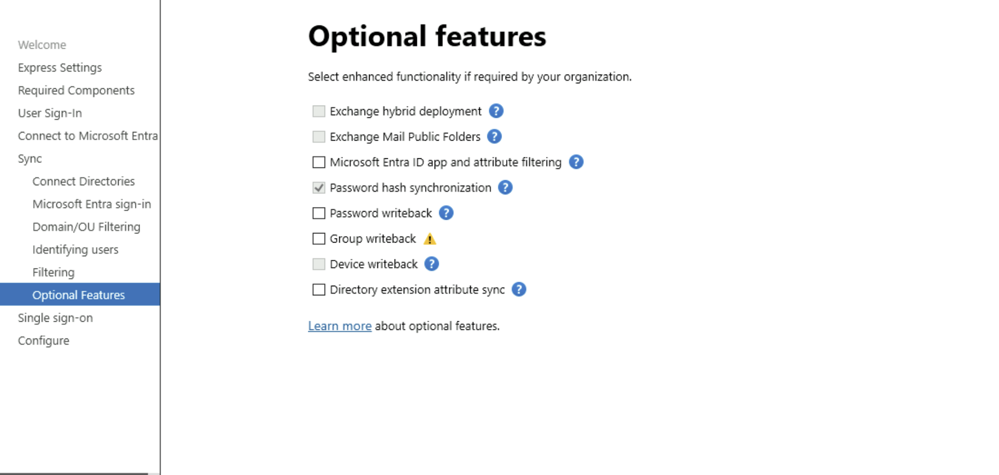

Password writeback and group writeback both need P1 and are out of scope.

---

## 9. Configuration complete

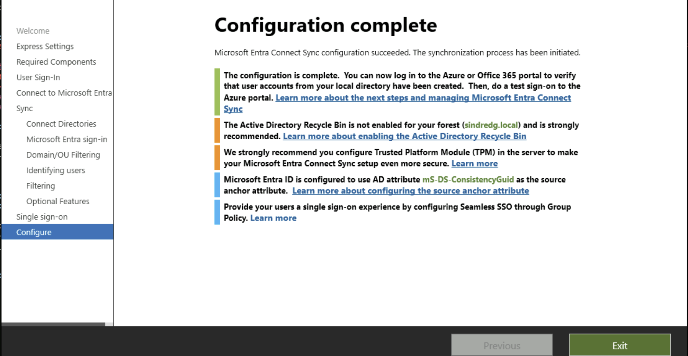

Four advisories on the final page, and three of them are worth acting on.

**AD Recycle Bin is not enabled.** A genuine gap, not lab noise. Without it a
deleted user or OU is recoverable only from a system state backup. This is a new
entry for the risk register and a one-line fix in Phase 4:

```powershell
Enable-ADOptionalFeature 'Recycle Bin Feature' -Scope ForestOrConfigurationSet -Target sindredg.local
```

It is irreversible once enabled, which is why it is off by default.

**No TPM on the sync server.** Azure Gen2 VMs support vTPM, which is a Terraform
change rather than something to fix by hand. Noted for later.

**Source anchor is `mS-DS-ConsistencyGuid`**, the modern default. It is written
back into AD, so a user survives being moved between forests or having their
object recreated. `objectGUID` is immutable but tied to one specific object, so
recreating a user produces a duplicate in the cloud rather than a match.

**Seamless SSO needs Group Policy to finish.** The wizard says so explicitly, and
it is now a real task for Phase 4 rather than an invented one.

---

## 10. What the wizard created in the cloud

Connect Sync does not authenticate to Entra with a stored password. It registers
an **application** and authenticates with a certificate.

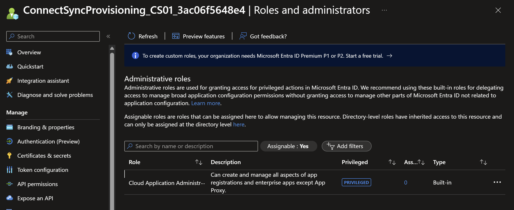

`ConnectSyncProvisioning_CS01_3ac06f5648e4`. The name encodes the server it runs
on and an installation hash, which is how you tell one sync server's identity from
another in a tenant that has several.

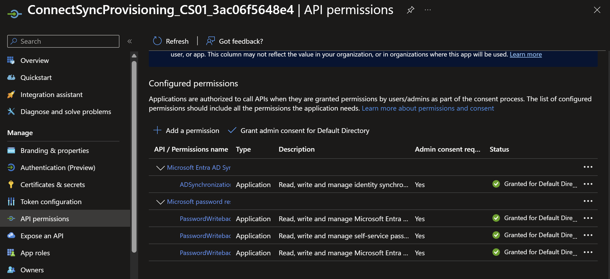

Its permissions are all **Application** type, admin-consented at install:

| Permission | Grants |
|---|---|
| `ADSynchronization.ReadWrite.All` | Read, write and manage identity synchronization |
| `PasswordWriteback` (three scopes) | Self-service password reset writeback |

**The password writeback permissions are consented but unused.** The feature was
left off during install because it needs P1, yet the app registration still holds
the rights. Consented permission and enabled functionality are different things,
and the gap between them is the sort of thing worth noticing when auditing a
tenant: the app *could* write passwords back, it simply is not configured to.

**This replaced the old sync service account.** Older Connect Sync versions
created a cloud account named `Sync_<server>_<hash>@tenant.onmicrosoft.com` with a
stored password. Application plus certificate is better on every axis: no password
to leak or rotate, permissions visible and auditable in one place, and revocation
is deleting an app registration rather than hunting for an account.

Note also the note in that first screenshot: *"To create custom roles, your
organization needs Microsoft Entra ID Premium P1 or P2."* The licence boundary
this lab stops at, appearing in passing.

---

## 11. Verification

```powershell
Start-ADSyncSyncCycle -PolicyType Initial
```

**Portal status** confirms the service is live and running on schedule:

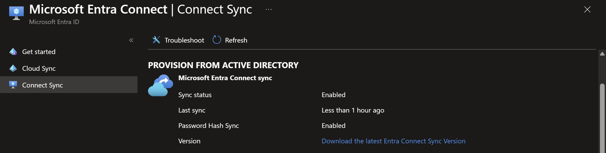


Sync enabled, last sync under an hour ago, Password Hash Sync enabled, Seamless
SSO enabled on one domain. Federation and pass-through authentication both
disabled, which is what choosing PHS means in practice.

**The users:**

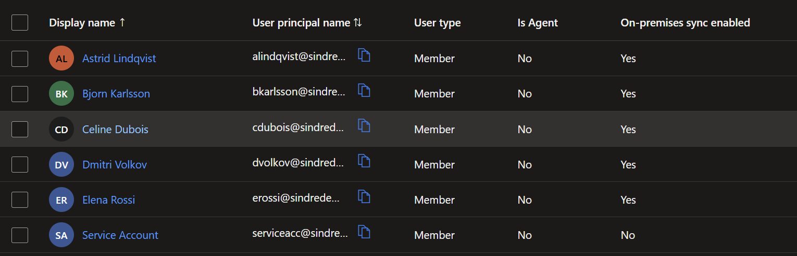

| Check | Expected | Result |
|---|---|---|
| Synced users | Five: `alindqvist`, `bkarlsson`, `cdubois`, `dvolkov`, `erossi` | **All five present** |
| UPN suffix | All `@sindredemitriohotmail...` | **Correct** |
| On-premises sync enabled | True on all five | **Yes on all five** |
| Service accounts from `OU=NoSync` | Absent | **Absent** |
| `MSOL_` connector account | Absent from the cloud | **Absent** |
| Sync errors | Zero | **Zero** |

**This settles the "Not Added" question.** The five users arrived on the
onmicrosoft suffix exactly as intended. The wizard's sign-in configuration page
was displaying something untrue, and proceeding on the Graph query rather than the
dialog was the right call. The cause of that display remains unexplained.

**The negative checks carry as much weight as the positive ones.** The one row
showing `On-premises sync enabled: No` is `Service Account`, the cloud-only
identity used to run the wizard. It is in the tenant but was never in the forest,
so it correctly reports as not synced. Nothing from `OU=NoSync` appears at all,
which is what proves the OU filtering did real work rather than being decorative.

---

## 12. Outstanding

| Item | Blocking? | Why |
|---|---|---|
| Re-enable IE ESC on CS01 | **Yes** | Set `IsInstalled` back to `1`. Disabled for an installer, not permanently |
| Confirm how many `MSOL_` accounts exist | **Yes** | See the correction below |
| Enable AD Recycle Bin | No, Phase 4 | Flagged by the wizard. One command, irreversible |
| Roll the Seamless SSO Kerberos key | No, ongoing | Every 30 days, manually. See the risk register |
| Consider vTPM on CS01 | No, optional | Terraform change, not a manual one |

### A correction about the connector account

An earlier draft of this document said to delete `MSOL_3ac06f5648e4` as an orphan
left by the abandoned first attempt. **That advice was probably wrong and acting
on it could have broken the sync.**

The app registration the wizard created is named
`ConnectSyncProvisioning_CS01_**3ac06f5648e4**`. The same hash. That strongly
suggests the `MSOL_` account is the live connector, reused across attempts rather
than duplicated by them.

Confirm before deleting anything:

```powershell
Get-ADUser -Filter "SamAccountName -like 'MSOL_*'" -Properties whenCreated |
  Select-Object SamAccountName, whenCreated, Enabled
```

If exactly one exists, there is no orphan and nothing to clean up. If two exist,
the one whose hash matches the app registration is live and the other can go.

The general lesson: **a hash appearing in two places is usually the same identity,
not a coincidence.** Deleting an account that holds Replicate Directory Changes
rights on a hunch is a poor trade against thirty seconds of checking.

---

## What this phase cost

Four blockers, and the pattern in them is worth more than any individual fix:

| Blocker | Root cause | Whose fault |
|---|---|---|
| JavaScript blocked at sign-in | IE ESC on Windows Server. Symptom and cause two layers apart | Windows default |
| Domain Admin rejected as connector | Correct least-privilege enforcement | Ours, and the tool was right |
| Forest credential rejected | Lost password, recovered from Terraform state | Ours, and the risk register predicted it |
| onmicrosoft domain shown as Not Added | **Unexplained.** Verified true via Graph, proceeded on that | Unknown |

Three of the four presented as one thing and were caused by another. The habit
that resolved them was checking the system directly rather than believing the
tool: Graph for the domain, the registry for TLS, `Get-Service` for the install
state, Terraform state for the password.

---

## Next

[Phase 3](03-hybrid-join.md) enables CL01 and CL02, joins them to the domain, and
configures hybrid Entra join through this same wizard. That is the step Cloud Sync
could not have supported, and the precondition for backing a LAPS password up to
Entra ID in Phase 6.

Problems from this phase are written up in
[99-troubleshooting.md](99-troubleshooting.md).
