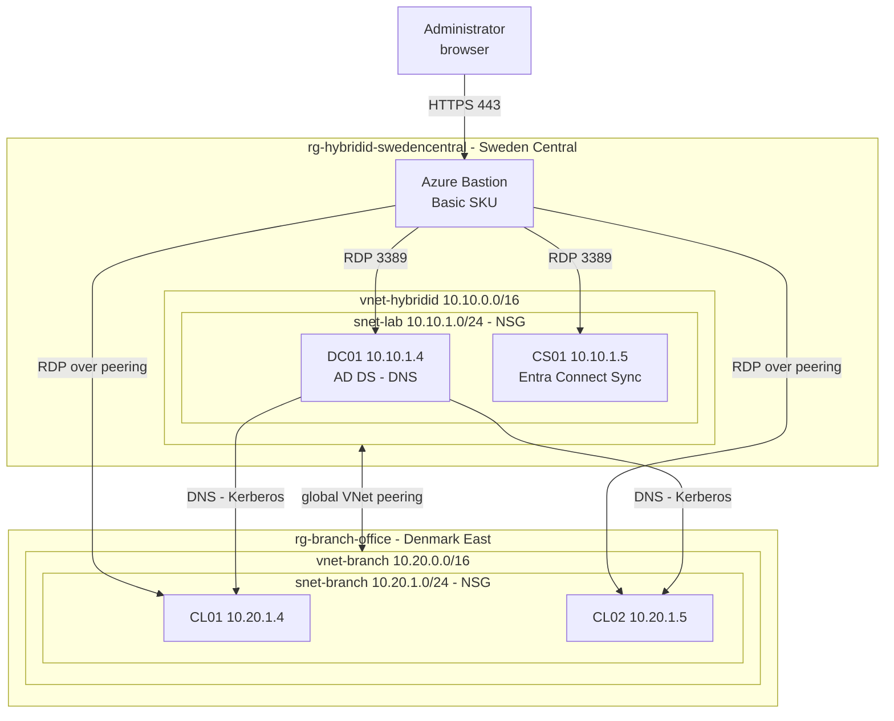
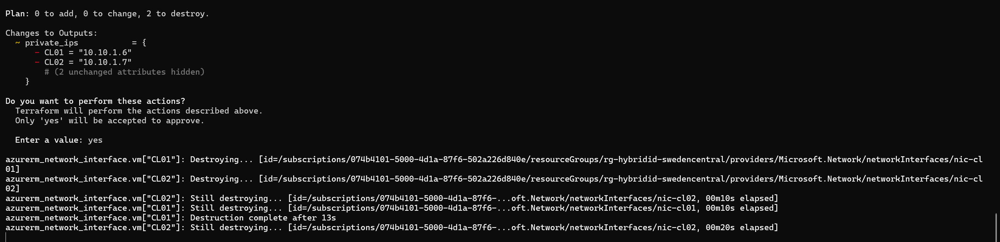
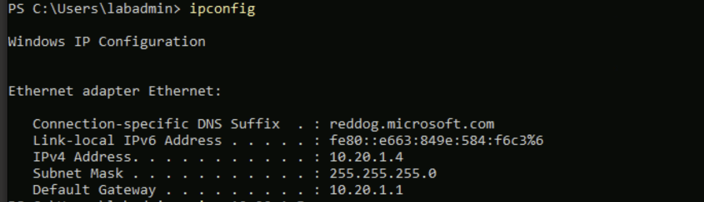
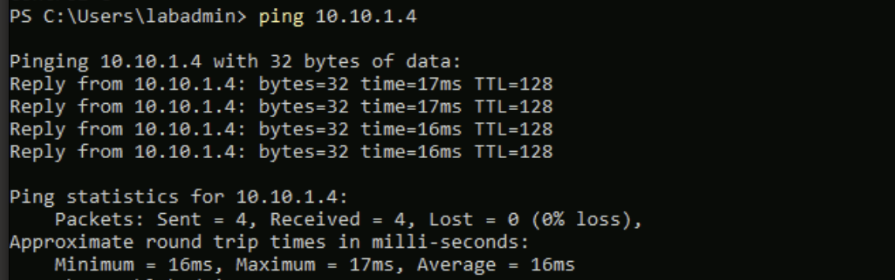
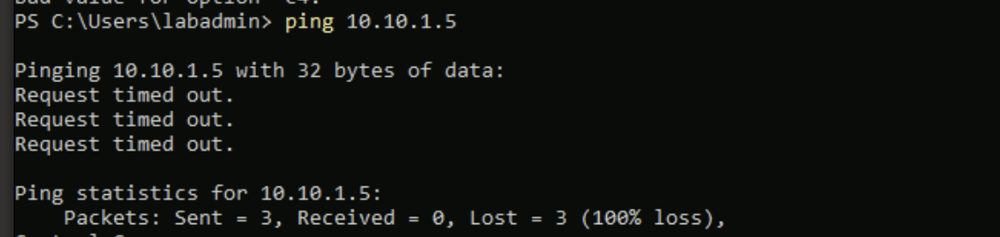
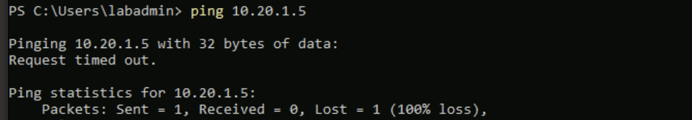

# Phase 3. Branch office network

**Built:** the client machines in a second Azure region, in their own resource
group and Terraform state, peered back to the domain controller in Sweden Central.
The clients would not fit inside the Sweden Central vCPU quota and a free trial
cannot raise it, so moving them added two sites, cross-region peering, and DNS and
Kerberos travelling over it. Alternatives in [decisions.md](decisions.md).

> Infrastructure in `terraform/azure-denmarkeast`, sharing a module with the HQ root.
> Commands used in this phase: [terraform.md](../cmd-sheets/terraform.md) and
> [azure-cli.md](../cmd-sheets/azure-cli.md).

Choosing a region took three attempts, each failing further along than the last.
Those are in
[troubleshooting/03-branch-network.md](troubleshooting/03-branch-network.md).

---

## 1. The constraint

Terraform created both client NICs and then refused both machines:


```
OperationNotAllowed: Operation could not be completed as it results in exceeding
approved Total Regional Cores quota. Current Limit: 4, Current Usage: 4,
Additional Required: 2
```

Two counters were exhausted, not one, and both would have needed raising:

| Quota | Usage | Limit |
|---|---|---|
| Total Regional vCPUs | 4 | 4 |
| Standard Bsv2 Family vCPUs | 4 | 4 |

DC01 and CS01 at 2 vCPU each consume the entire free trial allowance.

---

## 2. Choosing a region

**The VM size constrained the choice more than the quota did.** `Standard_B2ls_v2`
is offered to this subscription in only three regions out of twelve checked.
Elsewhere it is either not offered at all, or returns
`NotAvailableForSubscription`, which is a free trial restriction on the burstable
family rather than a capacity shortage.

| Region | `Standard_B2ls_v2` | Regional vCPU |
|---|---|---|
| Sweden Central | Available | 4 of 4 used |
| Poland Central | Available | 0 of 4 used |
| Denmark East | Available | 0 of 4 used |
| West Europe, Spain Central | `NotAvailableForSubscription` | 0 of 4 used |
| North Europe, Norway East, UK South, France Central, Germany West Central, Italy North, Switzerland North | Not offered | 0 of 4 used |

Denmark East was chosen. Keeping the branch machines on the same size as the HQ
machines mattered more than the alternative, which was changing the size and
accepting that the two sites no longer match.

To check a region before committing to it, see
[azure-cli.md](../cmd-sheets/azure-cli.md).

---

## 3. The topology



| Site | Region | Resource group | Address space | Machines |
|---|---|---|---|---|
| HQ | Sweden Central | `rg-hybridid-swedencentral` | 10.10.0.0/16 | DC01, CS01 |
| Branch | Denmark East | `rg-branch-office` | 10.20.0.0/16 | CL01, CL02 |

**One Bastion serves both sites.** The Basic SKU connects to VMs in peered virtual
networks, so the host already running in Sweden Central reaches the branch clients
without a second deployment. Only the Developer SKU lacks that.

**The branch network points at 10.10.1.4 for DNS from creation.** Unlike Phase 1,
where the DNS setting was added after DC01 was promoted, the domain controller
already exists, so there is no window where the clients need Azure DNS.

---

## 4. What changed in Terraform

| Root | Contents |
|---|---|
| `terraform/azure/` | HQ. Network, DC01, CS01, Bastion, `AzureBastionSubnet` |
| `terraform/azure-denmarkeast/` | Branch. Own resource group, network, NSG, both peering objects, the clients |
| `terraform/modules/windows-vm/` | One VM plus the NIC, OS disk and shutdown schedule that travel with it |

**Separate state, not just a separate folder.** The branch is meant to grow into
unrelated work later, so it's not sharing a plan with the domain controller.

**The branch root owns both peering objects** and reads the HQ network through a
data source. The dependency runs one way: the branch knows about HQ, HQ knows
nothing about the branch. The cost is that the branch root creates one resource
inside the HQ resource group, which is the single place the state boundary is not
clean.

**The module encodes earlier failures as plan-time validations** rather than
comments:

| Guard | What it catches |
|---|---|
| Computer name at 15 characters | Windows truncates silently, and the AD computer object then stops matching the machine |
| Arm64 sizes rejected | The `p` variants will not boot an x64 Windows image, and the error does not say so |
| Duplicate host index | Two clients racing for one address, the `PrivateIPAddressIsAllocated` failure from Phase 0, now caught before apply |
| OS disk under 127 GB | The Windows Server images are 127 GB and a smaller disk is rejected at create time |

Client addresses are derived with `cidrhost` against the subnet rather than
written out, so changing the subnet moves the machines with it.

---

## 5. Deploying

**From the workstation.** HQ first, which removes the two orphaned NICs from the
failed apply in section 1:

```bash
cd terraform/azure
```

```bash
terraform apply
```



Two to destroy, nothing added, nothing changed. Anything proposing to touch a VM
here is wrong and should stop the apply.

Then the branch:

```bash
cd terraform/azure-denmarkeast/branch
```

```bash
terraform init
```

```bash
terraform apply
```

> **Start DC01 first, every session.** The branch network points at 10.10.1.4 for
> DNS, so a deallocated DC01 leaves the clients with no name resolution at all,
> including for the internet. The same trap as Phase 1, now across a peering where
> the cause is less obvious.

> **Deallocate the clients when finished.** Denmark East does not publish
> `Microsoft.DevTestLab`, so there is no auto-shutdown schedule here. Stopping from
> inside Windows still bills. See [azure-cli.md](../cmd-sheets/azure-cli.md).

---

## 6. Verifying the peering

**From the workstation.** Both directions must read `Connected`. `Initiated` on
either side means its partner is missing:

```bash
az network vnet peering list --resource-group rg-branch-office --vnet-name vnet-branch --output table
```

```bash
az network vnet peering list --resource-group rg-hybridid-swedencentral --vnet-name vnet-hybridid --output table
```

**From CL01**, confirm it landed where Terraform intended:

```powershell
ipconfig
```



`10.20.1.4` with a gateway of `10.20.1.1`, which is the branch subnet rather than
anything in Sweden Central.

Then the test that actually exercises the peering:

```powershell
ping 10.10.1.4
```



**Four replies at 16 to 17 milliseconds.** The number is the evidence, not the
reply. A same-subnet reply would be well under a millisecond, so this is genuinely
the round trip from Denmark East to Sweden Central and back.

---

## 7. Why the other machines do not answer

The same command against CS01 and CL02 times out.





This looks like a network fault and is not one.

CL01 to CL02 is the shortest path in the lab: same subnet, same virtual network, no
peering. CL01 to DC01 is the longest. If routing, peering or the NSGs were at fault,
the long path would fail and the short one would work. The results are the other way
round.

The cause is Windows Firewall on each destination:

| Host | Why |
|---|---|
| DC01 | Promoting it to a domain controller enabled the `Active Directory Domain Controller - Echo Request (ICMPv4-In)` rule. Ping works as a side effect of dcpromo |
| CS01 | Domain-joined member server. Nothing enabled an echo rule, so it drops ICMP |
| CL02 | Not domain-joined at this point, so it sits on the Public firewall profile |

DC01 is the exception, not the other two. Not answering ping is the default state
of a Windows Server.

**Nothing in a domain join uses ICMP**, so ping is the wrong test regardless. Use
the ports that matter instead, from CL01:

```powershell
Test-NetConnection 10.10.1.4 -Port 389
```

Enabling ICMP across the estate is left to Phase 5, where a Group Policy linked at
the domain does it in one place rather than host by host.

---

## 8. Exit criteria

| Criterion | Command | Status |
|---|---|---|
| Branch network deployed | `terraform apply` in `terraform/azure-denmarkeast/branch` | Done |
| HQ orphan NICs removed | Plan shows 2 to destroy, 0 to add | Done |
| Peering connected both ways | `az network vnet peering list` reads `Connected` | Done |
| Clients addressed correctly | `ipconfig` shows 10.20.1.4 and 10.20.1.5 | Done |
| Cross-site reachability | DC01 answers from CL01 across the peering | Done |
| No public IPs | Neither subnet has an attached public address | Done |

---

## Next

[Phase 4](04-hybrid-join.md) puts the two subnets into named AD sites, joins both
clients to the domain, and registers them with Entra ID.
