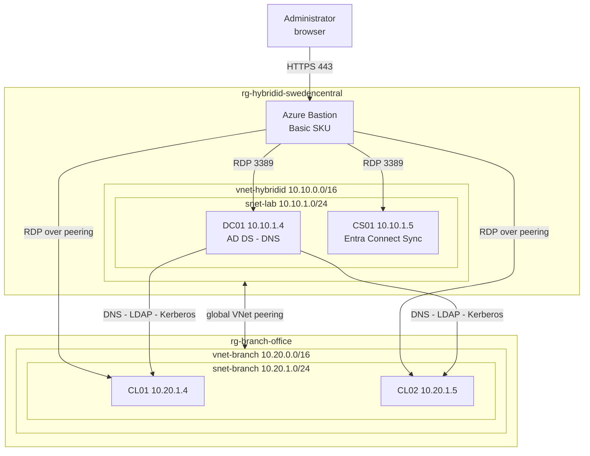

# Phase 3. Branch office and hybrid Entra join

**Goal:** move the clients into a second Azure region as a simulated branch office,
peered back to the domain controller, then hybrid join them so they hold an
identity in Active Directory and a registration in Entra ID at the same time.

> Infrastructure in `terraform/branch/`, sharing a module with the HQ root. Hybrid
> join is configured through the Entra Connect wizard on CS01. See
> [Configure Microsoft Entra hybrid join](https://learn.microsoft.com/entra/identity/devices/how-to-hybrid-join).

**Why this matters.** The branch half was not planned. The clients would not fit in
Sweden Central and the free trial cannot raise the cap, so the choice was to shrink
the lab or to split it. Splitting it added the layer the design was missing: two
sites, cross-region peering, DNS and Kerberos travelling over that peering, and a
reason for AD Sites and Services to exist. A single flat subnet never needed any of
it.

The hybrid join half is what makes the final phase work. A hybrid-joined device
takes policy from on-premises Group Policy while the secret that policy manages
lives in Entra ID.

**Trade-off from best practice.** Two things got worse to make this work. The Phase 0
story of one virtual network with no internet-facing surface is now two peered
networks, which is more moving parts and a small continuous data transfer charge.
And the branch region does not publish `Microsoft.DevTestLab`, so the clients have
no auto-shutdown schedule and have to be deallocated by hand. Both are recorded in
[decisions.md](decisions.md).

**No licence required.** Hybrid join is free. Only the Conditional Access that would
normally consume the device state needs P1, and that is where this lab stops.

**Status: branch office complete, hybrid join pending.** Choosing a region took
three attempts, each failing further along than the last. All of it is in
[99-troubleshooting.md](99-troubleshooting.md).

---

## 1. Why the design changed

The original plan was a fourth and fifth VM in `snet-lab` alongside DC01 and CS01.
Terraform created both NICs and then refused both machines:


```
OperationNotAllowed: Operation could not be completed as it results in exceeding
approved Total Regional Cores quota. Current Limit: 4, Current Usage: 4,
Additional Required: 2
```

Two counters were exhausted, not one, and both would have had to be raised:

| Quota | Usage | Limit |
|---|---|---|
| Total Regional vCPUs | 4 | 4 |
| Standard Bsv2 Family vCPUs | 4 | 4 |

DC01 and CS01 at 2 vCPU each consume the entire free trial allowance. A support
request is the normal answer and is not available on a free trial, so the
constraint is real rather than an inconvenience.

**The size is the part that constrained the region choice.** `Standard_B2ls_v2` is
offered to this subscription in only three regions out of the twelve checked.
Everywhere else it is either not offered at all or returns
`NotAvailableForSubscription`, which is a free trial restriction on the burstable
family rather than a capacity shortage.

| Region | `Standard_B2ls_v2` | Regional vCPU |
|---|---|---|
| Sweden Central | Available | 4 of 4 used |
| Poland Central | Available | 0 of 4 used |
| Denmark East | Available | 0 of 4 used |
| West Europe, Spain Central | `NotAvailableForSubscription` | 0 of 4 used |
| North Europe, Norway East, UK South, France Central, Germany West Central, Italy North, Switzerland North | Not offered | 0 of 4 used |

Denmark East was chosen. Keeping the same VM size as the HQ machines mattered more
than the alternative, which was changing the size and accepting that the two sites
no longer match.

---

## 2. The topology



| Site | Region | Resource group | Address space | Machines |
|---|---|---|---|---|
| HQ | Sweden Central | `rg-hybridid-swedencentral` | 10.10.0.0/16 | DC01, CS01 |
| Branch | Denmark East | `rg-branch-office` | 10.20.0.0/16 | CL01, CL02 |

**One Bastion serves both sites.** The Basic SKU supports connecting to VMs in
peered virtual networks, so the host already running in Sweden Central reaches the
branch clients without a second deployment. Only the Developer SKU lacks that, which
is worth knowing because it is the difference between one hourly charge and two.

**The branch VNet points at 10.10.1.4 for DNS from the moment it is created.**
Unlike Phase 1, where the DNS setting was added after DC01 was promoted, the domain
controller already exists here, so there is no window where the clients need
Azure-provided DNS.

---

## 3. What changed in Terraform

The clients moved out of the HQ root entirely.

| Root | Contents |
|---|---|
| `terraform/azure/` | HQ. Network, DC01, CS01, Bastion, and the `AzureBastionSubnet` |
| `terraform/branch/` | Branch. Its own resource group, network, NSG, both peering objects, and the clients |
| `terraform/modules/windows-vm/` | One VM plus the NIC, OS disk and shutdown schedule that always travel with it |

**Separate state, not just a separate folder.** The branch is meant to grow into
unrelated work later, so it should never share a plan with the domain controller. A
mistake in the branch root cannot produce a plan that touches DC01.

**The branch root owns both peering objects** and reads the HQ network through a
data source rather than a remote state lookup. The dependency runs one way: the
branch knows about HQ, HQ knows nothing about the branch. The cost of that choice is
that the branch root creates one resource inside the HQ resource group, which is the
single place the state boundary is not clean.

**The module carries the lab's accumulated scar tissue as validations** rather than
comments, so the next caller cannot repeat them:

| Guard | What it catches |
|---|---|
| Computer name at 15 characters | Windows truncates silently, and the AD computer object then stops matching the machine |
| Arm64 sizes rejected | The `p` variants will not boot an x64 Windows image, and the error does not say so |
| Duplicate host index | Two clients racing for one address, which is the `PrivateIPAddressIsAllocated` failure from Phase 0, now caught at plan time |
| OS disk under 127 GB | The Windows Server images are 127 GB and a smaller disk is rejected at create time |

Client addresses are derived with `cidrhost` against the subnet rather than written
out, so changing the subnet moves the machines with it.

---

## 4. Deploying

The HQ root first, which removes the two orphaned NICs left behind by the failed
apply in section 1. They cost nothing but they hold 10.10.1.6 and 10.10.1.7.

```bash
cd terraform/azure && terraform apply
```


Two to destroy, nothing added, nothing changed. Anything proposing to touch a VM
here is wrong and should stop the apply.

Then the branch root:

```bash
cd terraform/branch && terraform init && terraform apply
```

**Start DC01 before the clients, every session.** The branch network points at
10.10.1.4 for DNS, so a deallocated DC01 leaves the clients with no name resolution
at all, including for the internet. The same trap as Phase 1, now across a peering
where the cause is less obvious.

**Deallocate the clients when finished.** There is no auto-shutdown schedule in this
region. Stopping from inside Windows still bills; only a deallocate stops the meter.

```bash
az vm deallocate --ids $(az vm list -g rg-branch-office --query "[].id" -o tsv)
```

---

## 5. Verifying the peering works

CL01 first, to confirm it landed where Terraform intended:

```powershell
ipconfig
```


`10.20.1.4` with a gateway of `10.20.1.1`, which is the branch subnet rather than
anything in Sweden Central.

Then the only test that actually exercises the peering:

```powershell
ping 10.10.1.4
```


**Four replies at 16 to 17 milliseconds.** That number is the evidence, not the
success. A reply from another machine in the same subnet would be well under a
millisecond, so this is genuinely the round trip from Denmark East to Sweden Central
and back. Two regions, two virtual networks, two network security groups, and a
global peering in between.

---

## 6. Why the other two do not answer

The same command against CS01 and CL02 times out.


This looks like a network fault and is not one. The reasoning is what makes it
worth recording:

**CL01 to CL02 is the shortest path in the entire lab.** Same subnet, same virtual
network, no peering involved. CL01 to DC01 is the longest. If routing, peering or
the network security groups were at fault, the long path would fail and the short
one would work. The results are the other way round, so the network is not the
problem.

The cause is Windows Firewall on each destination, and each machine is in a
different state:

| Host | Why |
|---|---|
| DC01 | Promoting it to a domain controller enabled the `Active Directory Domain Controller - Echo Request (ICMPv4-In)` rule. Ping works as a side effect of dcpromo |
| CS01 | Domain-joined member server. Nothing ever enabled an echo rule, so it drops ICMP |
| CL02 | Not domain-joined yet, so it sits on the Public firewall profile and blocks essentially all unsolicited inbound traffic |

DC01 is the exception here, not the other two. Not answering ping is the default
state of a Windows Server.

**Nothing in a domain join uses ICMP**, so ping is the wrong test regardless. The
ports that matter:

```powershell
Test-NetConnection 10.10.1.4 -Port 389
Test-NetConnection 10.10.1.5 -Port 445
nltest /dsgetdc:sindredg.local
```

`nltest` is the real check, because it exercises DNS, LDAP and Kerberos in one step,
which is exactly what the join will do.

Enabling ICMP across the estate is left to Phase 4 deliberately. Doing it through a
Group Policy linked at the domain, rather than host by host, is a textbook use of
the thing that phase is about.

---

## 7. Hybrid join

> **Status: pending.** Not yet executed. The section below is written from
> documented behaviour and gets rewritten as a record, with screenshots, once run.

| Requirement | Detail |
|---|---|
| Entra Connect Sync installed | Phase 2, version 1.1.819.0 or later for the wizard |
| Computer objects in sync scope | `OU=Workstations,OU=Sync` must be selected in Connect Sync |
| Default device attributes not excluded | Excluding them breaks device registration in ways that surface much later |
| Hybrid Identity Administrator | Entra side of the wizard |
| Enterprise Admin | On-premises side |

Devices need outbound access to these endpoints. All four work through the subnet's
default outbound access, so no network security group change is needed:

```
https://enterpriseregistration.windows.net
https://login.microsoftonline.com
https://device.login.microsoftonline.com
https://autologon.microsoftazuread-sso.com
```

Steps:

1. Join both clients to `sindredg.local` as `SINDREDG\labadmin`
2. Move both computer objects into `OU=Workstations,OU=Sync`
3. Confirm the objects reach Entra, since hybrid join depends on it
4. Run the hybrid join wizard in Entra Connect on CS01
5. Restart the clients and wait for the scheduled device registration task

```powershell
dsregcmd /status
```

| Field | Expected |
|---|---|
| `AzureAdJoined` | YES |
| `DomainJoined` | YES |
| `DeviceId` | Present, and matching the object in the Entra portal |
| `TenantName` | The tenant |

`AzureAdJoined: NO` with `DomainJoined: YES` usually means the computer object has
not synced yet, or the device could not reach one of the registration endpoints.

---

## 8. AD Sites and Services

> **Status: pending.**

The split is what makes this worth doing. Both subnets get registered against named
sites on DC01:

| Site | Subnet |
|---|---|
| `HQ-SwedenCentral` | 10.10.1.0/24 |
| `Branch-DenmarkEast` | 10.20.1.0/24 |

Without it every client lands in `Default-First-Site-Name` and picks a domain
controller at random, which happens to work here only because there is exactly one.
Defining the sites is what gives DC locator, replication topology and site-aware
Group Policy processing something to act on. It is the one part of this phase that
exists purely because the lab is now in two places.

---

## 9. Exit criteria

| Criterion | Command | Status |
|---|---|---|
| Branch network deployed | `terraform apply` in `terraform/branch` | Done |
| HQ orphan NICs removed | Plan shows 2 to destroy, 0 to add | Done |
| Peering connected both ways | `az network vnet peering list` reads `Connected` on both sides | Done |
| Clients addressed correctly | `ipconfig` shows 10.20.1.4 and 10.20.1.5 | Done |
| Cross-site reachability | DC01 answers from CL01 across the peering | Done |
| Domain controller locatable | `nltest /dsgetdc:sindredg.local` from both clients | Pending |
| CL01 and CL02 domain-joined | `Get-ComputerInfo -Property CsDomainRole` | Pending |
| Computer objects synced | Present in `OU=Workstations,OU=Sync` and visible in Entra | Pending |
| Both hybrid joined | `dsregcmd /status` shows both joins | Pending |
| Sites and subnets defined | Both subnets bound to named sites | Pending |

---

## Next

[Phase 4](04-group-policy.md) builds the Group Policy estate these clients receive,
including the firewall policy that makes section 6 a solved problem rather than an
observation.
