# Phase 4. Sites, domain join and hybrid Entra join

**Built:** the directory made aware it spans two sites, both branch clients joined
to the domain, and both registered with Entra ID so they hold an identity in Active
Directory and a registration in the cloud at once. That hybrid-joined state is what
Phase 7 needs: policy arriving from on-premises Group Policy while the secret it
manages lives in Entra ID.

> Configured through PowerShell and the Entra Connect wizard on CS01. Commands used
> in this phase: [ad-sites.md](../cmd-sheets/ad-sites.md), [ad-join.md](../cmd-sheets/ad-join.md)
> and [entra-sync.md](../cmd-sheets/entra-sync.md).

Hybrid join needs no licence. Only the Conditional Access that would consume the
device state needs P1, and that is where this lab stops.

Two failures along the way are in
[troubleshooting/04-hybrid-join.md](troubleshooting/04-hybrid-join.md).

---

## 1. Where each command runs

Several commands in this phase look similar and do different things depending on
where you are.

| Section | Run from |
|---|---|
| 2. Sites and subnets | CS01 |
| 3. Pre-flight and join | CL01, then CL02 |
| 3. Directory verification | CS01 |
| 4. Hybrid join wizard | CS01 |
| 5. Restart | Workstation |
| 5. Registration and `dsregcmd` | CL01 and CL02 |

---

## 2. AD Sites and Services

Done before the join, not after. A client determines its site at join time, so
joining first would land both machines in `Default-First-Site-Name` and leave them
there until a netlogon refresh corrected it.

**From CS01.** The default site is renamed rather than replaced, because creating a
new site and moving DC01 into it reaches the same end state with more steps:

```powershell
Rename-ADObject -Identity (Get-ADReplicationSite -Identity "Default-First-Site-Name").DistinguishedName -NewName "HQ-SwedenCentral"
```

```powershell
New-ADReplicationSite -Name "Branch-DenmarkEast"
```

```powershell
New-ADReplicationSubnet -Name "10.10.1.0/24" -Site "HQ-SwedenCentral"
```

```powershell
New-ADReplicationSubnet -Name "10.20.1.0/24" -Site "Branch-DenmarkEast"
```

```powershell
Get-ADReplicationSubnet -Filter * | Select-Object Name, Site
```

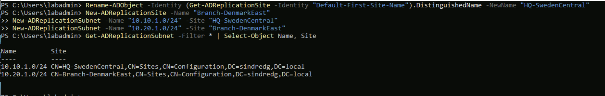

| Site | Subnet | Contains |
|---|---|---|
| `HQ-SwedenCentral` | 10.10.1.0/24 | DC01, CS01 |
| `Branch-DenmarkEast` | 10.20.1.0/24 | CL01, CL02 |

Without this every machine lands in one site and picks a domain controller at
random, which happens to work here only because there is exactly one. The subnet to
site mapping is what gives DC locator, replication topology and site-aware Group
Policy processing anything to act on.

---

## 3. Domain join

Run from each client. The machine joins itself, authenticating as a domain account
it does not yet know, which is passed to DC01 to authorise creating the computer
object.

### Pre-flight, from CL01

```powershell
ipconfig /all
```

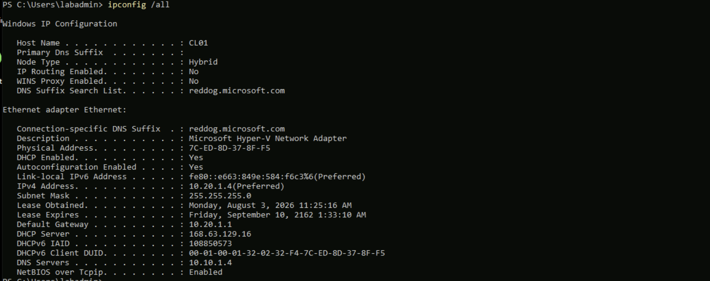

`DNS Servers: 10.10.1.4` is the line that matters. The branch network is handing
out the HQ domain controller across the peering. If this reads `168.63.129.16` the
NIC has not picked up the VNet setting and needs a restart first.

`DHCP Server` still reads `168.63.129.16` and that is correct. Azure's DHCP hands
out the custom DNS server; it does not stop being the DHCP server itself.

```powershell
nltest /dsgetdc:sindredg.local
```

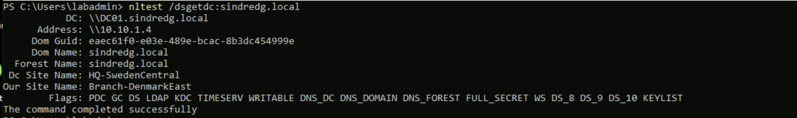

| Field | Value | What it confirms |
|---|---|---|
| `DC` / `Address` | `DC01.sindredg.local` at `10.10.1.4` | DNS, LDAP and Kerberos all reach across the peering |
| `Our Site Name` | `Branch-DenmarkEast` | The client places itself from its own address. Section 2 worked |
| `Dc Site Name` | `HQ-SwedenCentral` | It also knows the DC is in a different site, which is the point |
| `Flags` | `PDC GC DS LDAP KDC TIMESERV WRITABLE` | The DC advertises every role the join needs |

Two different site names in one output is what a multi-site directory looks like.
Before section 2 both read `Default-First-Site-Name`.

### Join, from CL01

**`-OUPath` puts the object straight into the synced OU** at join time. Without it
the computer lands in the default `Computers` container, which is outside `OU=Sync`
and therefore invisible to Entra Connect. Hybrid join would then fail for a reason
that looks nothing like the cause.

```powershell
Add-Computer -DomainName sindredg.local -OUPath "OU=Workstations,OU=Sync,DC=sindredg,DC=local" -Credential (Get-Credential SINDREDG\labadmin) -Restart
```

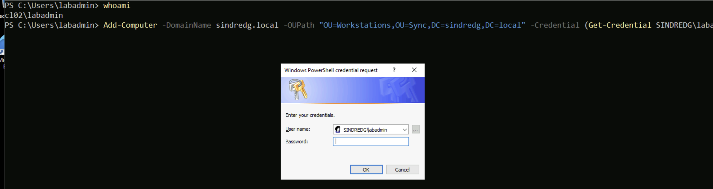

The credential is `SINDREDG\labadmin`, which promotion in Phase 1 made the sole
member of Domain Admins. The Bastion session drops with the restart.

For contrast, CL02 before its join, running the same two checks:

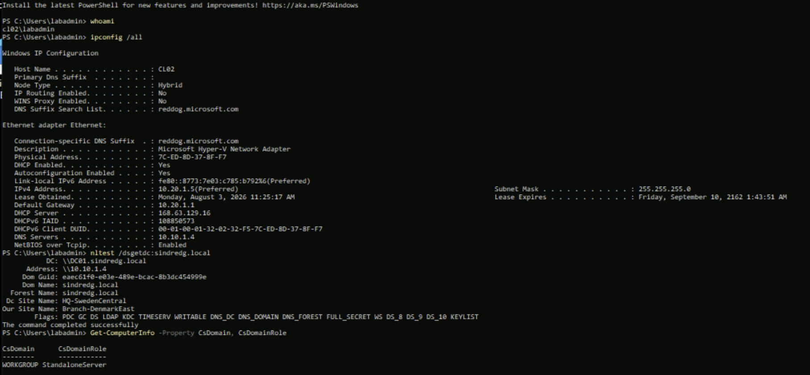

Identical network and site results, but `WORKGROUP` and `StandaloneServer`. Site
awareness works before the join, because it is derived from the address rather than
from membership.

### Confirm, from CL01 and CL02

```powershell
Get-ComputerInfo -Property CsDomain, CsDomainRole
```

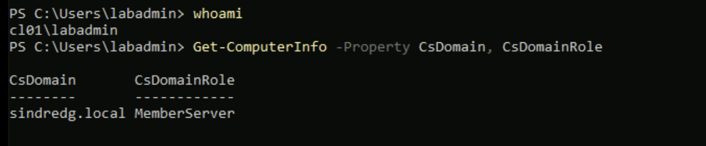

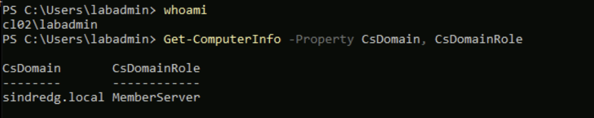

`sindredg.local` and `MemberServer` on both. These are Server 2022 images rather
than a Windows client SKU, so `MemberServer` is expected rather than
`MemberWorkstation`.

### Verify from the directory, from CS01

```powershell
Get-ADComputer -Filter * -SearchBase "OU=Workstations,OU=Sync,DC=sindredg,DC=local" | Select-Object Name, DistinguishedName
```

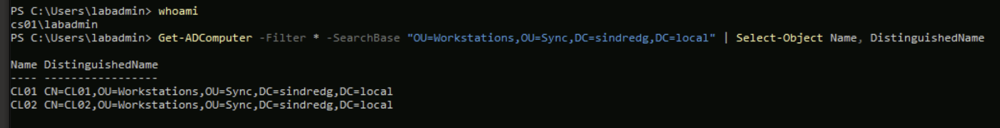

Worth also listing every computer in the forest, which catches an object that
landed somewhere unexpected:

```powershell
Get-ADComputer -Filter * -Properties DistinguishedName | Select-Object Name, DistinguishedName
```

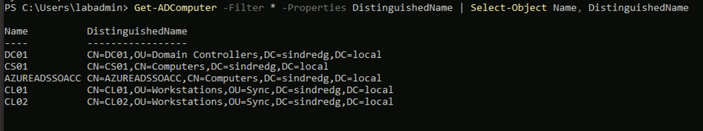

Five objects. DC01 in `Domain Controllers`, CS01 in the default `Computers`
container from its Phase 1 join, `AZUREADSSOACC` from Seamless SSO in Phase 2, and
the two clients correctly under `OU=Workstations,OU=Sync`.

**Each client also moved from the Public firewall profile to Domain** as a side
effect of joining. ICMP stays blocked either way until Phase 5 enables it.

---

## 4. Configuring hybrid join

**From CS01.** Entra Connect, then **Configure device options**:

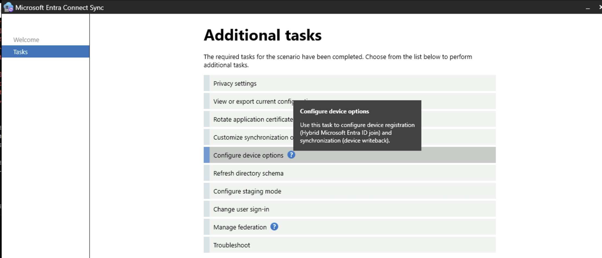

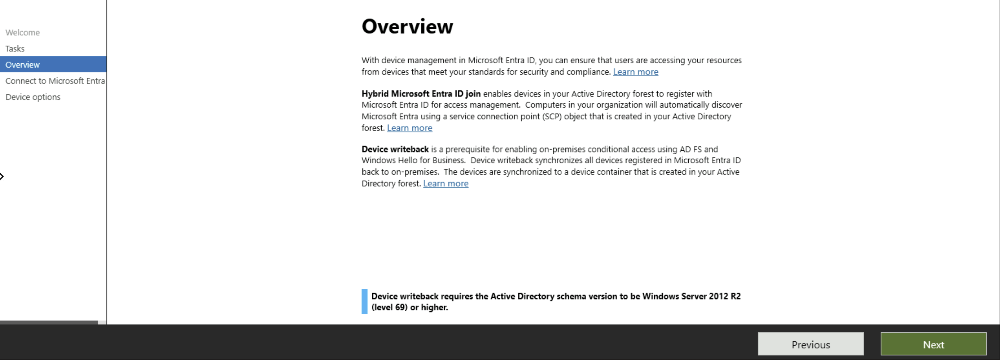

The overview page describes two features. Only the first applies here:

| Feature | Used |
|---|---|
| Hybrid Microsoft Entra ID join | Yes. Writes a service connection point into the forest so devices can discover the tenant |
| Device writeback | No. It is a prerequisite for on-premises Conditional Access via AD FS and Windows Hello for Business, neither of which this lab has |

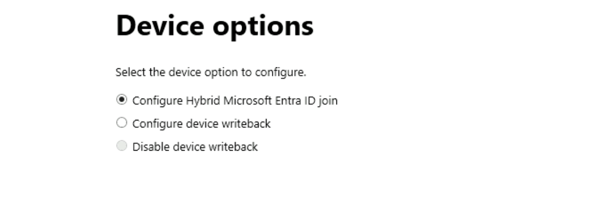

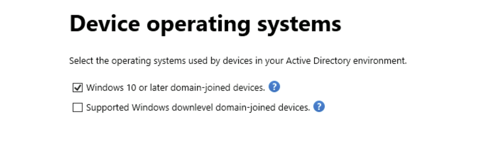

**Windows 10 or later domain-joined devices** covers Server 2016 and later, so the
Server 2022 clients qualify. The downlevel option is for Windows 7 and 8.1 and
needs extra components.

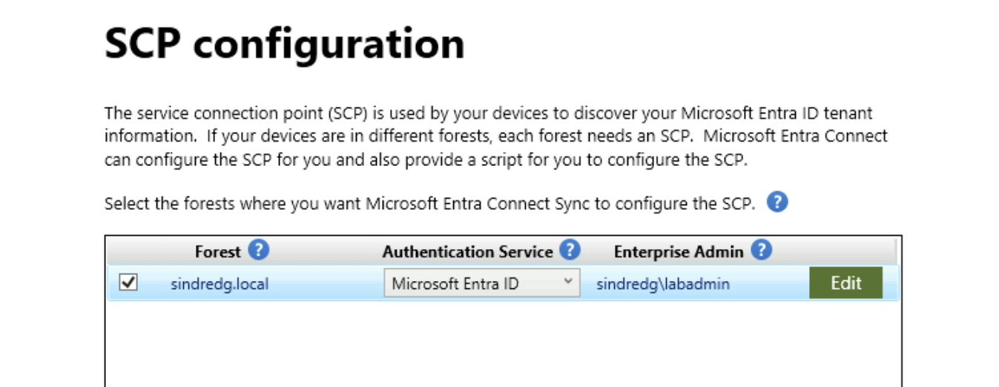

The forest is `sindredg.local` with **Microsoft Entra ID** as the authentication
service and `sindredg\labadmin` as the Enterprise Admin writing the object.

**Entra ID is the only valid choice here, and that traces back to Phase 2.** The
alternative is AD FS, which applies to federated domains. Password Hash
Synchronization makes this domain managed rather than federated, so there is no
federation server for the other option to point at.

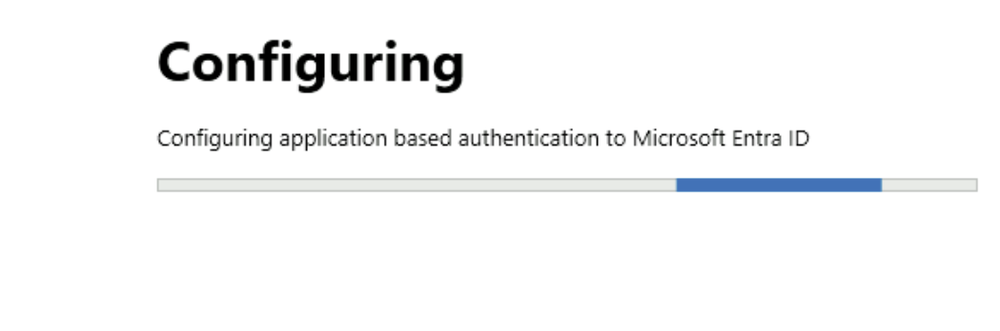

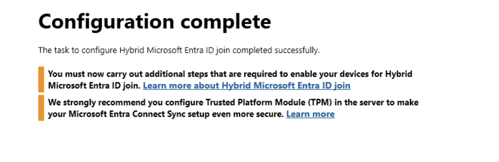

The two warnings on the completion page:

| Warning | Response |
|---|---|
| Additional steps required | Generic guidance. For domain-joined Server 2016 or later against a managed domain, the SCP plus a restart is the entire remaining process |
| Configure TPM on the server | Real but not actionable. Azure vTPM requires the VM to have been created with the Trusted Launch security type, and CS01 was not. Recorded in [risk-and-limitations.md](risk-and-limitations.md) |

**From CS01**, confirm what actually landed in the forest rather than trusting the
success message:

```powershell
Get-ADObject -Filter 'ObjectClass -eq "serviceConnectionPoint"' -SearchBase "CN=Device Registration Configuration,CN=Services,CN=Configuration,DC=sindredg,DC=local" -Properties keywords | Select-Object -ExpandProperty keywords
```

Two values come back, `azureADName:` with the tenant domain and `azureADId:` with
its GUID. That object is what every domain-joined machine reads to discover which
tenant to register against.

---

## 5. Device registration

**Hybrid join needs the computer objects in Entra before a client can register.**
The device object in the cloud is created from the synced computer object, and the
client then completes registration against it. This is the reason Phase 2 used
Connect Sync rather than Cloud Sync: Cloud Sync does not synchronise devices.

**From CS01**, force a sync rather than waiting for the 30 minute timer. The
`ADSync` module ships with Entra Connect but sits outside the default module path,
so it must be imported once per session:

```powershell
Import-Module "C:\Program Files\Microsoft Azure AD Sync\Bin\ADSync\ADSync.psd1"
```

```powershell
Start-ADSyncSyncCycle -PolicyType Initial
```

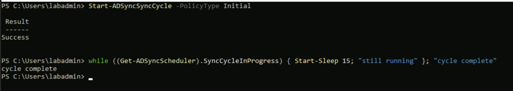

**`Initial`, not `Delta`.** A delta only picks up objects that changed since the
last run. Computer objects created after the previous full import have no change to
detect, so a delta leaves them invisible. This is the difference between the devices
appearing and not, and it is covered in the troubleshooting log.

```powershell
Get-ADSyncScheduler | Select-Object SyncCycleEnabled, SyncCycleInProgress, NextSyncCycleStartTimeInUTC
```

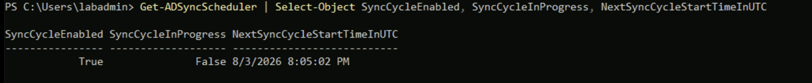

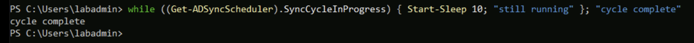

**From the workstation**, restart both clients so the registration task runs:

```bash
az vm restart --resource-group rg-branch-office --name CL01
```

```bash
az vm restart --resource-group rg-branch-office --name CL02
```

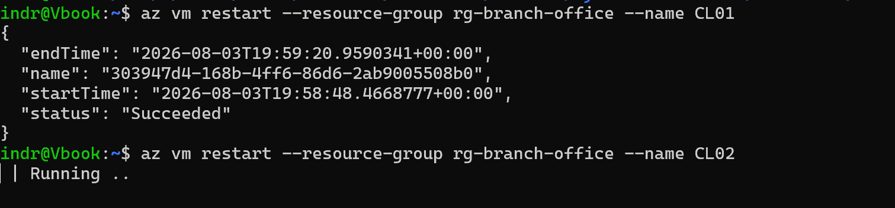

**From CL01 and CL02:**

```powershell
dsregcmd /status
```

Before the objects reached Entra, both clients reported the same thing:

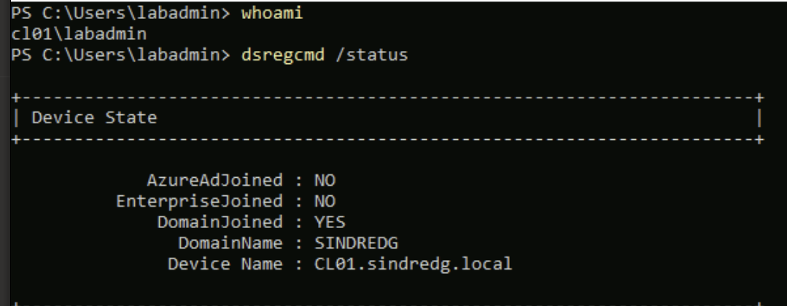

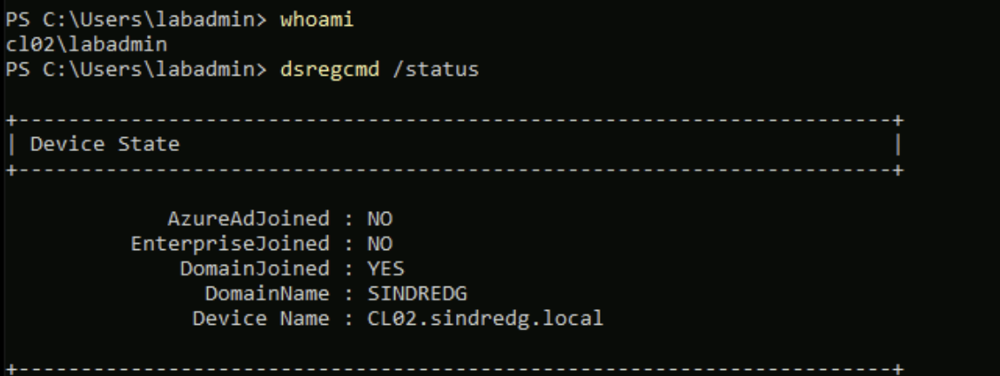

`DomainJoined: YES` with `AzureAdJoined: NO` is the signature of a device that
found its domain but has nothing in the cloud to attach to.

If the task has not run, trigger it rather than restarting again:

```powershell
Start-ScheduledTask -TaskPath "\Microsoft\Windows\Workplace Join\" -TaskName "Automatic-Device-Join"
```

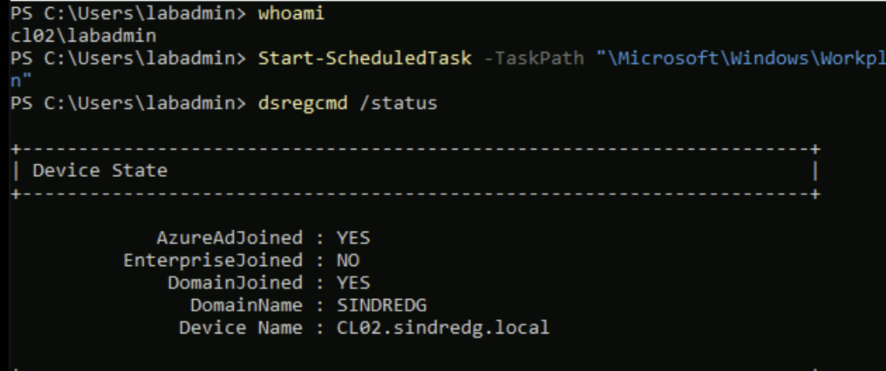

`AzureAdJoined: YES` and `DomainJoined: YES` together is a hybrid-joined device.

---

## 6. Verification

In the Entra admin center under Devices, CL01 registered first and CL02 lagged:

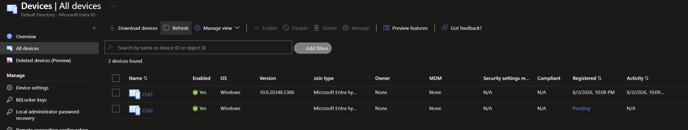

`Pending` means the computer object synced from AD but the machine itself has not
completed its side. Both eventually registered:

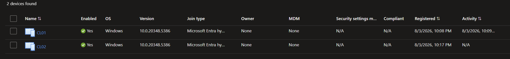

Two devices, join type **Microsoft Entra hybrid joined**, both enabled, both
reporting an OS version.

The same state read through Microsoft Graph, which shows the field that makes the
pending case diagnosable:

| Field | CL01 | CL02 before retry |
|---|---|---|
| `trustType` | `ServerAd` | `ServerAd` |
| `onPremisesSyncEnabled` | True | True |
| `onPremisesLastSyncDateTime` | 20:05:11Z | 20:05:11Z |
| `registrationDateTime` | 20:08:34Z | None |
| `operatingSystemVersion` | 10.0.20348.5386 | None |

**`operatingSystemVersion` is written by the device during registration, not by
the sync.** An object with the field empty has been created by Connect Sync and
never touched by the machine, which distinguishes "waiting" from "broken" without
having to guess.

---

## 7. Exit criteria

| Criterion | Command | Status |
|---|---|---|
| Sites and subnets defined | `Get-ADReplicationSubnet` binds both subnets to named sites | Done |
| Site awareness working | `nltest` reports `Our Site Name: Branch-DenmarkEast` | Done |
| Domain controller locatable | `nltest /dsgetdc:sindredg.local` from both clients | Done |
| Both clients domain-joined | `Get-ComputerInfo` reads `MemberServer` | Done |
| Computer objects in sync scope | Both under `OU=Workstations,OU=Sync` | Done |
| SCP written to the forest | `Get-ADObject` returns `azureADName` and `azureADId` | Done |
| Both devices in Entra | Devices blade lists two objects | Done |
| Both hybrid joined | `dsregcmd /status` shows both joins on both clients | Done |

---

## Next

[Phase 5](05-group-policy.md) builds the Group Policy estate these clients receive,
including the firewall policy that makes the ping behaviour in
[Phase 3](03-branch-network.md) a solved problem rather than an observation.
