# Phase 5. Group Policy foundation

**Built:** the Central Store, three GPOs, their links, security filtering and
client-side verification. Everything later is delivered by Group Policy: the
Phase 6 baselines, the Phase 7 LAPS policy and the Phase 8 logon restrictions all
arrive as GPOs.

> Managed from CS01 using GPMC and RSAT, not from the domain controller. Commands
> used in this phase: [group-policy.md](../cmd-sheets/group-policy.md).

One deliberate gap: the loopback demonstration is set up but not run, for the reason
in section 9. Failures along the way are in
[troubleshooting/05-group-policy.md](troubleshooting/05-group-policy.md).

---

## 1. Where each command runs

Several commands in this phase exist on more than one machine and do different
things depending on where you are.

| Section | Run from |
|---|---|
| 2. Recycle Bin | CS01 or DC01, it writes to the directory |
| 2. IE ESC | CS01 only, the component does not exist on Server Core |
| 3. Central Store | CS01, which holds the newest ADMX set |
| 4, 5, 6. GPO creation, settings, filtering | CS01 |
| 7. Verification | CL01 and CL02, then CS01 |

**All of it as `SINDREDG\labadmin`, not the local account of the same name.** Every
VM has a local `labadmin` from Terraform and a domain `labadmin` from the Phase 1
promotion. Signing in as the wrong one produces a failure that names the computer
rather than the account, which is the first entry in the troubleshooting log.

---

## 2. Carried-forward items

Two items were parked on this phase by earlier ones, and both are closed here.

### AD Recycle Bin

Flagged by the Entra Connect wizard in Phase 2 and recorded as open in
[risk-and-limitations.md](risk-and-limitations.md).

```powershell
Get-ADOptionalFeature -Filter 'Name -like "Recycle Bin*"' | Select-Object Name, EnabledScopes
```

```powershell
Enable-ADOptionalFeature 'Recycle Bin Feature' -Scope ForestOrConfigurationSet -Target sindredg.local
```

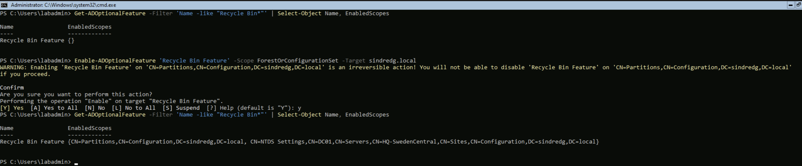

`EnabledScopes` reads `{}` before and holds two distinguished names after. That
field is the whole answer: the feature objects always exist in the directory, and
enabled or not is entirely whether anything is listed in it.

```
WARNING: Enabling 'Recycle Bin Feature' on 'CN=Partitions,CN=Configuration,
DC=sindredg,DC=local' is an irreversible action!
```

**Irreversible, and taken deliberately.** Enabled because Phase 7 extends the schema
and Phase 8 restructures OUs, and an accidental deletion during either would
otherwise be unrecoverable.

The same output lists Privileged Access Management immediately below, still at
`EnabledScopes : {}` and requiring `Windows2016Forest`.

### Internet Explorer Enhanced Security Configuration

Disabled on CS01 in Phase 2 so the Entra Connect wizard could sign in, and never
restored. A sync server is not the place to leave it off.

```powershell
Set-ItemProperty -Path 'HKLM:\SOFTWARE\Microsoft\Active Setup\Installed Components\{A509B1A7-37EF-4b3f-8CFC-4F3A74704073}' -Name IsInstalled -Value 1
```

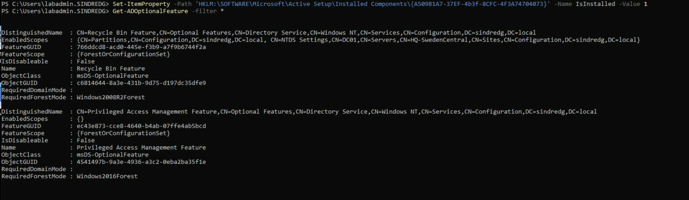

**Run on DC01 first, where it fails.** Server Core has no Internet Explorer, so the
Active Setup component genuinely does not exist there. The error names a missing
registry path rather than a missing feature, which is the troubleshooting log's
second entry.

**Consequence for Phase 6.** With ESC back on, the Security Compliance Toolkit
cannot comfortably be downloaded through a browser on CS01. Phase 6 fetches it with
`Invoke-WebRequest` instead. That is a smaller cost than leaving a sync server
unhardened.

---

## 3. The Central Store

ADMX templates live locally on each machine, so the settings an administrator can
see depend on which machine opened GPMC. The Central Store puts one copy in SYSVOL
so every editor sees the same policies. Microsoft describes it as "a file location
that's checked by the Group Policy tools by default"
([Create and manage the Central Store](https://learn.microsoft.com/troubleshoot/windows-client/group-policy/create-and-manage-central-store)).

**From CS01**, which runs Desktop Experience and carries the newest template set:

```powershell
Get-ChildItem C:\Windows\PolicyDefinitions\*.admx | Measure-Object
```

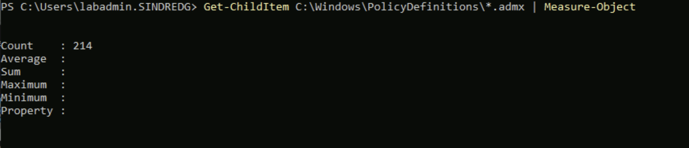

```powershell
Get-ChildItem C:\Windows\PolicyDefinitions\LAPS.admx
```

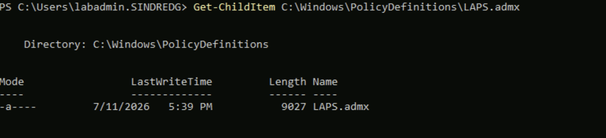

**Phase 7 depends on that file.** Windows LAPS ships in-box on a patched Server
2022, but the Central Store never populates itself, so a missing `LAPS.admx` would
surface two phases later as a policy that cannot be authored.

**Two file types, copied separately.** `.admx` files define the policies and `.adml`
files hold the display strings for them. Both are needed, and the language folder
does not travel with a wildcard copy of the parent:

```powershell
Copy-Item C:\Windows\PolicyDefinitions\* \\sindredg.local\SYSVOL\sindredg.local\Policies\PolicyDefinitions\ -Recurse
```

```powershell
Copy-Item C:\Windows\PolicyDefinitions\en-US \\sindredg.local\SYSVOL\sindredg.local\Policies\PolicyDefinitions\ -Recurse -Force
```

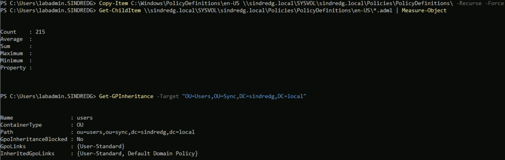

**Count both, not one.** A store holding templates without strings leaves GPMC able
to read the policies and unable to name them, surfacing as
[Extra Registry Settings](https://learn.microsoft.com/troubleshoot/windows-server/group-policy/group-policy-settings-show-as-extra-registry-settings).
That is worse than no store, because the tools prefer the store over the local copy
once one exists. Checking only the `.admx` count reports success on a half-copied
store, which is what happened here, see
[troubleshooting/05-group-policy.md](troubleshooting/05-group-policy.md).

| Checked | Source | Central Store |
|---|---|---|
| `*.admx` | 214 | 214 |
| `en-US\*.adml` | 215 | 215 |

```powershell
Compare-Object (Get-ChildItem C:\Windows\PolicyDefinitions\*.admx).BaseName (Get-ChildItem \\sindredg.local\SYSVOL\sindredg.local\Policies\PolicyDefinitions\en-US\*.adml).BaseName
```

```powershell
Get-ChildItem \\sindredg.local\SYSVOL\sindredg.local\Policies\PolicyDefinitions -Directory
```

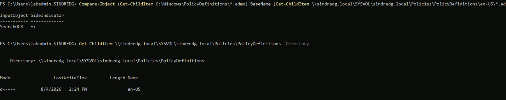

One result, `SearchOCR` with `=>`, meaning a language file with no matching
template. Harmless, the file is ignored. **The direction that matters is `<=`**, a
template with no strings, which fails the whole Administrative Templates node rather
than one entry. The directory listing shows `en-US` and nothing else, so neither copy
landed a level too deep.

Then GPMC, reopened so it re-reads the store:

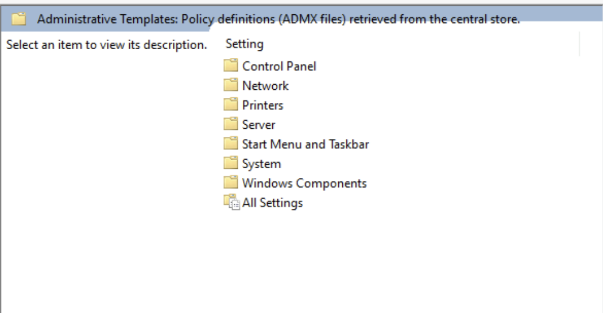

```
Administrative Templates: Policy definitions (ADMX files) retrieved from the central store.
```

The node renames itself when a store is found and no cmdlet reports it, so that
sentence is the evidence. Below it the categories load with their proper names,
which is what the `.adml` files bought.

Nothing was configured to make this happen. GPMC checks that SYSVOL path when it
loads, so the entire mechanism is a file copy with no client-side change.

### Reading the console

GPMC on CS01, before anything was created:

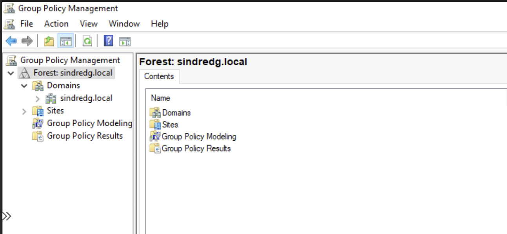

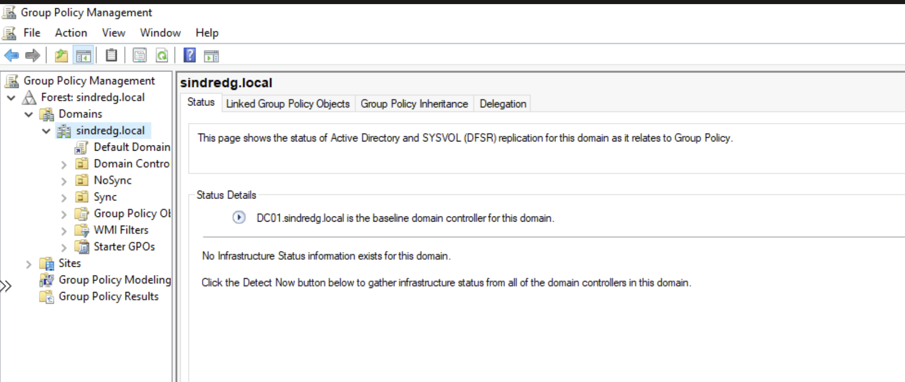

`DC01.sindredg.local is the baseline domain controller for this domain`, and the OU
structure from Phase 1 is visible in the tree as `Sync` and `NoSync`.

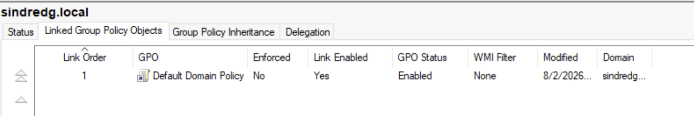

One link at the domain root, `Default Domain Policy`, link order 1. That GPO and
`Default Domain Controllers Policy` are left untouched throughout, so a mistake in
this phase is unlinked rather than untangled.

A throwaway GPO to inspect the editor without touching either default:

```powershell
New-GPO -Name "ZZ-CentralStoreCheck"
```

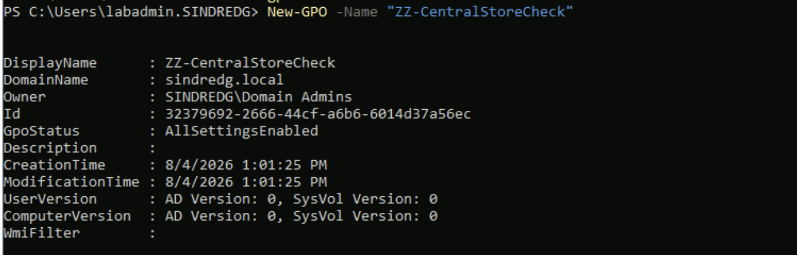

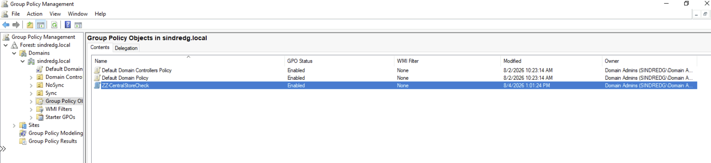

Right-clicking a GPO offers Edit, opening the Group Policy Management Editor.
Opening it changes nothing; a GPO is modified only when a value is set.

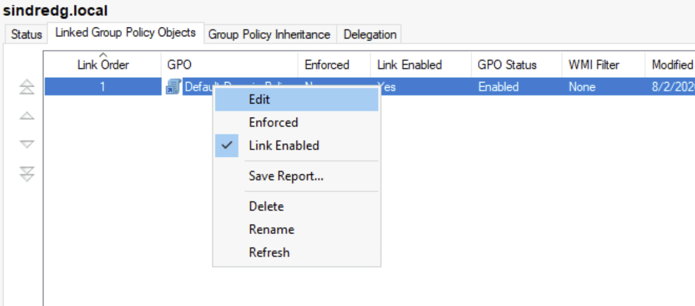

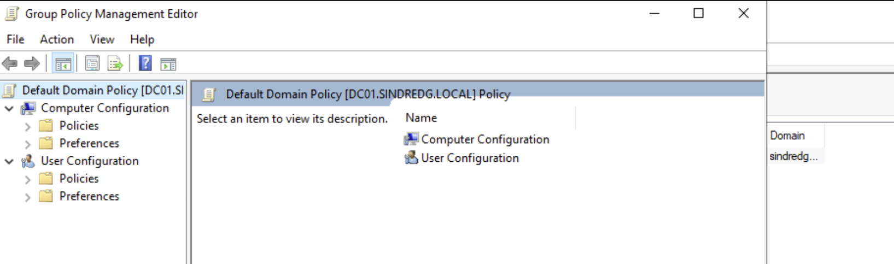

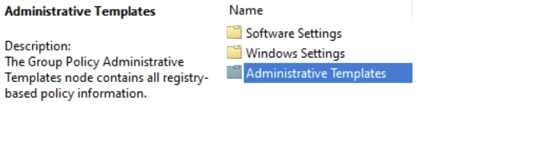

```powershell
Remove-GPO -Name "ZZ-CentralStoreCheck"
```

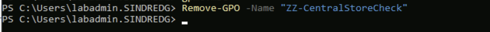

`Remove-GPO` deletes both halves of the object, the directory entry and the SYSVOL
folder. Deleting the folder by hand would leave the other half behind.

---

## 4. Structure

Policy is linked to the OU structure built in Phase 1. Names describe the target
rather than the setting, so a GPO can gain settings without its name going stale.

| GPO | Linked to | Type | Purpose |
|---|---|---|---|
| `Workstation-Baseline` | `OU=Workstations,OU=Sync` | Computer | Endpoint baseline |
| `User-Standard` | `OU=Users,OU=Sync` | User | Standard user configuration |
| `Loopback-Demo` | `OU=Workstations,OU=Sync`, filtered to CL02 | Computer | Loopback demonstration |

### Workstation-Baseline

```powershell
New-GPO -Name "Workstation-Baseline" -Comment "Phase 5. Endpoint computer baseline."
```

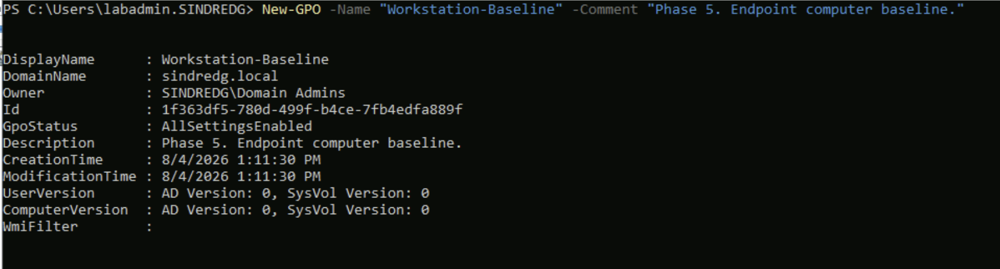

```powershell
New-GPLink -Name "Workstation-Baseline" -Target "OU=Workstations,OU=Sync,DC=sindredg,DC=local"
```

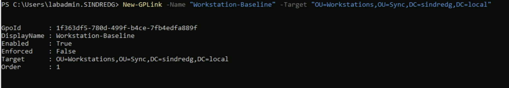

**Inbound ICMP**, which closes an observation left open since Phase 3 and named
again at the end of Phase 4. Firewall rules are not registry policy, but the
`NetSecurity` module writes directly into a GPO's policy store:

```powershell
New-NetFirewallRule -PolicyStore "sindredg.local\Workstation-Baseline" -DisplayName "Allow ICMPv4-In (lab)" -Direction Inbound -Protocol ICMPv4 -IcmpType 8 -RemoteAddress 10.10.1.0/24,10.20.1.0/24 -Action Allow -Profile Domain
```

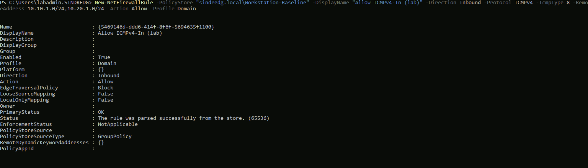

`PolicyStoreSourceType : GroupPolicy` confirms the rule went to the GPO rather than
to the local machine.

**Scoped to the two real subnets rather than `10.0.0.0/8`.** The supernet would work
and would also permit sixteen million addresses this lab will never have. The pair
used is exactly the two subnets Phase 4 registered in AD Sites and Services.
`AzureBastionSubnet` is absent, because Bastion reaches the VMs over RDP and never
pings them.

**Two WMI rules, added once the verification in section 6 needed them.** Querying
resultant policy from CS01 goes over RPC and WMI, which the client firewall also
blocks. Rather than open ports by hand on each machine, it became part of the
baseline:

```powershell
New-NetFirewallRule -PolicyStore "sindredg.local\Workstation-Baseline" -DisplayName "Allow WMI-In RPC endpoint mapper (lab)" -Direction Inbound -Protocol TCP -LocalPort RPCEPMap -Program "%SystemRoot%\system32\svchost.exe" -Service RpcSs -RemoteAddress 10.10.1.0/24 -Action Allow -Profile Domain
```

```powershell
New-NetFirewallRule -PolicyStore "sindredg.local\Workstation-Baseline" -DisplayName "Allow WMI-In WinMgmt (lab)" -Direction Inbound -Protocol TCP -LocalPort RPC -Program "%SystemRoot%\system32\svchost.exe" -Service Winmgmt -RemoteAddress 10.10.1.0/24 -Action Allow -Profile Domain
```

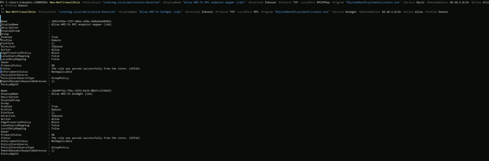

Both are scoped to the HQ subnet and bound to a specific service and program, so
they admit management traffic from the management server and nothing else. The
alternative, disabling the firewall, would never have identified which port mattered.

Then three registry-policy settings, an inactivity limit and a logon banner:

```powershell
Set-GPRegistryValue -Name "Workstation-Baseline" -Key "HKLM\Software\Microsoft\Windows\CurrentVersion\Policies\System" -ValueName "InactivityTimeoutSecs" -Type DWord -Value 900
```

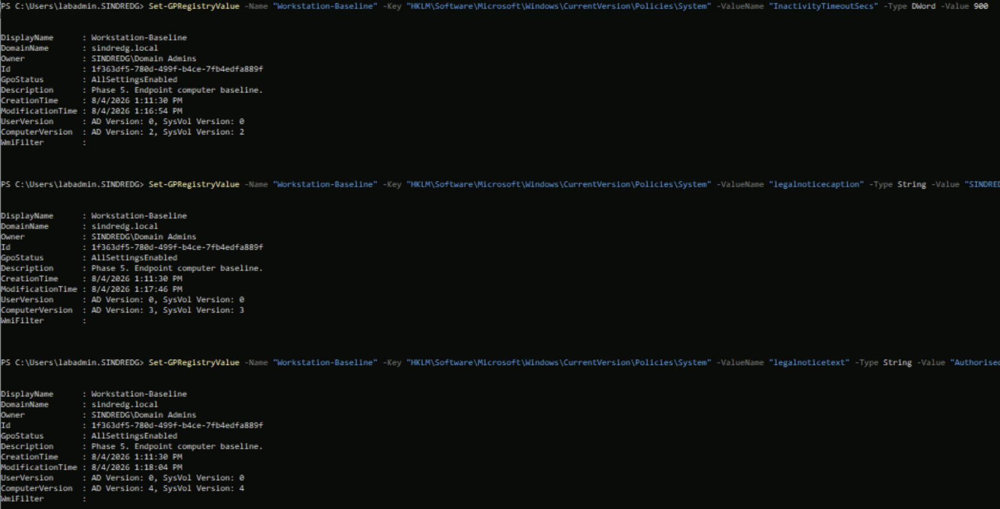

**The version counter is the useful part of that output.** `ComputerVersion` steps
from 2 to 3 to 4 across the three writes while `UserVersion` stays at 0. Each half of
a GPO carries its own version number, so watching one move confirms which half a
change landed in without opening the editor.

### User-Standard

```powershell
New-GPO -Name "User-Standard" -Comment "Phase 5. Standard user configuration."
```

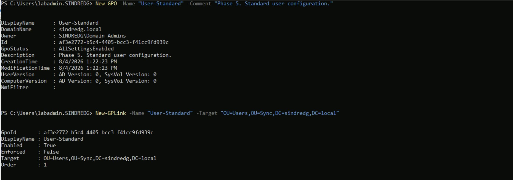

**The Seamless SSO requirement.** Enabling Seamless SSO in Phase 2 created the
`AZUREADSSOACC` account, but the feature does nothing until browsers are told to
treat the Entra endpoint as an intranet site and send it a Kerberos ticket. That
instruction is a Group Policy setting, which is why
[risk-and-limitations.md](risk-and-limitations.md) named Phase 5 as where Seamless
SSO gets finished.

```powershell
Set-GPRegistryValue -Name "User-Standard" -Key "HKCU\Software\Policies\Microsoft\Windows\CurrentVersion\Internet Settings\ZoneMapKey" -ValueName "https://autologon.microsoftazuread-sso.com" -Type String -Value "1"
```

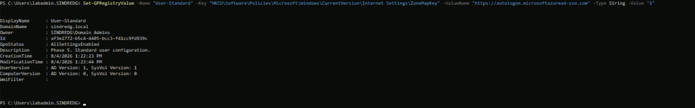

Zone `1` is Local Intranet. The companion setting allows script access to the
status bar in that zone, where `2103` is the setting number and `0` means enabled:

```powershell
Set-GPRegistryValue -Name "User-Standard" -Key "HKCU\Software\Policies\Microsoft\Windows\CurrentVersion\Internet Settings\Zones\1" -ValueName "2103" -Type DWord -Value 0
```

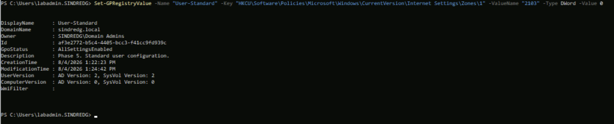

A screen saver lock, which is both a reasonable default and a value the loopback
demonstration in section 7 will deliberately conflict with:

```powershell
Set-GPRegistryValue -Name "User-Standard" -Key "HKCU\Software\Policies\Microsoft\Windows\Control Panel\Desktop" -ValueName "ScreenSaveTimeOut" -Type String -Value "600"
```

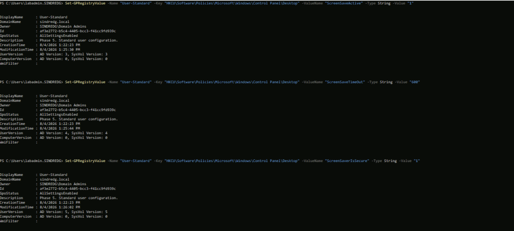

`UserVersion` climbs 1 through 5 while `ComputerVersion` stays at 0, the mirror
image of `Workstation-Baseline`.

### Disabling the unused half

```powershell
(Get-GPO -Name "Workstation-Baseline").GpoStatus = "UserSettingsDisabled"
```

```powershell
(Get-GPO -Name "User-Standard").GpoStatus = "ComputerSettingsDisabled"
```

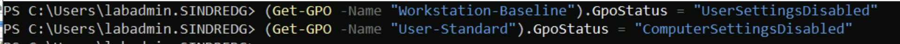

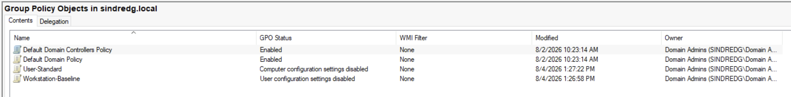

A GPO whose user half is empty is still evaluated at every logon. Turning off the
empty half removes that work and documents intent at the same time.

### Confirming the estate

```powershell
Get-GPO -All
```

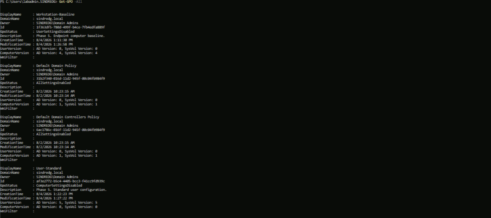

Four objects. The two Microsoft defaults untouched at `AllSettingsEnabled`, and the
two new ones each with one half disabled.

```powershell
Get-GPInheritance -Target "OU=Workstations,OU=Sync,DC=sindredg,DC=local"
```

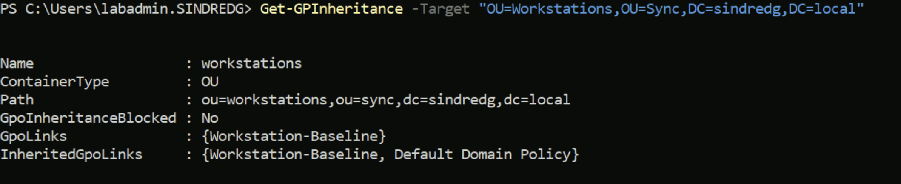

| Field | Value | Meaning |
|---|---|---|
| `GpoLinks` | `{Workstation-Baseline}` | Linked at this OU |
| `InheritedGpoLinks` | `{Workstation-Baseline, Default Domain Policy}` | Everything that reaches objects here |
| `GpoInheritanceBlocked` | `No` | Nothing above is being cut off |

`Default Domain Policy` in the inherited list is Local, Site, Domain, OU processing
order visible in one field. The domain-linked GPO still applies; the OU-linked one is
evaluated after it and wins on conflict.

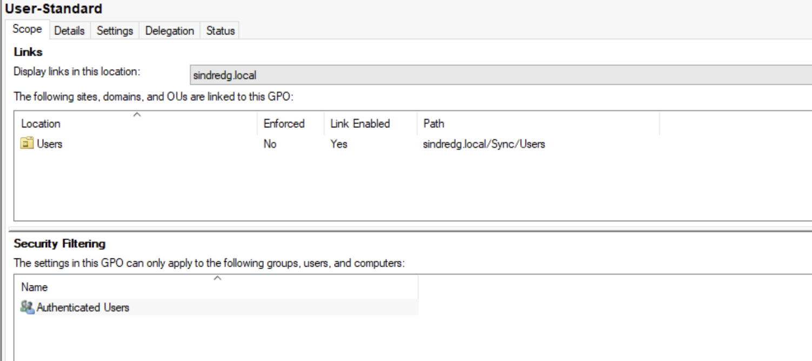

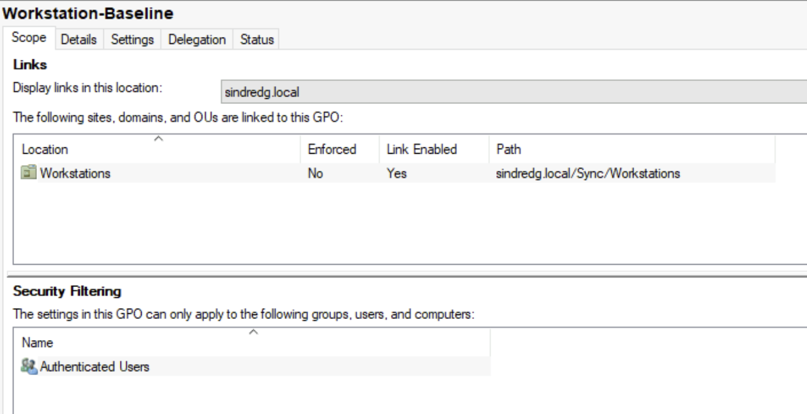

Both show `Authenticated Users` under Security Filtering, which is the default and
means every user or computer in the linked OU receives the policy.

---

## 5. Security filtering

Two clients sit in one OU and Phase 7 will give them different LAPS policies. That
requirement is what forces filtering, and it is rehearsed here on a GPO where a
mistake costs nothing.

```powershell
New-GPO -Name "Loopback-Demo" -Comment "Phase 5. Loopback demonstration, CL02 only."
```

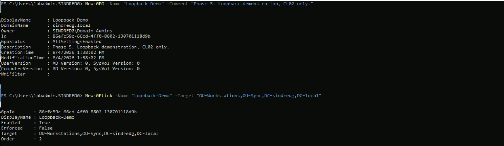

Link order 2, below `Workstation-Baseline`, so the baseline is applied last and
wins on any conflict.

```powershell
Set-GPPermission -Name "Loopback-Demo" -TargetName "Authenticated Users" -TargetType Group -PermissionLevel None
```

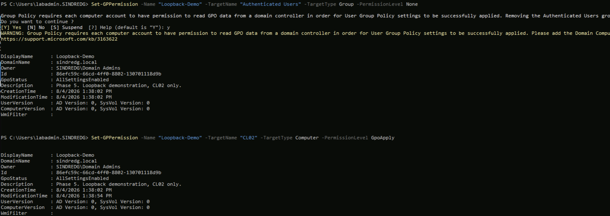

The cmdlet warns before it acts:

```
Group Policy requires each computer account to have permission to read GPO data
from a domain controller in order for User Group Policy settings to be
successfully applied.
```

Since MS16-072, Group Policy is retrieved in the **computer's** security context
rather than the user's. A GPO filtered to a user group therefore also needs
`Authenticated Users` or `Domain Computers` holding Read on the Delegation tab, or it
silently stops applying to everyone. Not an issue here, since the replacement
principal is a computer.

```powershell
Set-GPPermission -Name "Loopback-Demo" -TargetName "CL02" -TargetType Computer -PermissionLevel GpoApply
```

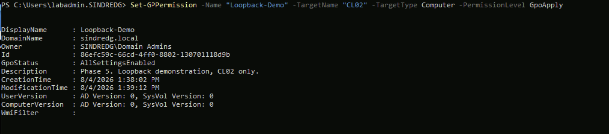

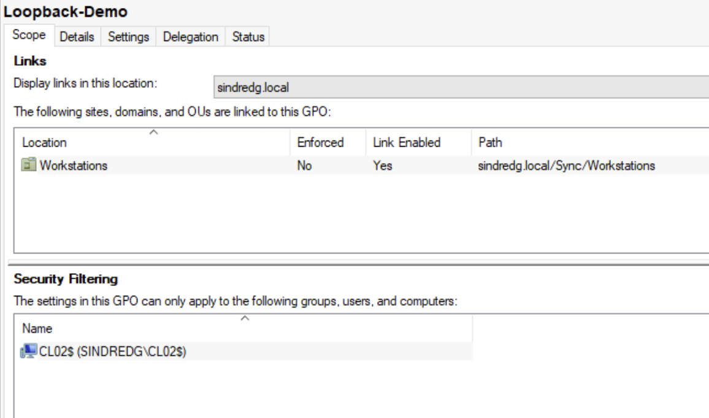

Security Filtering now lists `CL02$ (SINDREDG\CL02$)` and nothing else. **A GPO
applies only where the target holds both Read and Apply group policy**, and the GPMC
Scope tab is a readable view of that ACL.

---

## 6. Verification: the policy reaching a client

Group Policy reporting its own success is weak evidence. The firewall rule is better,
because its effect is observable from a second machine that has no part in the policy.

### Before

**From CL01:**

```powershell
gpresult /r /scope:computer
```

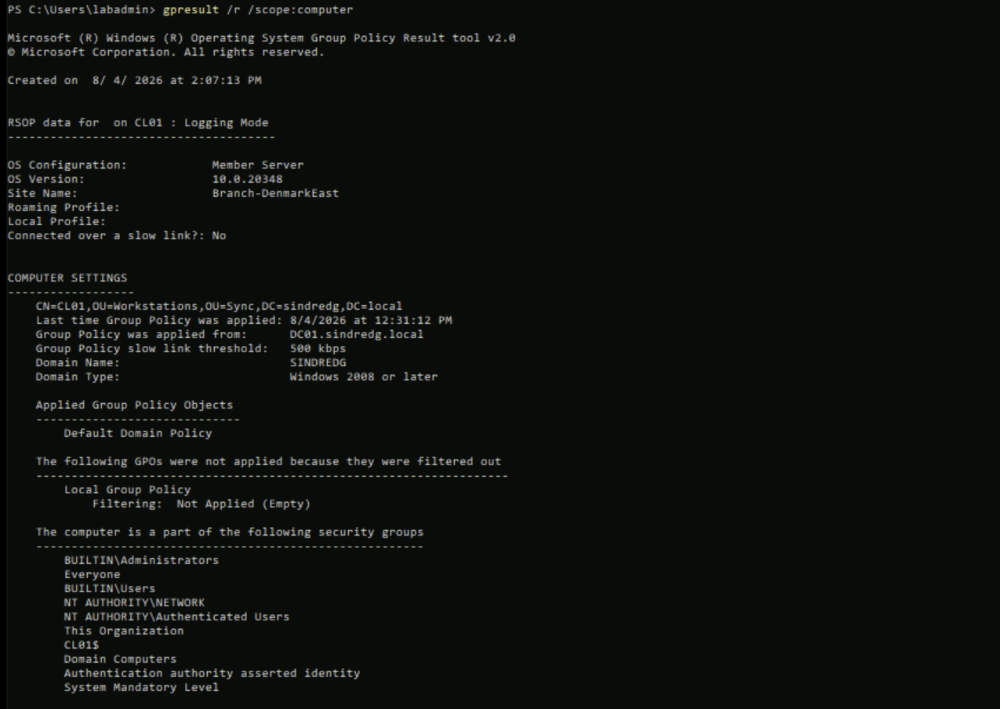

`CN=CL01,OU=Workstations,OU=Sync,DC=sindredg,DC=local` confirms the object is in the
linked OU, and the applied list holds `Default Domain Policy` alone.

```powershell
Test-NetConnection CS01 -InformationLevel Detailed
```

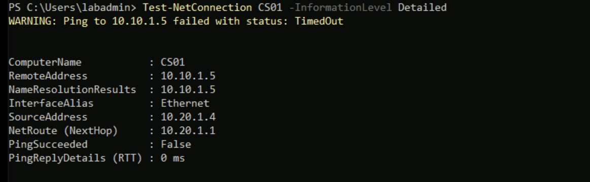

**From CS01:**

```powershell
Test-NetConnection CL01 -InformationLevel Detailed
```

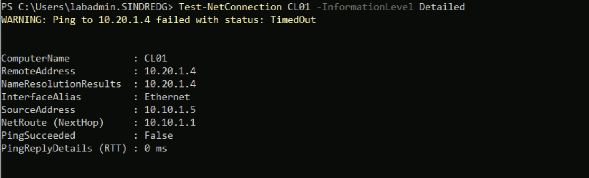

`PingSucceeded : False` in both directions across the peering.

**From CL01 to its neighbour in the same subnet:**

```powershell
ping cl02
```

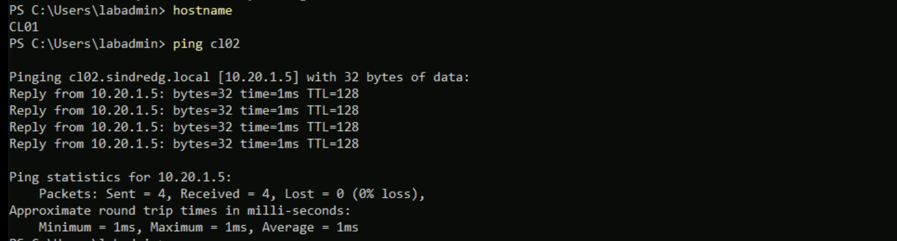

Four replies at 1 ms, which explains Phase 3. Windows Firewall ships an inbound echo
rule scoped to the local subnet, so the two branch clients could always reach each
other and never anything across the peering. The block was never about the network.

### The change

```powershell
gpupdate /force
```

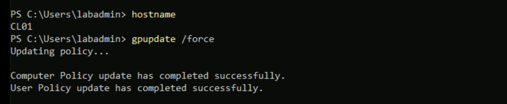

### After

**From CS01:**

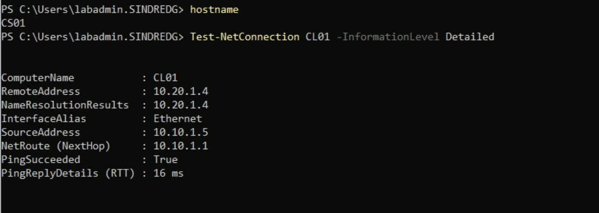

`PingSucceeded : True` at **16 ms**, which is the same cross-region latency Phase 3
measured to DC01. One `gpupdate` on the client changed what a different machine in
another country can observe, and nothing about the network was touched.

**From CL01, the same command as before:**

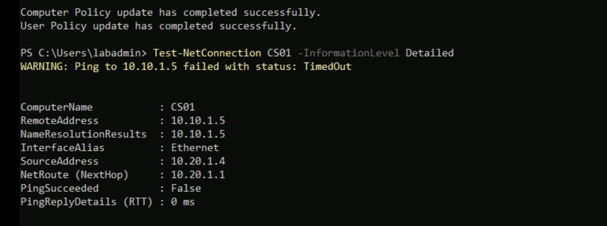

Still `False`, and **that is the correct result rather than a partial failure**. The
rule is inbound on machines that receive `Workstation-Baseline`. CS01 does not
receive it, so CS01 still drops inbound echo. The asymmetry is the proof: had the
peering or an NSG changed, both directions would have come back at once.

### What the client says

```powershell
gpresult /r /scope:computer
```

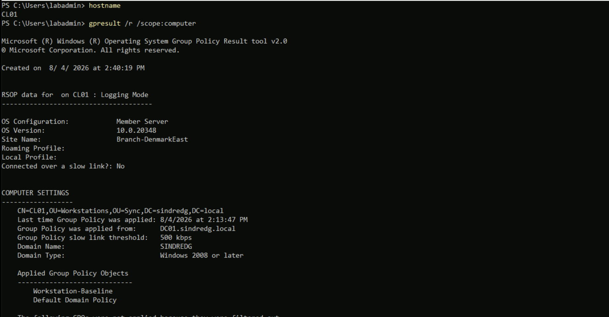

`Workstation-Baseline` now sits above `Default Domain Policy` in the applied list,
which is link order and processing order agreeing with each other.

The rule itself, on both clients, read from the store the firewall is actually
enforcing rather than from the GPO that supplied it:

```powershell
Get-NetFirewallRule -PolicyStore ActiveStore -DisplayName "Allow ICMPv4-In (lab)" | Select-Object DisplayName, PolicyStoreSource, Enabled
```

```powershell
Get-WinEvent -LogName "Microsoft-Windows-GroupPolicy/Operational" -MaxEvents 20 | Select-Object TimeCreated, Id, Message
```

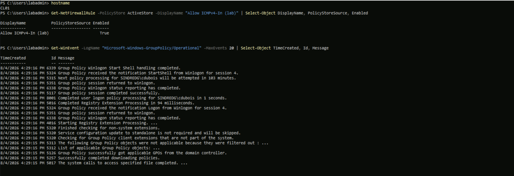

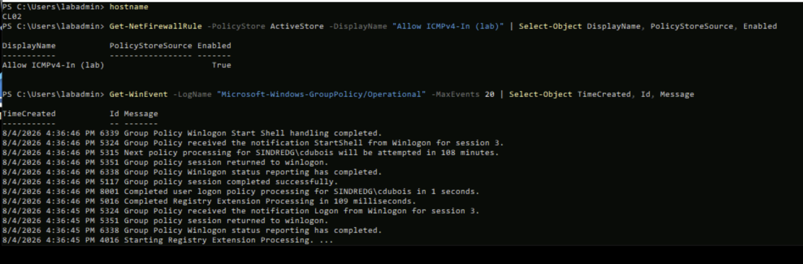

A rule nobody created locally is present and enabled on both machines. The
operational log carries the matching story, including event 5126, "Group Policy
successfully got applicable GPOs from the domain controller", and event 5313, which
names the objects that were filtered out.

### Resultant Set of Policy, from the management server

```powershell
Get-GPResultantSetOfPolicy -Computer CL01 -ReportType Html -Path C:\rsop-cl01.html
```

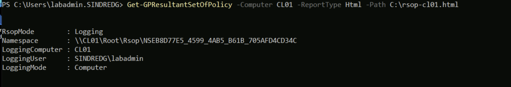

`RsopMode : Logging` and `LoggingMode : Computer`. **Logging mode reports what
already happened on a real machine.** The counterpart is Group Policy Modeling, which
simulates a combination that has never occurred and is the safer order for anything
that could lock an account out
([Group Policy Modeling and Group Policy Results](https://learn.microsoft.com/windows-server/identity/ad-ds/manage/group-policy/group-policy-modeling-results)).

Adding a user requires that the user has signed in to that computer, since logging
mode reads what was recorded at logon rather than predicting it:

```powershell
Get-GPResultantSetOfPolicy -Computer CL02 -User SINDREDG\cdubois -ReportType Html -Path C:\rsop-cl02.html
```

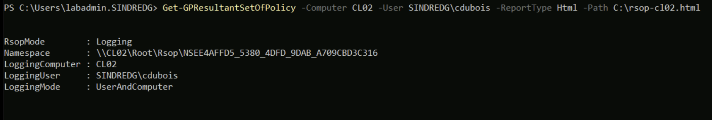

`LoggingMode : UserAndComputer`, which is both halves of the policy for a real user
on a real machine.

---

## 7. A seed user on a client

Proving that user policy follows the user object needs a user whose object sits in
`OU=Users,OU=Sync`. `labadmin` does not qualify, so `cdubois` was used, one of the
five accounts seeded in Phase 1.

`02-ad-structure.ps1` creates the seed users with `-ChangePasswordAtLogon $true`,
which is correct for unused accounts and awkward over Bastion, where a forced
password change at the logon screen is hard to complete. The password was reset and
the flag cleared before the first sign-in.

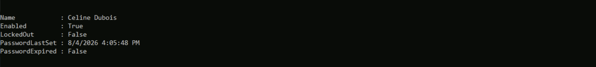

`Enabled : True`, `LockedOut : False` and `PasswordExpired : False`, all worth
checking before blaming Group Policy for a logon that does not work.

Domain users then cannot sign in over Bastion without the right to do so, which lives
in the local `Remote Desktop Users` group on the target:

```powershell
Add-LocalGroupMember -Group "Remote Desktop Users" -Member "SINDREDG\cdubois"
```

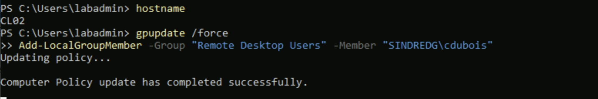

**Done locally rather than by policy, which is a shortcut.** The durable version is a
Group Policy Preferences local group item, applying to every machine in the OU and
surviving a rebuild. It has no PowerShell equivalent and has to be built in GPMC, so
it was skipped here. Phase 8 revisits local group membership properly.

```powershell
whoami
```

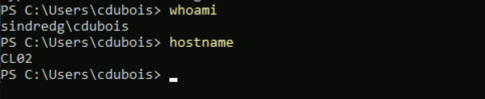

`sindredg\cdubois` on CL02, which is what made the `UserAndComputer` report above
possible.

---

## 8. Targeting is by OU, not by machine

`gpresult` on CS01 before any of this existed:

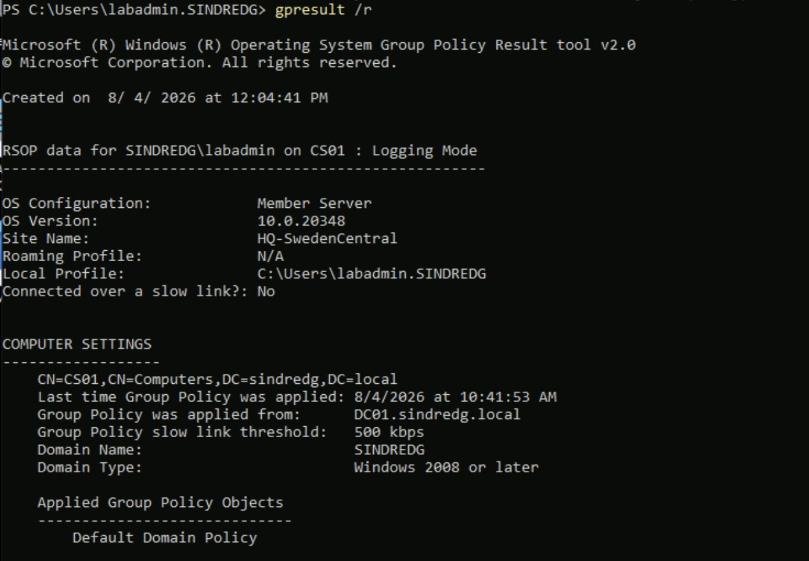

```
CN=CS01,CN=Computers,DC=sindredg,DC=local
Applied Group Policy Objects
    Default Domain Policy
```

**CS01 sits in `CN=Computers`, not in an OU**, because it joined the domain in
Phase 1 before the structure existed. `Workstation-Baseline` is linked to
`OU=Workstations,OU=Sync` and does not reach it, which is correct for a management
server. That is what the ping asymmetry in section 6 is measuring.

It cannot be fixed by linking either, because `CN=Computers` is a container rather
than an OU and **a GPO cannot be linked to a container**. That is why Phase 1 built a
real OU structure and why Phase 4 joined both clients with `-OUPath`.

---

## 9. The loopback demonstration, and why it was not run

`Loopback-Demo` exists, is linked, and is filtered to CL02. What it does not contain
is the loopback setting itself.

Loopback applies the user half of the GPOs assigned to the **computer**, regardless
of who signs in. Microsoft describes it as intended for "special-use computers, such
as classrooms, public kiosks, and reception areas", with two modes: Merge, where the
computer's user settings are appended to the user's own and win on conflict, and
Replace, where the user's own GPOs are never gathered at all
([Group Policy processing](https://learn.microsoft.com/windows-server/identity/ad-ds/manage/group-policy/group-policy-processing#loopback-processing-mode),
[KB 231287](https://learn.microsoft.com/troubleshoot/windows-server/group-policy/loopback-processing-of-group-policy)).

The remaining step is one registry value and two logons:

```powershell
Set-GPRegistryValue -Name "Loopback-Demo" -Key "HKLM\Software\Policies\Microsoft\Windows\System" -ValueName "UserPolicyMode" -Type DWord -Value 1
```

**Why it stops here.** CL02 is the untouched control that Phase 6 measures a hardened
CL01 against, so leaving a policy on it that changes user configuration would weaken
that comparison. Everything the demonstration needs is in place and can run later
against a machine whose job is not to be a control.

`Loopback-Demo` was unlinked before closing the phase:

```powershell
Remove-GPLink -Name "Loopback-Demo" -Target "OU=Workstations,OU=Sync,DC=sindredg,DC=local"
```

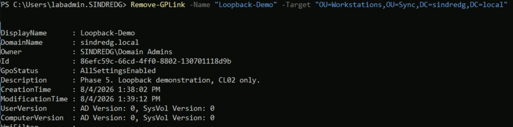

`UserVersion` and `ComputerVersion` both still reading `AD Version: 0, SysVol
Version: 0` confirms the GPO was created, linked and filtered and never had a setting
written to it. The filtering work in section 5 stands on its own, and the GPO
survives unlinked.

---

## 10. Exit criteria

| Criterion | Command | Status |
|---|---|---|
| Recycle Bin enabled | `Get-ADOptionalFeature` shows populated `EnabledScopes` | Done |
| IE ESC restored on CS01 | `IsInstalled` back to 1 | Done |
| Central Store populated | 214 `.admx` and 215 `.adml` in SYSVOL, pairing checked | Done |
| Central Store in use | GPMC node reads "retrieved from the central store" | Done |
| Computer and user GPOs linked to the right OUs | `Get-GPInheritance` on both OUs | Done |
| Unused halves disabled | `Get-GPO -All` shows both `GpoStatus` values | Done |
| Security filtering applied | Scope tab lists `CL02$` only | Done |
| Policy observably changes a client | Ping across the peering, failing before and 16 ms after | Done |
| Policy confirmed on the client | `gpresult`, `ActiveStore` firewall rule, operational event log | Done |
| Resultant policy from the management server | `Get-GPResultantSetOfPolicy` for CL01, and CL02 with a user | Done |
| Targeting follows the OU | CS01 in `CN=Computers` receives nothing, and still refuses ICMP | Done |
| CL02 left clean for Phase 6 | `Loopback-Demo` unlinked, both versions still at 0 | Done |
| Loopback demonstrated | Deferred, with the reason recorded in section 9 | Deferred |

---

## Next

[Phase 6](06-security-baselines.md) imports Microsoft's baselines as GPOs and
measures what they change.
