# Phase 6. Security baselines

**Goal:** apply Microsoft's own hardening guidance to one endpoint, leave the other
untouched, and measure the difference rather than trusting it.

> Managed from CS01. Commands used in this phase:
> [group-policy.md](../cmd-sheets/group-policy.md).

**Why two clients.** A single machine only lets you assert that a baseline was
applied. A hardened machine beside an untouched one turns that assertion into a
comparison, and the comparison is the deliverable.

**Status: complete.** Baseline deployed to CL01, CL02 held as control, differences
recorded. Problems hit along the way are in
[troubleshooting/06-security-baselines.md](troubleshooting/06-security-baselines.md).

---

## 1. Which baseline

The Security Compliance Toolkit ships baselines for Windows Server 2025, 2022, 2019
and 2016 ([SCT contents](https://learn.microsoft.com/windows/security/operating-system-security/device-management/windows-security-configuration-framework/security-compliance-toolkit-10)).
The clients run Server 2022 build 20348, so the Server 2022 baseline is the matching
one.

**Version-matched deliberately.** The 2025 baseline is more prominent on the download
page and would have applied without error, but settings referencing policies that do
not exist on 2022 simply never take effect. They would then appear as unexplained
gaps in the comparison, and half the findings in section 4 would need qualifying.
Reasoning recorded in [decisions.md](decisions.md).

The pack contains eight GPO backups. Only one was imported:

```powershell
Import-GPO -BackupGpoName "MSFT Windows Server 2022 - Member Server" -Path "C:\SCT\GPOs" -TargetName "Baseline-MemberServer-2022" -CreateIfNeeded
```

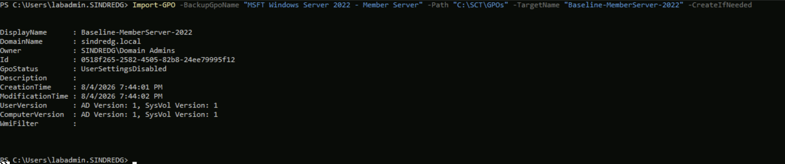

`GpoStatus : UserSettingsDisabled` came across from Microsoft's backup rather than
being set afterwards. A member server baseline is computer configuration, and the
half that holds nothing is switched off at source.

**Domain Controller and Domain Security were deliberately left out.** The first
belongs on DC01 and is not what this phase measures. The second is domain-wide, so it
would reach CL02 and destroy the control.

---

## 2. Scope it to one client

Both clients live in `OU=Workstations,OU=Sync`, so linking alone would harden both.
Security filtering is what keeps CL02 clean, and it is the mechanism rehearsed on
`Loopback-Demo` in Phase 5 for exactly this moment.

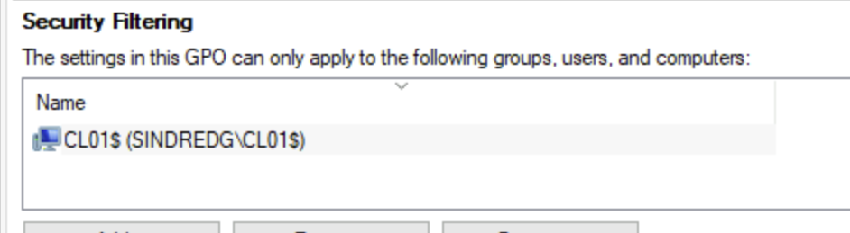

`CL01$` and nothing else. `Authenticated Users` was removed, which triggers the
MS16-072 warning covered in Phase 5.

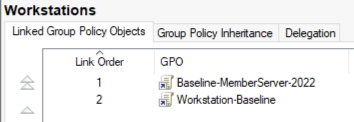

**Link order 1, above `Workstation-Baseline`.** Lowest number is applied last and
wins on conflict. Putting the lab's own GPO on top would mean measuring an opinion of
the baseline rather than the baseline itself, and any setting it overrode would be
invisible in the results.

---

## 3. Predict before applying

Group Policy Modeling simulates the outcome on the domain controller without touching
either machine, which is the safe order for anything that changes logon rights.

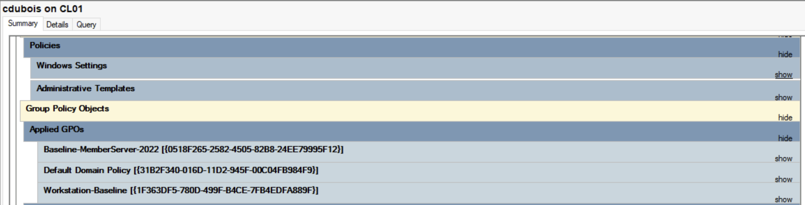

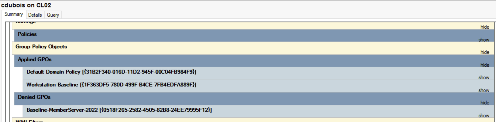

CL01 lists `Baseline-MemberServer-2022` under **Applied GPOs**. CL02 lists it under
**Denied GPOs**, which is the security filtering confirmed as an outcome rather than
as an intention. Had it read the other way, the control would have been contaminated
on the next refresh, and security settings delivered through templates do not reliably
revert when a GPO stops applying.

---

## 4. What the baseline changed

### An entire policy category appears

The clearest single difference is structural. Same report, same user, two machines:

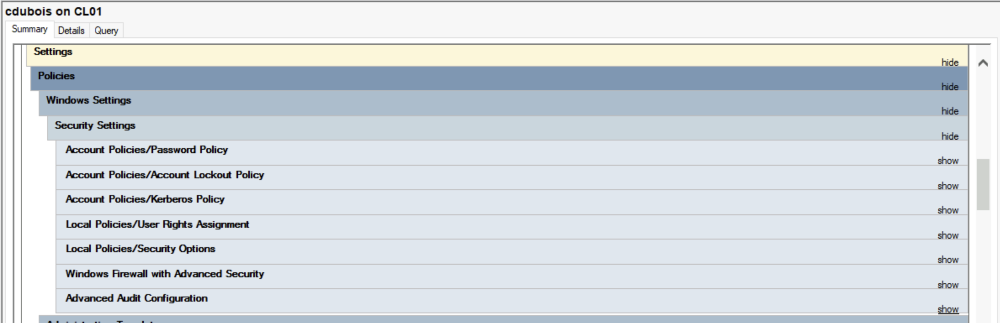

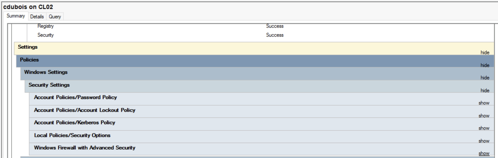

CL01 carries **User Rights Assignment** and **Advanced Audit Configuration**. CL02 has
neither. These are not settings with different values, they are whole categories that
exist on one machine and not the other.

### User rights, and the Winning GPO column

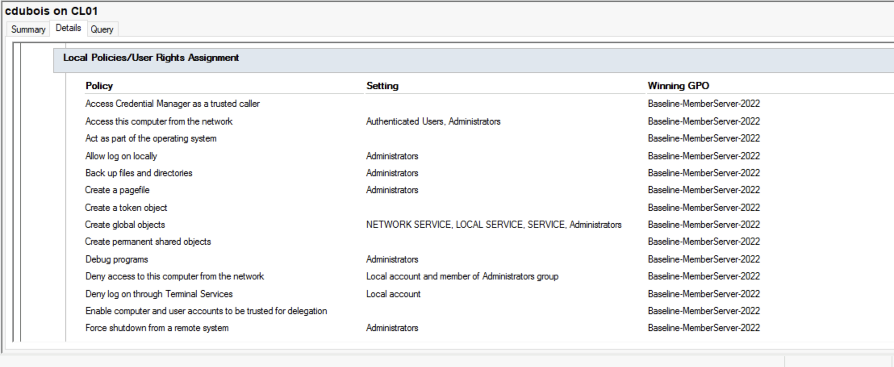

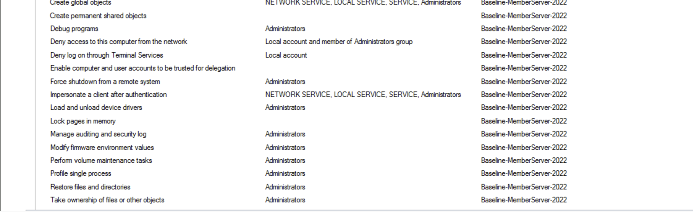

Every row reads `Baseline-MemberServer-2022` in the Winning GPO column, which is link
order from section 2 doing its job. Three rows explain the behaviour observed on the
machine:

| Policy | Setting |
|---|---|
| Allow log on locally | `Administrators` |
| Deny access to this computer from the network | `Local account and member of Administrators group` |
| Deny log on through Terminal Services | `Local account` |

**This is what broke, and it broke correctly.** CL01 can no longer be signed into with
the local `labadmin` account over Bastion, only with domain credentials. The flat
local-administrator credential that [risk-and-limitations.md](risk-and-limitations.md)
entry 3 names as a weakness is now refused by policy on the hardened endpoint. Deny
rights beat allow rights, so no group membership works around it.

### The firewall, where the prediction was wrong

The expectation going in was that baseline firewall settings would replace the ICMP
and WMI rules built in Phase 5.

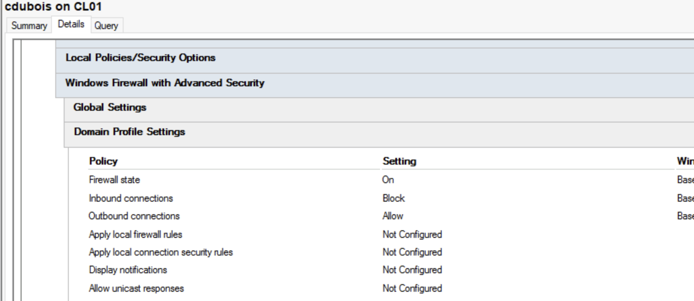

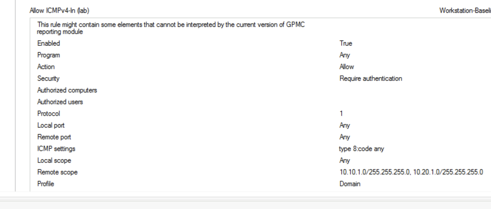

The baseline owns the **profile**: firewall on, inbound blocked, outbound allowed, all
winning from `Baseline-MemberServer-2022`. The **rules** are a separate list, and
`Allow ICMPv4-In (lab)` still names `Workstation-Baseline` as its winning GPO, with
the `10.10.1.0/24, 10.20.1.0/24` scope it was given in Phase 5. The WMI rules behave
the same way.

Profile settings and rule sets merge rather than compete. Recorded because the
prediction was wrong, and a corrected prediction is worth more than one never written
down.

### SmartScreen, found by accident

The baseline sets SmartScreen to warn and prevent bypass. On a machine that cannot
reach the SmartScreen service, that fails closed.

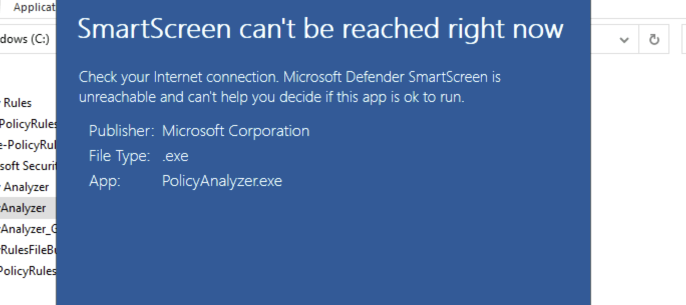

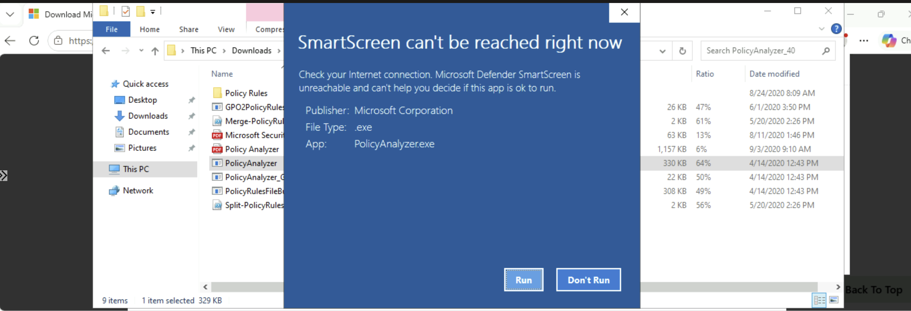

Same executable, same dialog, two machines. CL01 offers no way to continue. CL02
offers **Run**. The only difference between them is the GPO.

It is also the phase's most useful accident, because the blocked tool was Policy
Analyzer itself. Covered in the troubleshooting log with the exception made to run it.

---

## 5. Why Policy Analyzer was abandoned

The original plan was to capture effective state on both clients with Policy Analyzer
and diff the exports.

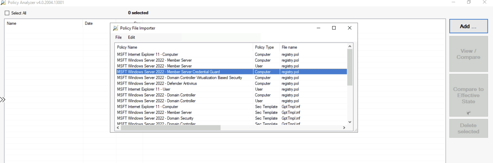

It was dropped once the tool cost more than the answer was worth:

- It runs **on the endpoint being measured**, so it needs deploying to CL01 and CL02
  rather than driving from CS01
- The comparison step is GUI-only. `GPO2PolicyRules.exe` automates building a rules
  file, and nothing automates the comparison or the export
- On CL01 the baseline blocked it from running at all

**Group Policy Modeling answered the same question with less friction**, and its
reports are shareable HTML rather than spreadsheets. Recorded as a deliberate stop
rather than a gap: the phase asks what the baseline changed, and the modeling reports
say so with the winning GPO named for every setting.

---

## 6. Exit criteria

| Criterion | Evidence | Status |
|---|---|---|
| Version-matched baseline chosen | Server 2022 baseline against Server 2022 clients | Done |
| Baseline imported as a GPO | `Import-GPO`, one GPO of the eight in the pack | Done |
| Applied to CL01 only | Security filtering shows `CL01$`, modeling shows CL02 denied | Done |
| Baseline takes precedence | Link order 1, Winning GPO column reads the baseline throughout | Done |
| Difference measured, not asserted | Two policy categories present on CL01, absent on CL02 | Done |
| Something broke, and it is explained | Local account logon refused on CL01, by three named user rights | Done |
| Deviations recorded | SmartScreen exception in `decisions.md` | Done |
| Policy Analyzer comparison | Dropped, with reasoning in section 5 | Not done |

---

## Next

[Phase 7](07-windows-laps.md) removes the shared local administrator password
entirely, delivering LAPS by Group Policy and storing the secret in Active Directory
on one client and Entra ID on the other.
