# Phase 8. Tiered administration

> **Status: in progress.** Steps 0 to 12 are built and verified below. The enforcement
> half is not yet implemented: deny-logon policy, the cross-tier test matrix, and
> retiring `labadmin`. Section 14 records where the walkthrough stopped. Nothing here
> describes a control that has not been run.

**Being built:** an end to the single Domain Admin account used for everything. Phase 7
removed the shared *local* administrator password; this removes the shared *domain*
one, and brings CS01 under LAPS. Phase 7 could not reach it.

> Managed from CS01 using RSAT and GPMC, with the Azure control plane as the recovery
> path. Commands used in this phase: [tiered-admin.md](../cmd-sheets/tiered-admin.md).
> Structure is scripted in
> [`scripts/ad-bootstrap/04-tier-structure.ps1`](../scripts/ad-bootstrap/04-tier-structure.ps1).
> See also [Microsoft's tiered access model](https://learn.microsoft.com/security/privileged-access-workstations/privileged-access-access-model).

**What it fixes.** `labadmin` is currently the Domain Admin, the local administrator on
every machine that LAPS does not yet manage, and the account used for routine work.
Any credential theft anywhere in the lab is immediately a forest compromise. Tiering
exists to break that: a credential that can administer domain controllers must never be
typed into a machine that a lower-privileged attacker could already own.

The rule is one-directional. Higher tiers may reach downward. Nothing reaches up.

| Tier | Machines | Admin account | Group |
|---|---|---|---|
| 0 | DC01 | `t0-admin` | `sg-tier0-admins` |
| 1 | CS01 | `t1-admin` | `sg-it-admins` |
| 2 | CL01, CL02 | `t2-admin` | `sg-helpdesk` |

`sg-it-admins` and `sg-helpdesk` were created in Phase 1 with the descriptions
*"Tier 1 administrators - member servers only"* and *"Tier 2 - denied logon to domain
controllers"*. Those descriptions have been aspirational since. This phase makes them
true.

---

## 1. Where each command runs

| Section | Run from |
|---|---|
| 2. Recovery path | Workstation, in WSL, against the Azure control plane |
| 3. Phase 7 verifications | CS01 as `cdubois`, and CL01 elevated |
| 4. Tier structure | CS01 |
| 5. CS01 relocation | CS01 |
| 6. Deny-rights survey | CS01 |
| 8. Local Administrators | CS01, then each target machine |
| 9. Positive path | Each target machine, as its own tier account |
| 10, 11. LAPS permissions and policy | CS01 as a Domain Admin |
| 12. LAPS result | CS01, elevated, then as `t1-admin` |

**Nothing runs on DC01 in the completed sections.** Administering the directory from a
member server with RSAT is the practice this phase exists to enforce, and every
interactive logon on a domain controller leaves a Tier 0 credential in its memory.

---

## 2. The recovery path, proven before anything else

Deny-logon rights are the easiest way in Windows to lock every human out of a domain
controller. Before creating a single object, the escape hatch was tested.

```bash
az vm run-command invoke -g rg-hybridid-swedencentral -n DC01 --command-id RunPowerShellScript --scripts "whoami"
```

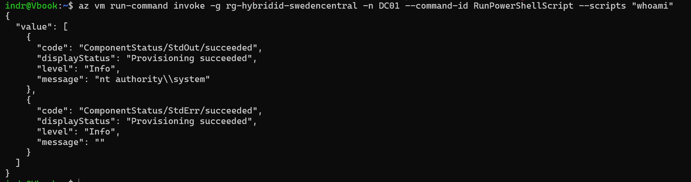

**`nt authority\system`.** This does not open a network connection to the VM. The
request goes to Azure Resource Manager, which hands the script to the Azure VM Agent
already running inside Windows. The agent is not authenticating as anybody. It is the
machine. User Rights Assignment governs logon types, and no logon occurs here, so no
deny rule authored in this phase can close this door.

**That cuts both ways, and it belongs in the risk register.** Anyone holding
`Virtual Machine Contributor` on this subscription can run SYSTEM code on a domain
controller and therefore owns the forest, without touching Active Directory at all.
The Azure control plane is an unreduced parallel path to Tier 0 sitting above the
entire model built below it. See
[risk-and-limitations.md](risk-and-limitations.md).

The rollback depends on cmdlets that may not be present on a Server Core domain
controller, so two more checks confirmed them before relying on the path:

```bash
az vm run-command invoke -g rg-hybridid-swedencentral -n DC01 --command-id RunPowerShellScript --scripts "Get-Module -ListAvailable GroupPolicy | Select-Object Name, Version"
```

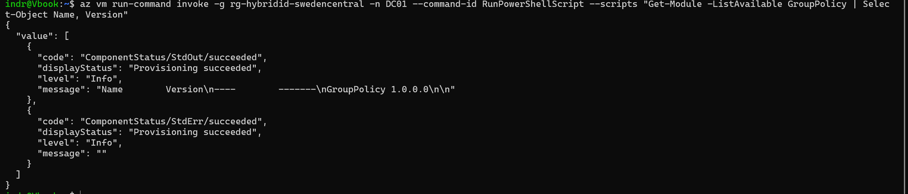

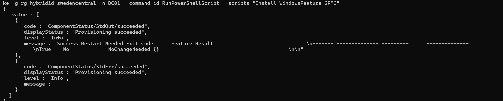

`Install-WindowsFeature GPMC` returned `NoChangeNeeded`, confirming the feature came in
with the AD DS role rather than needing to be added. Nothing was installed and no
restart was required.

### The estate before any change

```powershell
Get-GPO -All | Select-Object DisplayName
```

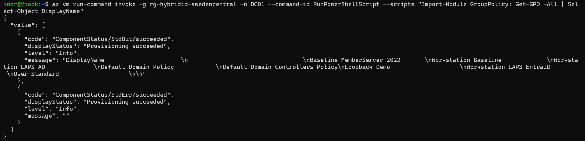

Eight GPOs from Phases 5, 6 and 7, plus the two defaults.

### The link state, saved

Group Policy links are not separate objects. Every link on an OU lives in a single
string attribute, `gPLink`, on the OU itself:

```powershell
$domainDN = (Get-ADDomain).DistinguishedName
"OU=Domain Controllers,$domainDN", "OU=Workstations,OU=Sync,$domainDN" | ForEach-Object {
    Get-ADObject -Identity $_ -Properties gPLink | Select-Object DistinguishedName, gPLink
} | Format-List
```

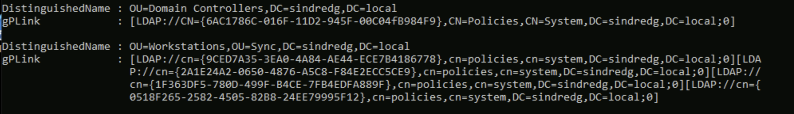

One bracketed block per linked GPO: a GUID, then a flag after the semicolon. `0` is
enabled, `1` disabled, `2` enforced, `3` both. Link order and precedence are properties
of *the OU*, not of the GPO, which is why they live here.

`OU=Domain Controllers` holds exactly one link, `{6AC1786C-016F-11D2-945F-00C04fB984F9}`.
That is the well-known GUID of *Default Domain Controllers Policy*, which carries the
rights that make a domain controller function. `OU=Workstations` holds four, from Phases 5 to 7.

**Both strings were copied off the VM before anything was changed.** Restoring a
mangled link set is then one `Set-ADObject -Replace` rather than a reconstruction from
memory. `-Clear gPLink` is not a rollback option on the Domain Controllers OU, because
it would unlink the default policy as well.

---

## 3. Closing Phase 7's outstanding verifications

Phase 7 left two checks uncaptured, both needing an account inside `sg-it-admins`. At
this point that is `cdubois`. Phase 8 removes her admin membership later, because a
*synced* user holding on-premises admin rights is the pattern tiering exists to break.
This was the last window to bank that evidence.

```powershell
Get-ADUser cdubois -Properties Enabled, PasswordExpired, MemberOf |
    Select-Object SamAccountName, Enabled, PasswordExpired, @{n='Groups';e={$_.MemberOf -join '; '}}
```

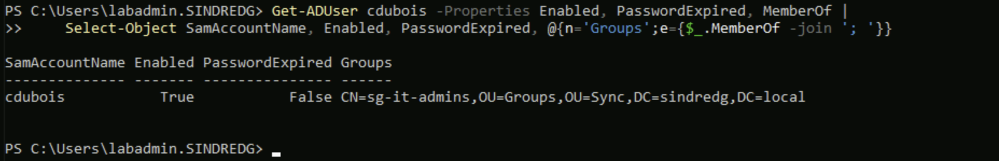

`02-ad-structure.ps1` creates seed users with `-ChangePasswordAtLogon $true` and enables
them only when the script is run with `-EnableUsers`. Both matter here: an account
flagged *must change password at next logon* cannot be used with `runas` at all. It
fails before authentication completes, which looks exactly like a wrong password.

### The positive half of the permission test

```powershell
runas /user:SINDREDG\cdubois powershell.exe
```

```powershell
Get-LapsADPassword -Identity CL01 -AsPlainText
```

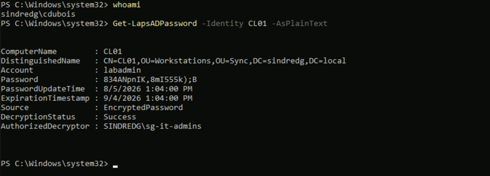

`DecryptionStatus: Success`, `AuthorizedDecryptor: SINDREDG\sg-it-admins`, from a
session that is **not elevated and not a Domain Admin**. Reading a LAPS password needs
directory rights, not local privilege.

**This is the half Phase 7 was missing.** That phase captured `labadmin`, a Domain
Admin, receiving `DecryptionStatus: Unauthorized` on the same command. On its own a
refusal is ambiguous; it could mean the mechanism is broken. Paired with a
non-privileged account succeeding, it proves something specific: *the encryption
principal is a real boundary, and forest-level privilege does not cross it.*

### Rotation

On CL01, elevated:

```powershell
Reset-LapsPassword
```

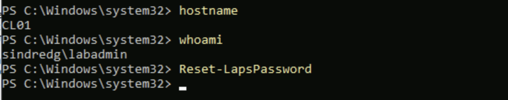

Rotation is performed by the managed machine itself. The client generates the password,
sets it on its own account, encrypts it, and writes it to its own computer object.
Nothing else can do this for it. The domain controller stores a secret it cannot
produce. Normally this fires at the 30-day age limit set in Phase 7; the cmdlet only
forces it early.

Read back from CS01, still as `cdubois`:

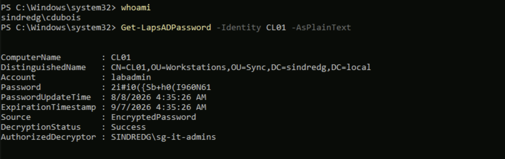

| | `PasswordUpdateTime` | `ExpirationTimestamp` |
|---|---|---|
| Before | 8/5/2026 1:04 PM | 9/4/2026 1:04 PM |
| After | **8/8/2026 4:35 AM** | **9/7/2026 4:35 AM** |

The password changed and the 30-day window moved with it, which confirms the age policy
from Phase 7 is what drives rotation rather than anything ad hoc.

**The credentials visible in these screenshots were invalidated by a further rotation
after capture.**

---

## 4. The tier structure

Admin accounts are placed **outside sync scope**. Connect Sync is scoped to `OU=Sync`,
so everything below lands on-premises only.

```powershell
$domainDN = (Get-ADDomain).DistinguishedName
$noSyncDN = "OU=NoSync,$domainDN"

New-ADOrganizationalUnit -Name 'Servers' -Path $domainDN -ProtectedFromAccidentalDeletion $false
New-ADOrganizationalUnit -Name 'Admin'   -Path $noSyncDN  -ProtectedFromAccidentalDeletion $false

$adminDN = "OU=Admin,$noSyncDN"
'Tier0','Tier1','Tier2' | ForEach-Object {
    New-ADOrganizationalUnit -Name $_ -Path $adminDN -ProtectedFromAccidentalDeletion $false
}
```

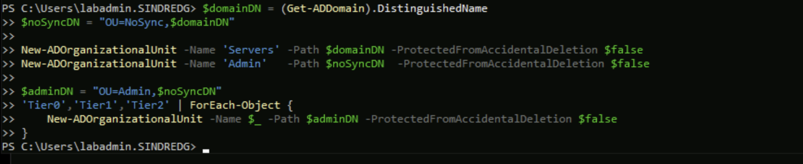

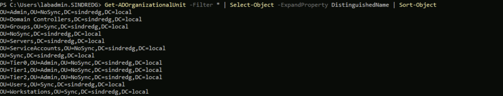

**A privileged on-premises account with a cloud object is a second attack path onto the
same credential.** Tier 0 goes further than the others: `sg-tier0-admins` is created in
`OU=Admin,OU=NoSync` rather than beside the other `sg-` groups in `OU=Groups,OU=Sync`,
so Tier 0 has no representation in Entra ID at all, not the group and not its member. The
naming inconsistency is deliberate and is recorded in
[decisions.md](decisions.md).

`OU=Servers` sits at the domain root rather than under `NoSync`, because `NoSync` holds
accounts and this holds computers. A GPO linked there should not inherit anything
written for service accounts.

Three accounts, three separate passwords. Sharing one password across them would
rebuild the exact problem being removed:

```powershell
New-ADUser -Name 't0-admin' -SamAccountName 't0-admin' -UserPrincipalName "t0-admin@sindredg.local" -Path "OU=Tier0,OU=Admin,OU=NoSync,$domainDN" -AccountPassword (Read-Host -AsSecureString 'Password for t0-admin') -Enabled $true -Description 'Tier 0. Domain controllers only.'
```

**`-Enabled $true` is not optional.** `New-ADUser` creates accounts disabled by default.
Omitting it produces three accounts that exist, list correctly, and refuse every logon.
That is the trap the seed users fell into in Phase 1.

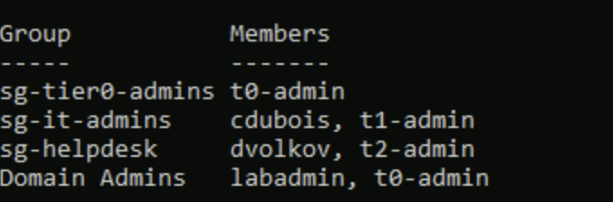

`Domain Admins` now holds two members. That is the precondition for retiring `labadmin`
later: until `t0-admin` has been proven to work, `labadmin` is the only verified way in,
and nothing about it is touched.

**A temporary side effect.** `Domain Admins` is placed in the local Administrators
group of every domain-joined machine automatically, so `t0-admin` is currently a local
administrator on CL01 and CL02 as well. That is the condition this phase removes, and
the state the test matrix in step 15 measures against.

`cdubois` remains in `sg-it-admins` at this point, which is correct: her evidence in
section 3 depended on it.

---

## 5. CS01 out of the Computers container

Phase 7 recorded CS01 as *"Still the shared Terraform password. It sits in
`CN=Computers`, which no GPO can be linked to."*

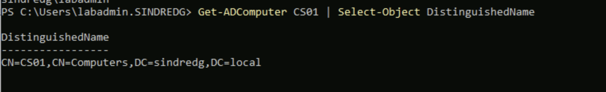

```powershell
Move-ADObject -Identity (Get-ADComputer CS01).DistinguishedName -TargetPath "OU=Servers,$domainDN"
```

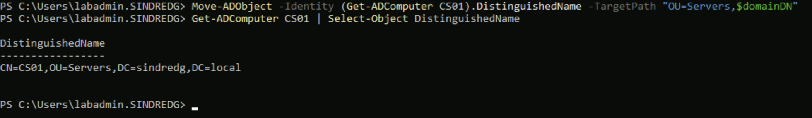

**Group Policy links only to sites, domains and OUs**, the L, D and OU of LSDOU.
`CN=Computers` is a *container*, a different object class with no `gPLink` attribute at
all. This one move unblocks both the Tier 1 policy and LAPS on CS01, and it is the
blocker Phase 7 documented and deferred.

**Nothing about CS01's configuration changed.** The computer's SID and password are
untouched, so domain membership and the Connect Sync service are unaffected. And
`Baseline-MemberServer-2022` is linked to `OU=Workstations`, not anywhere CS01 now sits,
so `OU=Servers` inherits only `Default Domain Policy`, exactly what `CN=Computers`
provided. The relocation and the policy changes are kept as separate steps so that if
something breaks later, it is clear which one did it.

---

## 6. What the estate already denies

User Rights Assignment does **not merge across GPOs**. Two GPOs setting the same right
do not combine their member lists. The higher-precedence GPO wins outright and the
other's entries stop existing. Phase 6 sets two of these rights, so this phase could
revert them with no error raised anywhere. The survey runs first for that reason.

```powershell
Get-GPO -All | ForEach-Object {
    [xml]$x = Get-GPOReport -Guid $_.Id -ReportType Xml
    $ura = $x.GPO.Computer.ExtensionData.Extension.UserRightsAssignment |
           Where-Object { $_.Name -like 'SeDeny*' }
    foreach ($u in $ura) {
        [PSCustomObject]@{
            GPO     = $x.GPO.Name
            Right   = $u.Name
            Members = ($u.Member.Name.'#text') -join ', '
        }
    }
} | Format-Table -AutoSize -Wrap
```

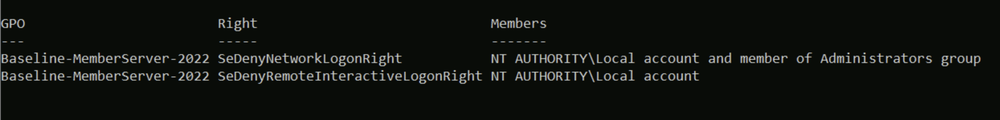

Across the whole estate, exactly one GPO sets any deny-logon right:

| GPO | Right | Members | SID |
|---|---|---|---|
| `Baseline-MemberServer-2022` | `SeDenyNetworkLogonRight` | Local account and member of Administrators group | `S-1-5-114` |
| `Baseline-MemberServer-2022` | `SeDenyRemoteInteractiveLogonRight` | Local account | `S-1-5-113` |

That second row is the mechanism behind the Phase 6 result: *CL01 stops accepting the
shared local administrator account over Bastion.*

**Interactive, batch and service denies are set by nothing.** Three of the five rights
this phase needs are collision-free.

### The connector account

```powershell
Get-ADUser -Filter "SamAccountName -like 'MSOL_*'" -Properties MemberOf | Select-Object SamAccountName, @{n='Groups';e={$_.MemberOf -join '; '}}
```

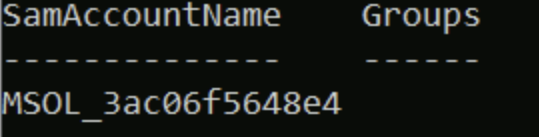

The Connect Sync AD DS connector account authenticates to DC01 over the network on
every cycle. It holds no group membership beyond `Domain Users`, so it cannot be caught
by any deny rule targeting a tier group.

---

## 7. Design decisions taken from the survey

Three choices follow from section 6. Each departs from the standard tiering guidance,
so the reasoning is recorded next to it.

**Deny network logon is deliberately absent on domain controllers.** A DC is not only a
logon target. It is also the SYSVOL file server every domain member reads Group Policy
from, and the LDAP endpoint RSAT on CS01 talks to. Denying network logon there for Tier
1 and Tier 2 would break Group Policy retrieval and RSAT for the accounts that need
them. Microsoft's guidance includes it because Tier 1 and 2 *admin* accounts have no
such need in a production estate. In a four-machine lab where `sg-it-admins` does
directory work from CS01, the cost lands directly on the operator. Interactive and RDP
denies are applied; network is not.

**Denying network logon downward is kept.** A Tier 0 credential that cannot make a
network logon to a workstation cannot be replayed from one. Tier 0 has no work to do on
a workstation, so nothing is lost by denying it there.

**CL02 will gain two settings it does not have today.** `Tier2-Logon-Restrictions` has
to define the two colliding rights and carry the baseline's members forward. That GPO
links at `OU=Workstations`, which holds both clients, while the baseline is
security-filtered to CL01 alone. The alternative is to leave RDP and network denies out
of the tier model, which drops the control against a Tier 0 credential being replayed
from a workstation.

**The cost.** Phase 6's comparison holds as a measurement taken on that date. From
Phase 8 onward CL02 is a control for everything in the baseline *except* those two user
rights, which weakens it. Splitting `OU=Workstations` into hardened and control sub-OUs
would avoid that, but the OU's distinguished name appears in Phases 5, 6 and 7 including
the LAPS ACLs. Rewriting all of it for a two-setting distinction was judged not worth
it. Both options have a cost and this one was chosen.

---

## 8. Local Administrators by policy

`t1-admin` and `t2-admin` had no way into their own tier. Signing in over RDP needs
membership of local Administrators or Remote Desktop Users, and neither account had
either. The only reason anyone could sign in anywhere was `Domain Admins`, which Windows
places into every machine's local Administrators automatically. That is what this phase
removes, so the replacement has to exist first.

Two GPOs, one per tier:

```powershell
New-GPO -Name "Tier1-Local-Admins" -Comment "Phase 8. Places sg-it-admins into local Administrators on Tier 1 servers."
New-GPLink -Name "Tier1-Local-Admins" -Target "OU=Servers,$domainDN" -LinkEnabled Yes
```

```powershell
New-GPO -Name "Tier2-Local-Admins" -Comment "Phase 8. Places sg-helpdesk into local Administrators on Tier 2 workstations."
New-GPLink -Name "Tier2-Local-Admins" -Target "OU=Workstations,OU=Sync,$domainDN" -LinkEnabled Yes
```

The setting itself has no cmdlet. It lives under Computer Configuration, Preferences,
Control Panel Settings, Local Users and Groups.

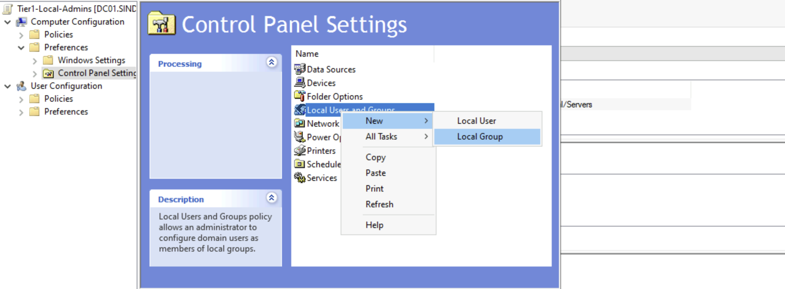

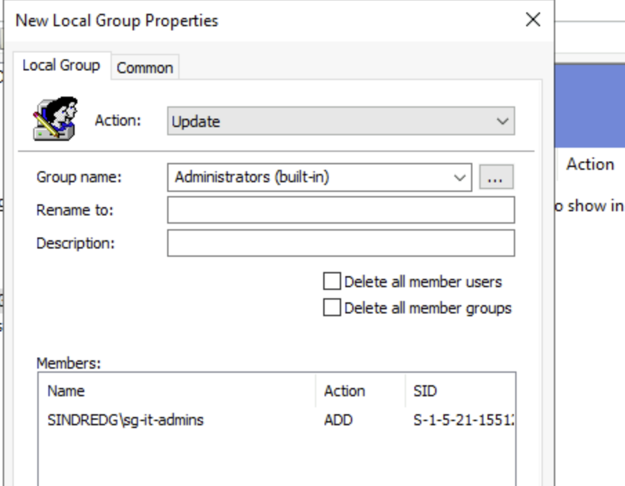

| Field | Value |
|---|---|
| Action | Update |
| Group name | `Administrators (built-in)` |
| Members | The tier's group, fully qualified, action ADD |

**`Administrators (built-in)` resolves by well-known SID**, `S-1-5-32-544`. A typed name
depends on the group not having been renamed, and a lookup that matches nothing reports
success while doing nothing.

**Action is Update, not Replace.** Replace deletes the group and rebuilds it from the
member list, which removes `Domain Admins` along with everything else.

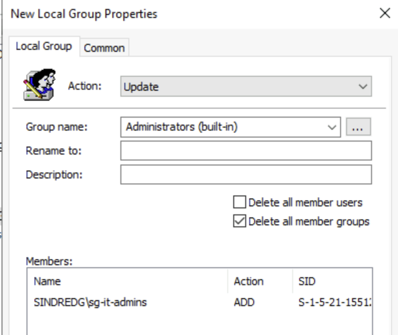

The two delete boxes do the same thing by another route. Ticking either makes the item
authoritative and strips every member not listed. Both stay unticked.

**Preferences rather than Restricted Groups.** Restricted Groups' *Members of this group*
list replaces membership wholesale, which is the same destructive behaviour but on by
default. Group Policy Preferences with the Update action is additive. Recorded in
[decisions.md](decisions.md).

### Result

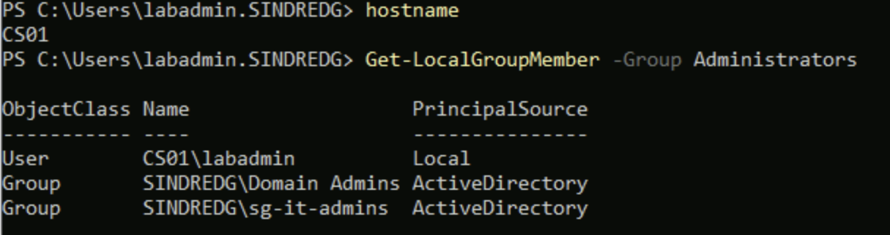

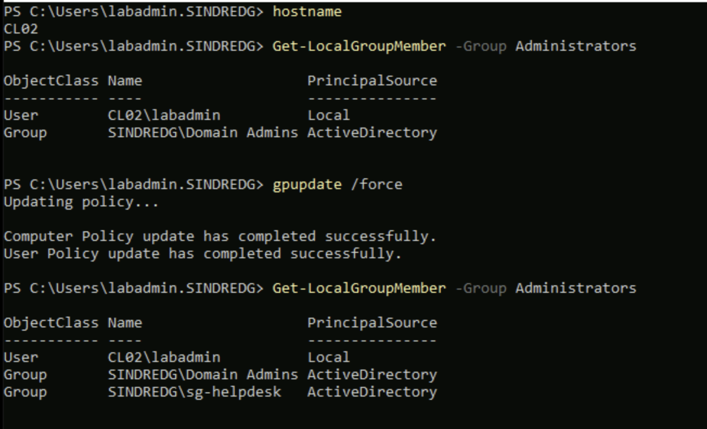

`PrincipalSource: ActiveDirectory` distinguishes the domain groups from the local
`labadmin` account that Terraform created.

CL01 got `sg-it-admins` first, because the Tier 1 member list was authored into the
Tier 2 GPO. Correcting the GPO did not undo it on the machine. That is
[troubleshooting entry 1](troubleshooting/08-tiered-administration.md), and the reason
for the next part.

### Membership is stated, not accumulated

As authored, policy could add a group but never take one away. A machine that acquired a
wrong local administrator kept it. Each GPO therefore also names the other tier's group
with the Remove action:

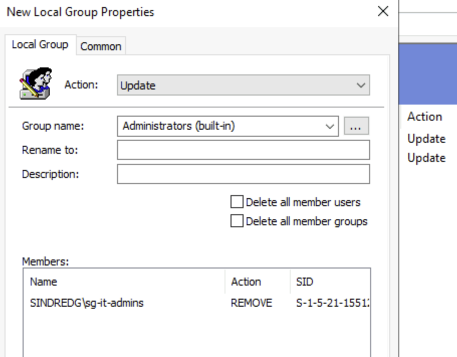

| GPO | Member | Action |
|---|---|---|
| `Tier2-Local-Admins` | `SINDREDG\sg-it-admins` | Remove from this group |
| `Tier1-Local-Admins` | `SINDREDG\sg-helpdesk` | Remove from this group |

`Domain Admins` is deliberately not in either Remove list. Tier 0 on a lower-tier machine
is handled by the deny-logon rights in step 13, which make its local membership
irrelevant. Stripping it here would be a larger change with no added benefit.

**Temporary side effect.** `cdubois` is still in `sg-it-admins` until step 18, so she
holds local administrator on CS01 until then.

---

## 9. The positive path, before anything is denied

Each tier account has to be proven against its own machine first. A refusal in section
16 only means something if the same account is known to have worked before the deny
rules existed.

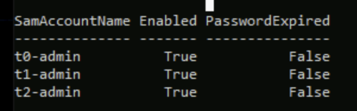

Four Bastion sessions, one per account:

| Account | Target | Admitted by |
|---|---|---|
| `t0-admin` | DC01 | `Domain Admins`, which Windows places in local Administrators on every DC |
| `t1-admin` | CS01 | `sg-it-admins`, placed by `Tier1-Local-Admins` |
| `t2-admin` | CL01 | `sg-helpdesk`, placed by `Tier2-Local-Admins` |
| `t2-admin` | CL02 | same |

```powershell
hostname; whoami
```

```powershell
whoami /groups | Select-String "sg-|Domain Admins|Administrators"
```

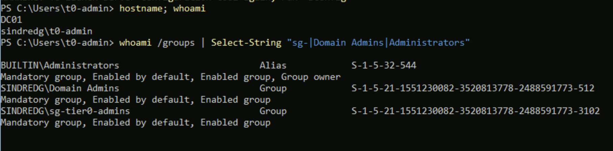

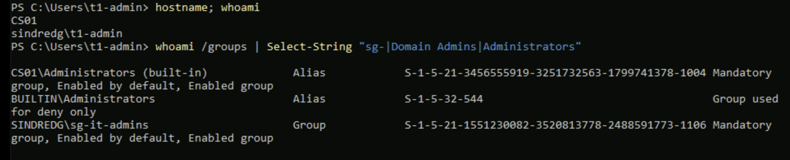

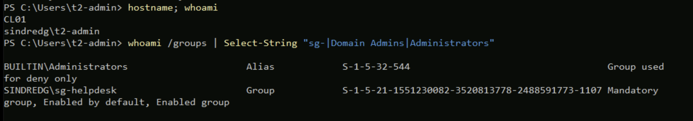

**`whoami /groups` reads the access token, not the machine.** `Get-LocalGroupMember`
shows what a machine believes about its own groups. The token is built once, at logon,
from the account's memberships at that moment, and never updated. Deny-logon rights are
evaluated against the SIDs in that token, so this is the input section 14's rules will
act on. An account that signed in before a membership existed keeps the old token until
it signs out.

**`BUILTIN\Administrators ... Group used for deny only` is not a fault.** UAC issues
administrators a filtered token in which that SID is present but disabled, and it reads
`Enabled group` only in an elevated process. It is the same mechanism behind the two
`Invoke-LapsPolicyProcessing` refusals in the Phase 7 troubleshooting log. On DC01 the
same line reads `Enabled group, Group owner`, because that session was elevated.

The CS01 capture also shows a local group named `Administrators (built-in)` with a
machine-local SID, which should not exist. It is
[troubleshooting entry 2](troubleshooting/08-tiered-administration.md), along with the
lockout that preceded these four sessions.

---

## 10. LAPS permissions on the new OU

The schema was extended once in Phase 7 and is forest-wide, so none of that repeats.
This is only the ACL on `OU=Servers`, and it needs Domain Admin, so it is Tier 0 work
that `t1-admin` cannot do.

```powershell
Set-LapsADComputerSelfPermission -Identity "OU=Servers,$domainDN"
```

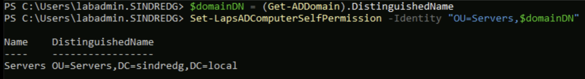

**`SELF` is the computer account.** CS01 authenticates as `SINDREDG\CS01$` and writes
the LAPS attributes on its own object and nothing else. No service account and no agent
holds standing privilege over anyone's password. That is what allows a domain controller
to store a secret it has no way to produce.

```powershell
Set-LapsADReadPasswordPermission -Identity "OU=Servers,$domainDN" -AllowedPrincipals "SINDREDG\sg-it-admins"
```

```powershell
Set-LapsADResetPasswordPermission -Identity "OU=Servers,$domainDN" -AllowedPrincipals "SINDREDG\sg-it-admins"
```

Read and reset are separate rights on purpose. Reset lets a tier invalidate a password
without ever seeing one.

The principal must be fully qualified. A bare `sg-it-admins` is rejected as an isolated
name, because it could resolve against the local SAM, the domain, or a trusted domain.
That refusal is in the Phase 7 troubleshooting log.

```powershell
Find-LapsADExtendedRights -Identity "OU=Servers,$domainDN"
```

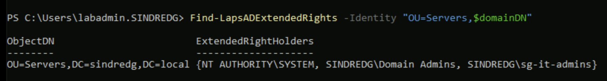

`sg-it-admins` holds it rather than `sg-tier0-admins` because CS01 is a Tier 1 machine
and Tier 1 owns it. A tier may reach downward, so a second Tier 0 path to a secret that
already has an owner adds exposure without adding capability.

`Domain Admins` appears without having been granted anything, because it holds *All
Extended Rights* implicitly. Section 12 shows that this does not let it decrypt.

---

## 11. The policy

```powershell
New-GPO -Name "Server-LAPS-AD" -Comment "Phase 8. LAPS backup to Active Directory for Tier 1 servers. Decryptor sg-it-admins."
```

```powershell
New-GPLink -Name "Server-LAPS-AD" -Target "OU=Servers,$domainDN" -LinkEnabled Yes
```

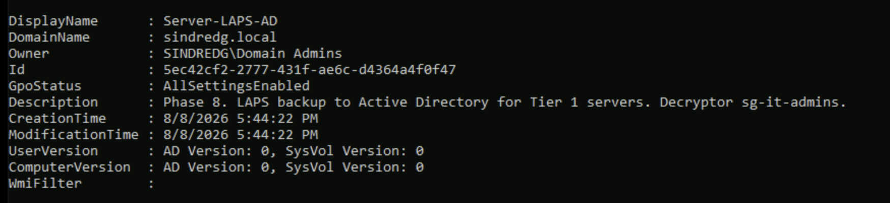

`ComputerVersion: AD Version: 0` immediately after creation. `New-GPO` and `New-GPLink`
create and link. Neither authors a setting, and a linked empty GPO does nothing.

Settings are entered in GPMC under **Computer Configuration, Policies, Administrative
Templates, System, LAPS**. That node exists because Phase 5 copied `LAPS.admx` into the
Central Store, two phases before anything needed it.

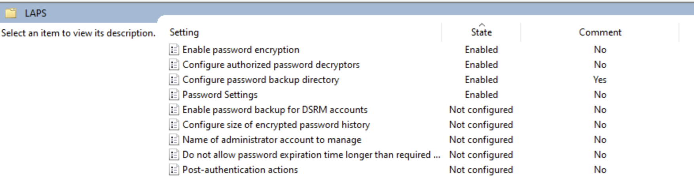

| Setting | Value |
|---|---|
| Configure password backup directory | Enabled, `Active Directory` |
| Enable password encryption | Enabled |
| Configure authorized password decryptors | `SINDREDG\sg-it-admins` |
| Password Settings | Complexity 4, length 20, age 30 days |
| Name of administrator account to manage | Not Configured |

**`Configure password backup directory` is a dropdown, not a switch, and it defaults to
`Disabled`.** Enabling the policy and clicking OK leaves the feature off while the
dialog and the GPO report both read `Enabled`. That is what happened here and it is
[troubleshooting entry 3](troubleshooting/08-tiered-administration.md).

The decryptor value is typed by hand and worth checking character by character. A
leading hyphen on this exact setting cost Phase 7 a debugging session, because
`-SINDREDG\sg-it-admins` cannot be resolved to a SID and LAPS then refuses to encrypt.

Leaving the account name unset means LAPS manages the built-in administrator by RID
rather than by name.

---

## 12. CS01 under LAPS

```powershell
gpupdate /force
```

```powershell
Invoke-LapsPolicyProcessing
```

**That order is required.** `Invoke-LapsPolicyProcessing` re-reads the policy the machine
already holds and does not fetch Group Policy.

| Event | Meaning |
|---|---|
| 10054 | Processing in response to a Group Policy change notification |
| 10055 | Using DC01 |
| 10015 | Password needs updating, five reasons at once. Normal on a first run |
| 10018 | Wrote the new password to Active Directory |
| 10020 | Set it on the local account, `labadmin`, **RID 0x1F4** |
| 10004 | Succeeded |

`0x1F4` is 500. LAPS manages the built-in administrator by RID, and Azure renamed RID
500 to `labadmin` at provisioning rather than creating a second account. Phase 7
established that on CL01 with `Get-LocalUser`. Here the event states it directly.

### The encryption boundary, again

As `labadmin`, a Domain Admin:

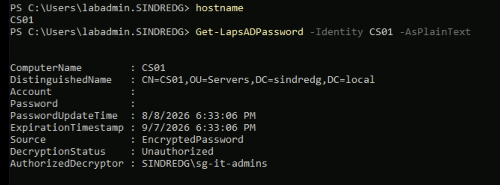

The attribute is readable. `Account` and `Password` are empty and `DecryptionStatus`
reads `Unauthorized`. Forest administration does not include reading this.

As `t1-admin`, a member of `sg-it-admins`:

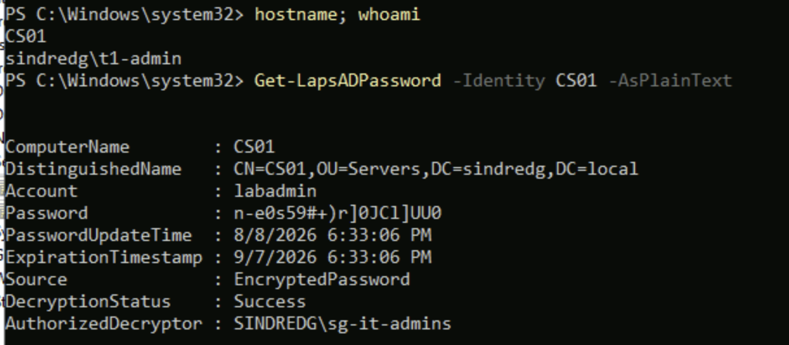

Same command, same object, opposite result, and the difference is not privilege. This
is the Phase 7 demonstration repeated on a Tier 1 machine with a Tier 1 account.

### What this closes

| Machine | Local administrator |
|---|---|
| CL01 | LAPS, encrypted to `sg-it-admins`, stored in Active Directory |
| CL02 | LAPS, stored in Entra ID |
| CS01 | LAPS, encrypted to `sg-it-admins`, stored in Active Directory |
| DC01 | No local accounts. Promotion migrates them into the directory |

CS01 was the last machine holding the shared Terraform password, and Phase 7 had to
leave it because `CN=Computers` cannot be a Group Policy target.

**The password in `terraform.tfstate` no longer opens any machine in the lab.** Only the
domain `labadmin` account still uses it, and section 17 retires that. Risk 3 is closed
for local credentials and open for the domain one. Risk 2 drops from a live credential
to a stale string, and would become live again after a `terraform destroy` and rebuild.

---

## 13. Exit criteria

| Criterion | Evidence | Status |
|---|---|---|
| Recovery path proven before any change | `run-command` returns `nt authority\system` | Done |
| Link state captured for rollback | `gPLink` saved for both target OUs | Done |
| Phase 7 decryption verified for `sg-it-admins` | `DecryptionStatus: Success` as `cdubois` | Done |
| Phase 7 rotation verified | Password and expiry both moved | Done |
| Tier OU structure created, outside sync scope | Twelve OUs, admin accounts under `NoSync` | Done |
| Per-tier admin accounts created | `t0-admin`, `t1-admin`, `t2-admin` in their groups | Done |
| CS01 relocated to a linkable OU | `CN=CS01,OU=Servers,DC=sindredg,DC=local` | Done |
| Existing deny rights surveyed before authoring | One GPO, two rights, both recorded | Done |
| Local Administrators membership controlled by policy | `sg-it-admins` on CS01, `sg-helpdesk` on both clients | Done |
| CS01 relocated, LAPS permissions granted on `OU=Servers` | `Find-LapsADExtendedRights` lists `sg-it-admins` | Done |
| Each tier account reaches its own machine | Token on all four targets carries the tier group | Done |
| CS01 local administrator under LAPS | `Get-LapsADPassword -Identity CS01` returns an encrypted object | Done |
| Encryption boundary holds on CS01 | `Unauthorized` as `labadmin`, `Success` as `t1-admin` | Done |
| Shared Terraform password removed from every machine | CL01, CL02 and CS01 all LAPS-managed | Done |
| Deny-logon rights applied by GPO per tier | | Pending |
| Cross-tier logon attempted and refused | | Pending |
| Denial captured in the event log | | Pending |
| `labadmin` retired to break-glass | | Pending |
| Shared Domain Admin entry in the risk register closed | | Pending |

---

## 14. Walkthrough status

**Stopped after section 12.** Everything above has been run and its output captured.
Nothing has been denied to anybody yet, and no deny policy is linked. The environment is
in a safe intermediate state: every tier account reaches its own machine, `labadmin`
still works everywhere, and every previous phase behaves as its own document describes.

Two failures along the way are in
[troubleshooting/08-tiered-administration.md](troubleshooting/08-tiered-administration.md),
both in Group Policy authoring rather than in the tier model: a preference that locked
every domain account out of CS01, and a dropdown that left LAPS switched off while the
policy reported as configured.

Remaining work, in dependency order:

| # | Step | Why it is next |
|---|---|---|
| 13 | Author the three deny GPOs, unlinked | Must carry the baseline members from section 6 |
| 14 | Group Policy Modeling, then link one tier at a time, Tier 2 first | Lowest blast radius first; Tier 0 last, with the rollback command ready |
| 15 | Test matrix: six accounts against four machines, three logon paths | The phase is only proven by what it refuses |
| 16 | Correlate each denial to its Security event | Event 4625 substatus `0xC000015B`, against 4768 showing a TGT still issued |
| 17 | Retire `labadmin` to break-glass | Only after `t0-admin` is proven |
| 18 | Remove `cdubois` from `sg-it-admins` | Her evidence is banked in section 3 |

**A consequence already accepted for step 14.** Once `Tier1-Logon-Restrictions` is
linked, `t0-admin` cannot sign into CS01, which is where GPMC lives. DC01 has the
GroupPolicy module but is Server Core, and editing User Rights Assignment is GUI-only.
Group Policy editing therefore falls back to `labadmin`, the break-glass account, which
weakens the model it is meant to enforce. The proper answer is a Tier 0 administrative
workstation, and this lab does not have one. It goes in the risk register as an open
item, not a solved one.
