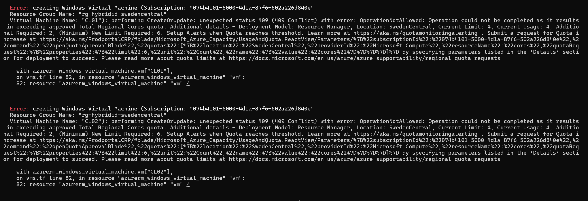

# Phase 3. Branch office network

Walkthrough: [03-branch-network.md](../03-branch-network.md).

Choosing a region took three attempts. Each one failed further along than the last,
and each failure was a different kind of "this region will not work", which is the
part worth recording. Quota is only the first of three independent checks.

---

## 1. Quota exhausted, on two counters rather than one

**Symptom.** Terraform created both client NICs and then refused both VMs:

```
Error: creating Windows Virtual Machine (...  Virtual Machine Name: "CL01"):
performing CreateOrUpdate: unexpected status 409 (409 Conflict) with error:
OperationNotAllowed: Operation could not be completed as it results in exceeding
approved Total Regional Cores quota. Additional details - Deployment Model:
Resource Manager, Location: SwedenCentral, Current Limit: 4, Current Usage: 4,
Additional Required: 2, (Minimum) New Limit Required: 6
```



**Cause.** DC01 and CS01 at 2 vCPU each consume the entire free trial allowance.

The detail that matters: **two separate counters were exhausted**, and raising only
one would not have helped.

| Quota | Usage | Limit |
|---|---|---|
| Total Regional vCPUs | 4 | 4 |
| Standard Bsv2 Family vCPUs | 4 | 4 |

**Resolution applied.** None available. A free trial cannot raise quota, which
makes this a design constraint rather than a support ticket. The clients moved to a
second region.

**Leftover.** The two NICs were created before the VMs failed and stayed behind,
holding 10.10.1.6 and 10.10.1.7. They cost nothing but had to be cleaned up in a
later apply.

---

## 2. The VM size is restricted per region, separately from quota

**Symptom.** A region with free quota still refused to deploy anything usable.
Germany West Central returned 354 VM SKUs and not one unrestricted 2 vCPU x64 size
with 4 GB or more.

**Cause.** A free trial restricts *which sizes it may use* per region, on top of the
core cap. `Standard_B2ls_v2` is offered to this subscription in only three regions
out of twelve checked. In West Europe and Spain Central every Bsv2 size returns
`NotAvailableForSubscription`, which is a subscription restriction rather than a
capacity shortage.

| Region | `Standard_B2ls_v2` | Regional vCPU |
|---|---|---|
| Sweden Central | Available | 4 of 4 used |
| Poland Central | Available | 0 of 4 used |
| Denmark East | Available | 0 of 4 used |
| West Europe, Spain Central | `NotAvailableForSubscription` | 0 of 4 used |
| North Europe, Norway East, UK South, France Central, Germany West Central, Italy North, Switzerland North | Not offered | 0 of 4 used |

**Resolution applied.** Denmark East, which had both the quota and the size.

**Check before committing to a region:**

```bash
az vm list-skus --location denmarkeast --resource-type virtualMachines --size Standard_B2ls --output table
```

A region returning no rows at all usually means the subscription cannot see it,
rather than that the size is missing.

**Trap.** `Standard_B2pls_v2`, `B2ps_v2` and `B2pts_v2` appear as cheap 2 vCPU
options in the same list. The `p` means Arm64 and the Windows x64 images will not
boot on them. The `windows-vm` module now rejects these at plan time.

---

## 3. `Root object was present, but now absent` on the virtual network

**Symptom.** The apply created the VNet successfully and then failed reading it
back:

```
Error: Provider produced inconsistent result after apply

When applying changes to azurerm_virtual_network.branch, provider
"registry.terraform.io/hashicorp/azurerm" produced an unexpected new value:
Root object was present, but now absent.

This is a bug in the provider, which should be reported in the provider's own
issue tracker.
```

It happened twice in a row.

**Cause.** Not a provider bug despite the message. Checked directly against Azure,
the VNet existed with the correct address space and DNS servers and a
`Succeeded` provisioning state. The create worked; the read immediately afterwards
returned nothing. That is read-after-write inconsistency in a very new region.

**How it was diagnosed.** Comparing the two sources of truth rather than trusting
either:

```bash
az resource list --resource-group rg-branch-office --output table
```

```bash
terraform state list
```

Azure held the VNet, Terraform's state did not. The mismatch in that direction rules
out a configuration fault, because a bad config never creates the resource in the
first place.

**Resolution applied.** Re-ran the apply. It settled on a later attempt. Treat a
repeat as the region being eventually consistent rather than as something to fix.

---

## 4. `LocationNotAvailableForResourceType` on the auto-shutdown schedule

**Symptom.** Both VMs deployed successfully, then both shutdown schedules failed:

```
Error: unexpected status 400 (400 Bad Request) with error:
LocationNotAvailableForResourceType: The provided location 'denmarkeast' is not
available for resource type 'Microsoft.DevTestLab/schedules'.
```

**Cause.** Auto-shutdown is a `Microsoft.DevTestLab` resource, and that provider
publishes to a much shorter region list than compute does. Denmark East is absent
from it. So is Poland Central, which means the alternative region would have hit the
identical wall one step later.

This is the third independent thing that has to be true of a region, after quota and
size, and the one least likely to be checked in advance.

**Resolution applied.** `enable_auto_shutdown` added to the `windows-vm` module,
defaulting to false in the branch root. The branch clients are deallocated by hand
instead:

```bash
az vm deallocate --resource-group rg-branch-office --name CL01
```

**Check before turning it on in a new region:**

```bash
az provider show --namespace Microsoft.DevTestLab --query "resourceTypes[?resourceType=='schedules'].locations" --output json
```

**Lesson.** "The region has quota" is the first of three independent checks, not the
only one. Quota, size availability and resource type availability each fail at a
different stage of the apply, and each one costs a full deploy cycle to discover.
