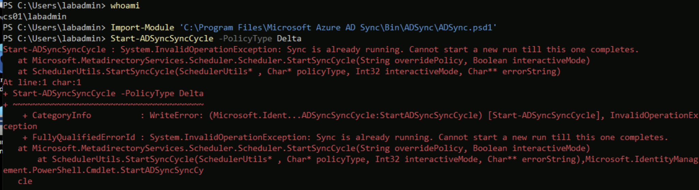

# Phase 4. Sites, domain join and hybrid Entra join

Walkthrough: [04-hybrid-join.md](../04-hybrid-join.md).

Two failures, one trivial and one instructive. The instructive one is the second:
the symptom appeared on a client, the cause was a sync setting two machines away,
and the fix was a different kind of sync than the one you would naturally reach for.

---

## 1. `Start-ADSyncSyncCycle` is not recognized

**Symptom.** Every `ADSync` cmdlet failed on CS01, on a machine where Entra Connect
was installed and running:

```
Start-ADSyncSyncCycle : The term 'Start-ADSyncSyncCycle' is not recognized as the
name of a cmdlet, function, script file, or operable program.
```

`Import-Module ADSync` failed too:

```
Import-Module : The specified module 'ADSync' was not loaded because no valid
module file was found in any module directory.
```

**Cause.** The module ships with Entra Connect but installs outside
`$env:PSModulePath`, so neither auto-loading nor importing by name finds it.

**Resolution applied.** Import by full path, once per PowerShell session:

```powershell
Import-Module "C:\Program Files\Microsoft Azure AD Sync\Bin\ADSync\ADSync.psd1"
```

If the install landed elsewhere:

```powershell
Get-ChildItem "C:\Program Files" -Recurse -Filter ADSync.psd1 -ErrorAction SilentlyContinue
```

**Worth knowing.** This recurs on every new Bastion session, so it is part of the
normal path rather than a one-off fix. It is in
`cheatsheets/entra-sync.md` for that reason.

---

## 2. `Sync is already running`

**Symptom.**

```
Start-ADSyncSyncCycle : System.InvalidOperationException: Sync is already running.
Cannot start a new run till this one completes.
```



**Cause.** Not a failure. The scheduler runs its own delta cycle every 30 minutes
and refuses to start a second on top of it.

**Resolution applied.** Wait. The cycle already running picks up the same objects:

```powershell
while ((Get-ADSyncScheduler).SyncCycleInProgress) { Start-Sleep 15; "still running" }; "cycle complete"
```


---

## 3. Devices never appeared in Entra, and a delta sync did not help

**Symptom.** Both clients were domain-joined, both computer objects were in
`OU=Workstations,OU=Sync`, the hybrid join wizard had completed successfully and
written the service connection point. `dsregcmd /status` on both clients reported:

```
AzureAdJoined : NO
DomainJoined  : YES
```


The Entra Devices blade was empty. Re-running the registration scheduled task on the
clients changed nothing, and neither did restarting them.

**First hypothesis, wrong.** That the OU filter did not include `OU=Workstations`.
Checked directly rather than assumed:

```powershell
(Get-ADSyncConnector | Where-Object { $_.Type -eq "AD" }).Partitions[0].ConnectorPartitionScope.ContainerInclusionList
```

It returned `OU=Sync,DC=sindredg,DC=local`. Selecting a parent OU includes its
children, so `OU=Workstations` was already in scope. Not the cause.

**Second hypothesis, also wrong.** That the branch subnet had no outbound internet
access and the clients could not reach `enterpriseregistration.windows.net`.
Plausible, because Azure no longer gives default outbound access to every new
virtual network:

```bash
az network vnet subnet show --resource-group rg-branch-office --vnet-name vnet-branch --name snet-branch
```

`defaultOutboundAccess: true`. Not the cause either.

**What actually isolated it.** Comparing users against devices in the tenant. The
five synced users were present and correct; devices were entirely absent. That
split rules out "sync is broken" and points at "these particular objects are not
being exported".

```bash
az rest --method GET --url "https://graph.microsoft.com/v1.0/devices"
```

**Cause.** Delta syncs only pick up objects that changed since the last run. The
computer objects were created after the previous full import, so from the delta's
point of view there was nothing to detect. Every delta cycle reported success while
exporting nothing new, which is why repeated syncs and client-side retries had no
effect.

**Resolution applied.** A full import rather than a delta:

```powershell
Start-ADSyncSyncCycle -PolicyType Initial
```


Both devices appeared immediately afterwards.

**Lesson.** `Delta` reports success whether or not it had anything to do, so a
missing object produces no error anywhere in the chain. When something is absent
rather than stale, reach for `Initial`. Absence and staleness are different
problems and only one of them a delta can fix.

---

## 4. One device registered, the other stuck on `Pending`

**Symptom.** After the full sync, both devices existed in Entra but only CL01 had
registered. CL02 showed `Pending` in the Registered column.


**Cause.** A race, not a misconfiguration. Read through Graph, the two objects
differ in exactly the fields the device writes rather than the sync:

| Field | CL01 | CL02 |
|---|---|---|
| `onPremisesLastSyncDateTime` | 20:05:11Z | 20:05:11Z |
| `registrationDateTime` | 20:08:34Z | None |
| `operatingSystemVersion` | 10.0.20348.5386 | None |

Both objects were created by the same sync at the same second. CL01 then registered
three minutes later; CL02 never did.

Both clients had been restarted at roughly 20:00, five minutes *before* the sync put
their objects in Entra at 20:05. Their boot-time registration task ran, found
nothing to attach to, and failed. CL01 happened to retry and caught it. CL02 did
not, and the task does not retry aggressively.

**Resolution applied.** Triggered the task by hand on CL02:

```powershell
Start-ScheduledTask -TaskPath "\Microsoft\Windows\Workplace Join\" -TaskName "Automatic-Device-Join"
```


**How to tell "waiting" from "broken".** `operatingSystemVersion` is written by the
device during registration, not by Connect Sync. An object with that field empty has
been created by the sync and never touched by the machine. An object with it
populated has completed a round trip. That distinction is what makes a `Pending`
device diagnosable without guessing, and it is not visible in the portal column.
