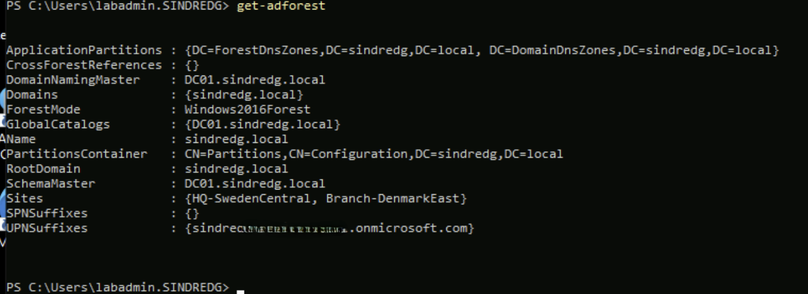
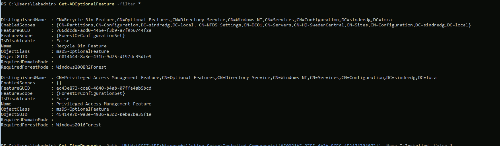
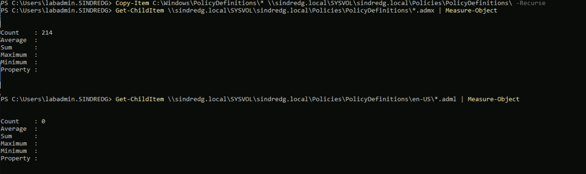

# Phase 5. Group Policy foundation

Walkthrough: [05-group-policy.md](../05-group-policy.md).

Five failures. The first three are variations on one theme, which is that this phase
involves four machines and two accounts with the same name, and the error message
never says which of them is wrong. The last two share a different one: an operation
that reported success while doing half its job, and the symptom it produced two
steps later in a different tool.

---

## 1. `Get-ADDomain` cannot find an object named after the computer

**Symptom.** On CS01, with the `ActiveDirectory` module loaded and the domain
reachable:

```
Get-ADDomain : Cannot find an object with identity: 'CS01' under: 'DC=sindredg,DC=local'.
    + CategoryInfo          : ObjectNotFound: (CS01:ADDomain) [Get-ADDomain], ADIdentityNotFoundException
```

**What the error rules out.** The query reached DC01, searched under
`DC=sindredg,DC=local` and returned a negative answer. So Active Directory Web
Services, DNS and the module were all working. That narrows the problem
considerably before any diagnosis starts.

**Cause.** `Get-ADDomain` with no arguments derives its target from the logon
context, effectively `$env:USERDOMAIN`. The session was signed in as the **local**
`labadmin` rather than `SINDREDG\labadmin`, so `USERDOMAIN` was `CS01` and the
cmdlet went looking for a domain of that name.

Both accounts exist and are easy to confuse. Terraform creates a local `labadmin`
on every VM, and the Phase 1 promotion created a domain `labadmin`. Entering a bare
`labadmin` at the Bastion prompt selects the local one.

**Confirmed with:**

```powershell
whoami
```

`cs01\labadmin` rather than `sindredg\labadmin`. The profile path is a second tell:
the domain account gets `C:\Users\labadmin.SINDREDG` because the local account
already owns `C:\Users\labadmin`.

**Resolution applied.** Reconnect as the domain account. Supplying credentials
explicitly proves the diagnosis without reconnecting, and works because it fixes
both halves of the failure at once, the bind identity and the identity lookup:

```powershell
Get-ADDomain -Identity sindredg.local -Credential (Get-Credential SINDREDG\labadmin)
```

**Not a workaround worth keeping.** GPMC, `gpresult` and Group Policy Preferences
editing take no `-Credential` parameter, so a session running as a local account
hits the same wall later in a less obvious place.

**Lesson.** The error names the symptom two layers from the cause, which is the
recurring theme in this log. It said the directory contained no object called CS01,
which was true and irrelevant.

---

## 2. Azure Bastion rejects the `DOMAIN\user` logon format

**Symptom.** Entering `SINDREDG\labadmin` in the Bastion username field is refused
before a connection is attempted. Bastion Basic offers no native client, so there is
no second route in.

**Resolution applied.** Use the user principal name instead:

```
labadmin@sindredg.local
```

That account keeps the default `sindredg.local` suffix. The retargeting to the
tenant's `onmicrosoft.com` suffix in `03-prep-sync.ps1` only touched the five seed
users, so the two logon names are the other way round for them: seed users sign in
as `<sam>@<tenant>.onmicrosoft.com`, which works on-premises only because that same
script added the tenant suffix as an alternative UPN suffix in the forest.



`UPNSuffixes` holding the tenant domain is that change, visible in the forest object
two phases later. Without it a seed user could not sign in to any machine here at
all, because `.local` cannot be verified in Entra and the accounts carry no other
usable name.

**Alternative, if the UPN is also refused.** Connect as the local account and
elevate inside the session:

```powershell
runas /user:SINDREDG\labadmin powershell.exe
```

```powershell
runas /user:SINDREDG\labadmin "mmc gpmc.msc"
```

Workable, and it leaves two windows with different rights in the same desktop.
Anything launched from the local session still has none.

---

## 3. The IE ESC registry path does not exist on DC01

**Symptom.** Re-enabling Internet Explorer Enhanced Security Configuration, using
the same command Phase 2 had used to disable it:

```
Set-ItemProperty : Cannot find path 'HKLM:\SOFTWARE\Microsoft\Active Setup\Installed
Components\{A509B1A7-37EF-4b3f-8CFC-4F3A74704073}' because it does not exist.
    + CategoryInfo          : ObjectNotFound: (HKLM:\SOFTWARE\...C-4F3A74704073}:String)
      [Set-ItemProperty], ItemNotFoundException
```



**Cause.** The command was run on DC01. It is Server Core, which ships no Internet
Explorer, so the Active Setup component is genuinely absent. ESC was never on there
and cannot be turned back on.

**Why it was not obvious.** Nothing earlier in the session distinguished the two
machines. `Get-ADOptionalFeature` and every other directory cmdlet return identical
output from DC01 and CS01, because they query the same directory over the network.
The first command in the phase that behaves differently on the two machines is one
that touches the local registry.

**Resolution applied.** Run it on CS01, where ESC was disabled in the first place:

```powershell
hostname
```

**Lesson.** In a lab where most commands are directory operations, machine identity
stops being visible in the output. Checking `hostname` costs nothing and is the
cheapest guard against a whole class of confusion here.

---

## 4. The Central Store copy omitted every language file

**Symptom.** None. `Copy-Item` produced no output and no error, and the template
count in SYSVOL matched the source exactly.

```powershell
Copy-Item C:\Windows\PolicyDefinitions\* \\sindredg.local\SYSVOL\sindredg.local\Policies\PolicyDefinitions\ -Recurse
```

The failure appeared only on the second check:

| Checked | Source | Central Store |
|---|---|---|
| `*.admx` | 214 | 214 |
| `en-US\*.adml` | present | **0** |



**Why it matters.** `.admx` files define policies; `.adml` files hold the display
strings for them. A Central Store carrying templates without strings leaves GPMC
able to read the policies but unable to name them, which is worse than having no
Central Store at all, because GPMC prefers the store over the local copy once it
exists.

**Cause.** A wildcard copy of the parent directory does not carry the language
subfolder, whatever `-Recurse` suggests.

**Resolution applied.** Copy the folder by name as a second operation:

```powershell
Copy-Item C:\Windows\PolicyDefinitions\en-US \\sindredg.local\SYSVOL\sindredg.local\Policies\PolicyDefinitions\ -Recurse -Force
```

215 `.adml` files against 214 `.admx`. The surplus is `SearchOCR`, a language file
with no matching template, which is ignored. The direction that breaks an editor is
the opposite one.

**Lesson.** This is the same failure mode as the two Phase 1 script bugs in
[01-ad-environment.md](01-ad-environment.md): a verification that covers one
attribute of the thing it claims to check will report success while the thing is
broken. There, a guard tested whether an object existed and let every other
attribute drift. Here, a count of `.admx` files was taken as proof that a directory
tree had copied. Any check of a multi-part operation has to cover every part the
operation claims to perform.

---

## 5. Administrative Templates hangs or renders empty, and the store cannot be moved

**Symptom.** With the half-copied store in place, expanding Administrative
Templates in the Group Policy Management Editor either hung indefinitely or
produced an empty node.

**First attempt at a bisect.** Move the store aside so GPMC falls back to the local
templates, which separates a content problem from a machine problem:

```
Rename-Item : Access to the path '\\sindredg.local\SYSVOL\sindredg.local\Policies\PolicyDefinitions' is denied.
    + CategoryInfo          : WriteError: (\\sindredg.loca...licyDefinitions:String) [Rename-Item], IOException
    + FullyQualifiedErrorId : RenameItemIOError,Microsoft.PowerShell.Commands.RenameItemCommand
```

**Cause of the denial.** Not permissions. `labadmin` is a Domain Admin and the copy
into the same path had just succeeded. GPMC holds the store open while any editor
window is alive, and a directory cannot be renamed while anything beneath it is in
use.

```powershell
Get-Process mmc -ErrorAction SilentlyContinue | Select-Object Id, MainWindowTitle
```

**Cause of the original symptom.** The missing `.adml` files from entry 4. GPMC
prefers the Central Store over the local copy as soon as one exists, so it was
reading 214 templates it could not name. Copying the language files and reopening
GPMC produced a node that loads normally.

**Resolution applied.** Fix the content, close every GPMC and editor window, reopen.
The bisect was never needed.

**Worth knowing.** The same lock explains a more common confusion: a change to the
Central Store made while GPMC is open will not be seen until the console is closed
and reopened, because the store is read once at load.
