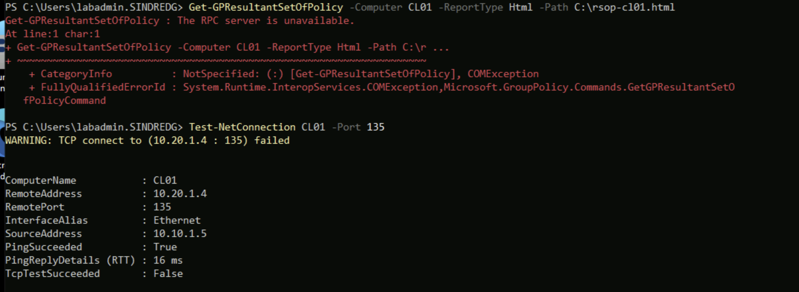
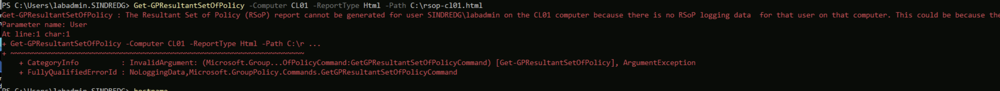

# Phase 5. Group Policy foundation

Walkthrough: [05-group-policy.md](../05-group-policy.md).

Five entries. The first is one mistake producing three unrelated-looking errors. The
rest share a theme worth more than the individual fixes: an operation that reports
success while doing half its job, and the symptom it produces later in a different
tool.

---

## 1. One wrong account, three different error messages

**Where it starts.** Azure Bastion rejects the `DOMAIN\user` logon format in its
username field. The obvious next attempt is a bare `labadmin`, which connects
successfully to the **local** account of that name. Every VM has one, created by
Terraform, alongside the domain `labadmin` created by the Phase 1 promotion.

Nothing announces which one you are using. What follows are the three ways it
surfaced.

**On `Get-ADDomain`:**

```
Get-ADDomain : Cannot find an object with identity: 'CS01' under: 'DC=sindredg,DC=local'.
    + CategoryInfo          : ObjectNotFound: (CS01:ADDomain) [Get-ADDomain], ADIdentityNotFoundException
```

The cmdlet derives its target from the logon context, effectively `$env:USERDOMAIN`.
Signed in locally that is `CS01`, so it searched for a domain of that name. The query
reached DC01 and returned a negative answer, which rules out Active Directory Web
Services, DNS and the module in one go.

**On `Remove-GPLink`, two hours later:**

```
Remove-GPLink : Current security context is not associated with an Active Directory domain or forest.
    + CategoryInfo          : NotSpecified: (:) [Remove-GPLink], ActiveDirectoryOperationException
```

Same cause, and this message says so almost directly, but only if you already know
to read "security context" as "which account you signed in with".

**Diagnosis:**

```powershell
whoami
```

`cs01\labadmin` rather than `sindredg\labadmin`. The profile path is a second tell:
the domain account is given `C:\Users\labadmin.SINDREDG` because the local account
already holds `C:\Users\labadmin`.

**Resolution applied.** Sign in with the user principal name, which Bastion accepts:

```
labadmin@sindredg.local
```

Supplying credentials explicitly proves the diagnosis without reconnecting, but is
not worth keeping, because GPMC, `gpresult` and Preferences editing take no
`-Credential` parameter:

```powershell
Get-ADDomain -Identity sindredg.local -Credential (Get-Credential SINDREDG\labadmin)
```

**Worth knowing.** The seed users are the other way round. Their UPNs were retargeted
to the tenant's `onmicrosoft.com` suffix by `03-prep-sync.ps1`, which also added that
suffix to the forest, so `cdubois@<tenant>.onmicrosoft.com` is a valid on-premises
logon.


---

## 2. The IE ESC registry path does not exist on DC01

**Symptom.** Re-enabling Internet Explorer Enhanced Security Configuration with the
same command Phase 2 used to disable it:

```
Set-ItemProperty : Cannot find path 'HKLM:\SOFTWARE\Microsoft\Active Setup\Installed
Components\{A509B1A7-37EF-4b3f-8CFC-4F3A74704073}' because it does not exist.
    + CategoryInfo          : ObjectNotFound: (HKLM:\SOFTWARE\...C-4F3A74704073}:String)
      [Set-ItemProperty], ItemNotFoundException
```


**Cause.** The command ran on DC01, which is Server Core and ships no Internet
Explorer, so the component is genuinely absent. ESC was never on there.

**Why it was not obvious.** Most of this phase is directory work, and
`Get-ADOptionalFeature` and its relatives return identical output from DC01 and CS01
because they query the same directory over the network. The first command that
behaves differently on the two machines is one that touches the local registry.

**Resolution applied.** Run it on CS01, where ESC was disabled in the first place.
`hostname` costs nothing and rules this out immediately.

---

## 3. The Central Store copy omitted every language file

**Symptom.** None. `Copy-Item` produced no output and no error, and the template
count in SYSVOL matched the source exactly at 214.


| Checked | Source | Central Store |
|---|---|---|
| `*.admx` | 214 | 214 |
| `en-US\*.adml` | present | **0** |

**Cause.** A wildcard copy of the parent directory does not carry the language
subfolder. Microsoft's guidance treats the two as separate steps, with `.adml` files
going to a culture-named folder such as `en-US`
([Create and manage the Central Store](https://learn.microsoft.com/troubleshoot/windows-client/group-policy/create-and-manage-central-store)).

**Why it matters.** `.admx` files define policies and `.adml` files hold their
display strings. A store with templates and no strings is worse than no store,
because the Group Policy tools prefer the store once one exists, and the affected
settings appear as
[Extra Registry Settings](https://learn.microsoft.com/troubleshoot/windows-server/group-policy/group-policy-settings-show-as-extra-registry-settings)
with no readable name.

**Resolution applied.**

```powershell
Copy-Item C:\Windows\PolicyDefinitions\en-US \\sindredg.local\SYSVOL\sindredg.local\Policies\PolicyDefinitions\ -Recurse -Force
```

215 `.adml` against 214 `.admx`. `Compare-Object` identified the surplus as
`SearchOCR`, a language file with no matching template, which is ignored. The
direction that breaks an editor is the opposite one.

**Lesson.** Same shape as the Phase 1 script bugs in
[01-ad-environment.md](01-ad-environment.md). A check that covers one part of a
multi-part operation will report success while the operation is broken.

---

## 4. Administrative Templates hangs or renders empty

**Symptom.** With the half-copied store in place, expanding Administrative Templates
in the editor either hung or produced an empty node.

**Attempted bisect.** Move the store aside so the tools fall back to local templates:

```
Rename-Item : Access to the path '\\sindredg.local\SYSVOL\sindredg.local\Policies\PolicyDefinitions' is denied.
    + FullyQualifiedErrorId : RenameItemIOError,Microsoft.PowerShell.Commands.RenameItemCommand
```

**Cause of the denial.** Not permissions. The copy into the same path had just
succeeded as the same account. GPMC holds the store open while any editor window is
alive, and a directory cannot be renamed while anything beneath it is in use.

```powershell
Get-Process mmc -ErrorAction SilentlyContinue | Select-Object Id, MainWindowTitle
```

**Cause of the original symptom.** The missing language files from entry 3. Copying
them and reopening the console produced a node that loads normally.

**Worth knowing.** The same lock explains a more common confusion: a change to the
Central Store made while GPMC is open is not visible until the console is closed and
reopened, because the store is read at load.

---

## 5. Resultant Set of Policy fails against a remote client

**Symptom.** Querying CL01 from CS01:

```
Get-GPResultantSetOfPolicy : The RPC server is unavailable.
    + FullyQualifiedErrorId : System.Runtime.InteropServices.COMException
```



**Cause.** `Get-GPResultantSetOfPolicy` reaches the target over RPC and WMI, which
the client firewall blocks. `Test-NetConnection CL01 -Port 135` returning
`TcpTestSucceeded : False` while `PingSucceeded : True` isolates it precisely: ICMP
was already permitted by `Workstation-Baseline`, and TCP 135 was not.

**Resolution applied.** Two scoped rules added to the same GPO rather than opened by
hand on each machine, bound to the specific service and program and limited to the
HQ subnet. Both are in section 4 of the walkthrough.

**Second symptom, after the ports opened:**

```
Get-GPResultantSetOfPolicy : The Resultant Set of Policy (RSoP) report cannot be generated for user
SINDREDG\labadmin on the CL01 computer because there is no RSoP logging data for that user on that computer.
    + FullyQualifiedErrorId : NoLoggingData,Microsoft.GroupPolicy.Commands.GetGPResultantSetOfPolicyCommand
```



**Cause, and the useful distinction.** Logging mode reports what was recorded when a
user actually signed in, so it cannot answer for a user who never has. `labadmin` had
not logged on to CL01. Signing `cdubois` in to CL02 produced a working
`UserAndComputer` report there. The tool for a combination that has not happened is
Group Policy Modeling, which simulates rather than reads
([Group Policy Modeling and Group Policy Results](https://learn.microsoft.com/windows-server/identity/ad-ds/manage/group-policy/group-policy-modeling-results)).
