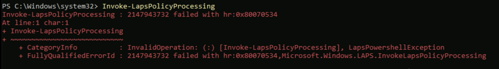
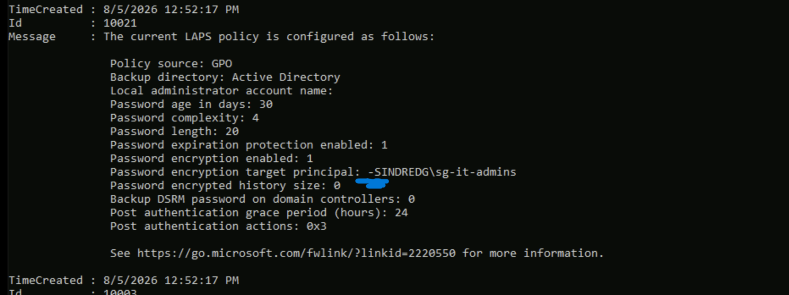
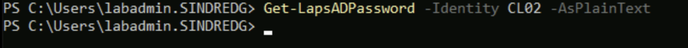

# Phase 7. Windows LAPS

Walkthrough: [07-windows-laps.md](../07-windows-laps.md).

Four failures. Two are about who you are rather than what you configured, and the
last one is the good kind: a correct policy in every setting except one character,
found by an event log that named the offending value exactly.

---

## 1. `Invoke-LapsPolicyProcessing` refused for a standard user

**Symptom.** On CL02, signed in as `cdubois`:

```
WARNING: Current process is not running as a local administrator
Invoke-LapsPolicyProcessing : This cmdlet must be run by a local administrator
```

**Cause.** Correct behaviour, not a fault. Phase 5 added `cdubois` to
`Remote Desktop Users` on CL02 so a seed user could sign in over Bastion for the
resultant-policy work. That grants sign-in and nothing else.

**Resolution applied.** Signed in as `SINDREDG\labadmin` instead.

**Worth keeping.** A standard user being unable to drive LAPS is the design working.
Had it succeeded, the local group membership from Phase 5 would have been far more
permissive than intended.

---

## 2. The same refusal as an administrator

**Symptom.** Identical error on CL01 while signed in as `SINDREDG\labadmin`, a member
of the local Administrators group.



**Cause.** Membership of Administrators is not the same as running elevated. UAC
issues even administrators a filtered token, and the cmdlet checks for elevation
rather than for group membership.

**Resolution applied.** PowerShell started with **Run as administrator**.

**Lesson.** "I am an admin" and "this process holds admin rights" are different
statements. The error says *local administrator* and means *elevated*, which is the
kind of wording that sends people to check group membership they already have.

---

## 3. `0x80070534` on every policy processing attempt

**Symptom.** With the GPO applied and both permissions granted:

```
Invoke-LapsPolicyProcessing : 2147943732 failed with hr:0x80070534
```

`0x80070534` is `ERROR_NONE_MAPPED`: no mapping between account names and security
IDs was done. Nothing in the error names which account.

**Diagnosis.** The LAPS operational log reports the complete effective policy on
every run, so one command settles it:

```powershell
Get-WinEvent -LogName "Microsoft-Windows-LAPS/Operational" -MaxEvents 15 | Select-Object TimeCreated, Id, Message | Format-List
```



Event **10021** prints the whole policy, and event **10035** names the failure
directly:

```
The configured encryption principal name could not be mapped to a known account.

Encryption principal name: -SINDREDG\sg-it-admins
```

**Cause.** A leading hyphen. `-SINDREDG\sg-it-admins` is not a resolvable account
name, so LAPS could not obtain a SID, so it refused to encrypt, so it never wrote a
password. Copy-paste from a PowerShell example had carried the `-` from a parameter
name into the value.

Every other setting in event 10021 was correct: backup directory, age, complexity,
length, encryption enabled, post-authentication actions.

**Resolution applied.** Removed the hyphen from *Configure authorized password
decryptor* in `Workstation-LAPS-AD`, then `gpupdate /force` and
`Invoke-LapsPolicyProcessing` on CL01.

**Lesson.** Event 10021 is the first thing to read for any LAPS problem. It prints
`Policy source` alongside every effective value, so it settles "did the policy
arrive" and "is the policy correct" in a single output. The error code alone
answers neither.

Event **10015** in the same output listed four reasons the password needed updating,
including "the policy is configured for password encryption but the encrypted
password attribute was not found". All four are normal on a first run and none of
them were faults, which is worth recognising so they are not read as four more
problems.

---

## 4. Retrieval returned nothing, twice, for two different reasons

**Symptom, before the policy existed.**

```powershell
Get-LapsADPassword -Identity CL01
```


Silence. No error, no object.

**Cause.** The schema and permissions had been configured, so the attributes existed
and were readable. Nothing had written to them, because no policy had yet told any
machine to generate a password.

**Symptom, after everything was working.** The same silence against CL02.



**Cause.** Also correct. CL02 receives `Workstation-LAPS-EntraID` and backs up to the
tenant, so there is nothing in Active Directory to return. Its password was in the
Entra admin center the whole time.

**Lesson.** An empty result from `Get-LapsADPassword` carries no information on its
own. It means the same thing whether the machine has no policy, has an Entra-backed
policy, or has an AD-backed policy that has not run yet. The command that does
distinguish them is the client's own event 10021, which names the backend it is
configured for.
