# Phase 8. Tiered administration

Walkthrough: [08-tiered-administration.md](../08-tiered-administration.md).

---

## 1. A preference that stayed after the policy was corrected

**Symptom.** CL01 was meant to get `sg-helpdesk` in local Administrators. It got
`sg-it-admins`, the Tier 1 group.


The member entry was corrected in GPMC to `sg-helpdesk`. After a refresh CL01 held both
groups, and further `gpupdate /force` runs changed nothing.


**Cause.** The Tier 1 member list was authored into the Tier 2 GPO. Correcting it
stopped the group being added again. It did not remove the group from the machine that
had already been changed.

Group Policy Preferences write straight to the system, the same as an administrator
typing the change. Nothing records that Group Policy owns the value, so there is nothing
to withdraw when the item changes. Settings under Computer Configuration, Policies
behave the opposite way and are removed when the GPO stops applying.

CL02 was clean because its `gpupdate /force` ran after the GPO was corrected. Same
policy, different refresh times.

**Resolution.** Removed by hand on CL01, then refreshed and re-read to confirm it
did not come back:

```powershell
Remove-LocalGroupMember -Group Administrators -Member 'SINDREDG\sg-it-admins'
```

Each tier GPO then got an explicit `Remove from this group` entry naming the other tier's
group, so the same mistake self-corrects next time.

**Lesson.** Preferences are not policies. A policy is withdrawn when it stops applying, a
preference is not. Anything set through the Preferences node has to be unset
deliberately, either by hand or by a second preference item that removes it.

The Common tab offers **Remove this item when it is no longer applied**, which sounds
like the fix. For a Local Group item it forces the action to **Replace**, which deletes
the group and rebuilds it from the member list, taking `Domain Admins` with it. The
explicit Remove entry does the same job without removing the domain admin.

---

## 2. Every domain account locked out of CS01

**Symptom.** Only the local `CS01\labadmin` account could sign into CS01. Every domain
account was refused, including `t1-admin` and the domain `labadmin`.

CS01 is where GPMC runs, so the policy could not be corrected from the machine the
policy had broken. The Azure VM agent was the only remaining way in:

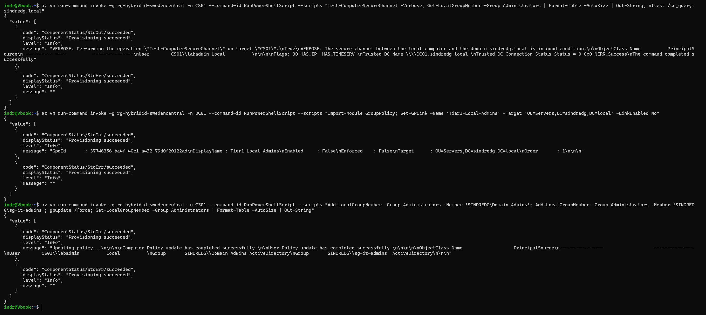

`Get-LocalGroupMember -Group Administrators` returned one entry, `CS01\labadmin`, a
local user. `Domain Admins` and `sg-it-admins` were both gone.

**Cause.** The `Remove from this group` entry added at the end of section 8 was saved
with **Delete all member groups** ticked, on the second of the two Local Group items:

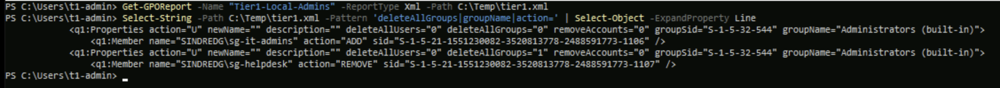

```
Item 1: deleteAllGroups="0"  ADD    SINDREDG\sg-it-admins
Item 2: deleteAllGroups="1"  REMOVE SINDREDG\sg-helpdesk
```

Preferences process in order. Item 1 added `sg-it-admins`. Item 2 then deleted every
group from local Administrators, which took `Domain Admins` and the entry item 1 had
just made, and finally removed `sg-helpdesk`, which had never been there.

`CS01\labadmin` survived because `deleteAllUsers="0"` and it is a user, not a group.
That is why the symptom looked like a broken trust rather than a group problem: local
accounts kept working and every domain account stopped.

The clients were unaffected. `Tier2-Local-Admins` did not have the box ticked.

**Resolution.** `Test-ComputerSecureChannel` returned `True` and `nltest` reported
`NERR_Success`, which ruled out the trust and confirmed this was authorization rather
than authentication. Then, through `run-command`: disable the GPO link so the next
refresh could not strip the groups again, add both groups back, and refresh.

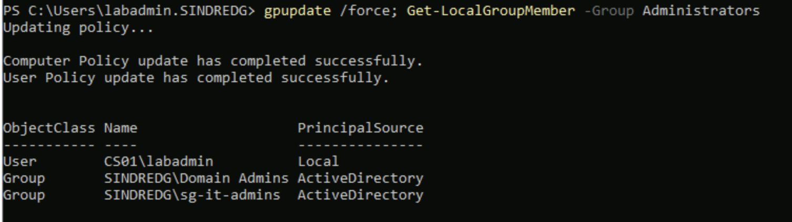

With CS01 reachable again, the tickbox was cleared, both items confirmed as
`deleteAllGroups="0"`, and the link re-enabled.

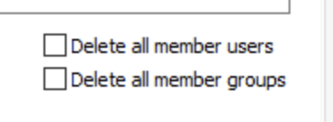

**A leftover with no established cause.** A local group named `Administrators (built-in)`
existed on CS01 with a machine-local SID ending `-1004`, holding `sg-it-admins`. It is
not the built-in Administrators group, which is `S-1-5-32-544` and appears separately:

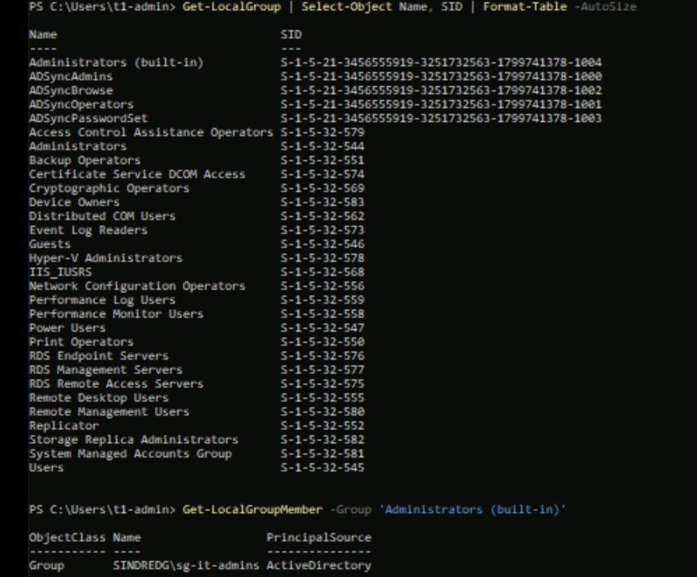

Both GPP items resolve by `groupSid="S-1-5-32-544"`, so the policy as written does not
explain it. It granted nothing, because no ACL references it, and it was removed with
`Remove-LocalGroup`. Recorded rather than explained.

**Lesson.** Each Local Group item carries its own copy of the delete checkboxes.
Ticking one on an item whose only purpose is to remove a single group is as destructive
as ticking it on the item that adds them, and the dialog gives no indication of the
difference. Check `deleteAllGroups` in the GPO report after authoring, not the dialog.

**On the recovery path.** The escape hatch tested in section 2 was needed for real, and
it was needed because the broken machine was the management machine. A second Bastion
session would not have helped, since reconnecting requires a fresh logon.

**A diagnostic detour worth recording.** DC01 showed no Kerberos events for the failed
logons, only NTLM 4776:

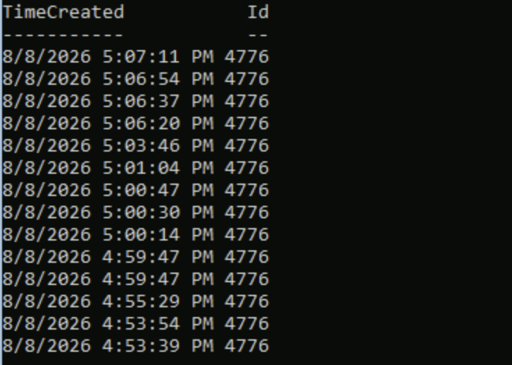

Bastion connects to `10.10.1.5` by IP address. With no hostname there is no service
principal name to request a ticket for, so authentication falls back to NTLM and no 4768
or 4769 is generated at all. The absence of Kerberos events was read as a possible
trust failure before that was understood. It also means DC-side evidence for the
cross-tier tests in section 16 is a successful **4776**, not a 4768.

---

## 3. LAPS reported no policy while the GPO was applying

**Symptom.** After linking `Server-LAPS-AD`, CS01 returned nothing for its password and
logged event **10024**, `LAPS policy is configured as disabled`, on every run.


Three things said the policy was fine. `gpresult` listed the GPO as applied:

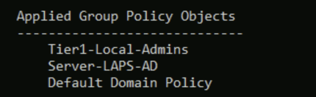

All four settings reported `State: Enabled`, `registry.pol` existed in SYSVOL, and
`ComputerVersion` was above zero. Yet nothing landed on the client:

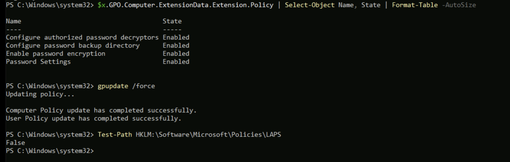

**A dead end that cost time.** The missing registry key was read as evidence that no
policy had arrived. CL01 has been backing up to Active Directory since Phase 7 and
rotated successfully the same day, and it returns `False` for the same key:

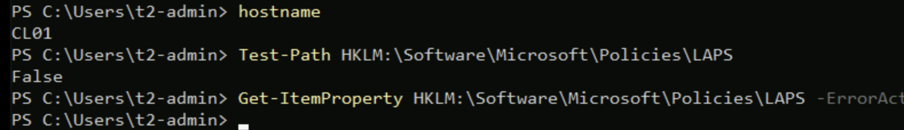

That ruled out the path rather than the machine, and the whole registry line of enquiry
with it. The working machine was available as a control from the start and was consulted
last.

**Cause.** `Configure password backup directory` was Enabled with its dropdown left on
`Disabled`:

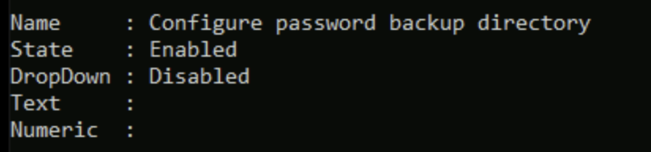

`State: Enabled` means the policy is configured. It says nothing about the value inside
it. The dropdown carries the actual setting and defaults to `Disabled`, so enabling the
policy and clicking OK leaves the feature off while the dialog looks configured:

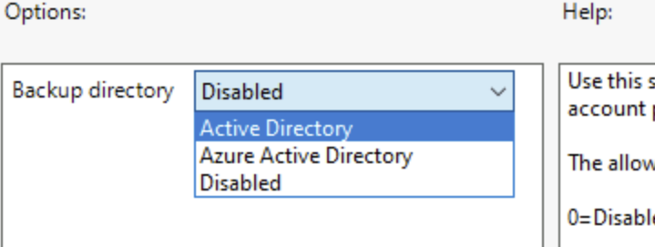

Event 10024 was accurate throughout. A policy had arrived and it evaluated to disabled.

**Resolution.** Dropdown changed to `Active Directory`, then `gpupdate /force` followed
by `Invoke-LapsPolicyProcessing`, in that order.

**Ordering matters and cost two attempts.** `Invoke-LapsPolicyProcessing` does not fetch
Group Policy. It tells the LAPS service to re-read the policy the machine already holds.
Run without a preceding `gpupdate`, it re-reads the old policy and reports 10024 again,
which looks identical to the fix not working.

**Lesson.** In an Administrative Templates report, `State: Enabled` and the value inside
the policy are two different questions. `Get-GPOReport` answers the first by default. The
second needs the `DropDownList`, `EditText` and `Numeric` values:

```powershell
$x.GPO.Computer.ExtensionData.Extension.Policy | ForEach-Object { [PSCustomObject]@{ Name = $_.Name; State = $_.State; DropDown = ($_.DropDownList.Value.Name -join ', '); Text = ($_.EditText.Value -join ', '); Numeric = ($_.Numeric.Value -join ', ') } } | Format-List
```

The Phase 7 command sheet described 10024 as *"policy configured as disabled, meaning no
policy reached this machine"*. The second half is wrong and sent this investigation
looking for a missing policy. It has been corrected.
