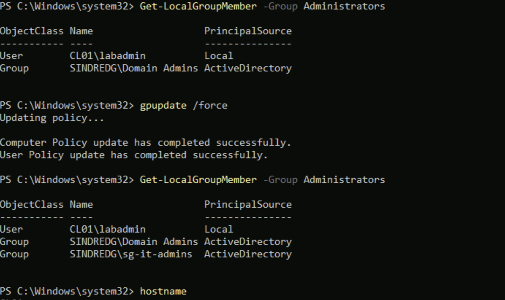
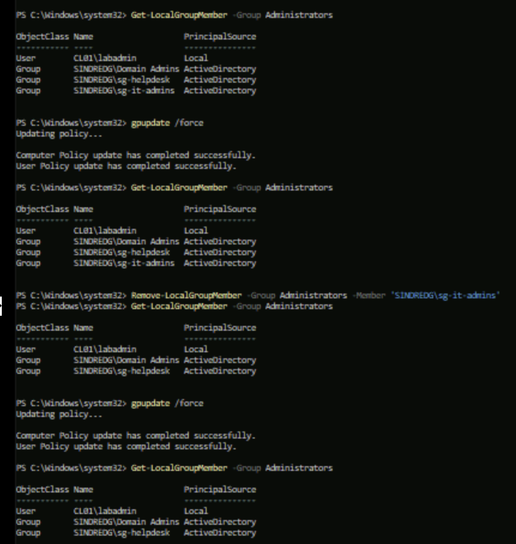

# Phase 8. Tiered administration

Walkthrough: [08-tiered-administration.md](../08-tiered-administration.md).

---

## 1. A preference that stayed after the policy was corrected

**Symptom.** CL01 was meant to get `sg-helpdesk` in local Administrators. It got
`sg-it-admins`, the Tier 1 group.



The member entry was corrected in GPMC to `sg-helpdesk`. After a refresh CL01 held both
groups, and further `gpupdate /force` runs changed nothing.



**Cause.** The Tier 1 member list was authored into the Tier 2 GPO. Correcting it
stopped the group being added again. It did not remove the group from the machine that
had already been changed.

Group Policy Preferences write straight to the system, the same as an administrator
typing the change. Nothing records that Group Policy owns the value, so there is nothing
to withdraw when the item changes. Settings under Computer Configuration, Policies
behave the opposite way and are removed when the GPO stops applying.

CL02 was clean because its `gpupdate /force` ran after the GPO was corrected. Same
policy, different refresh times.

**Resolution.** Removed by hand on CL01, then refreshed and re-read to confirm it
did not come back:

```powershell
Remove-LocalGroupMember -Group Administrators -Member 'SINDREDG\sg-it-admins'
```

Each tier GPO then got an explicit `Remove from this group` entry naming the other tier's
group, so the same mistake self-corrects next time.

**Lesson.** Preferences are not policies. A policy is withdrawn when it stops applying, a
preference is not. Anything set through the Preferences node has to be unset
deliberately, either by hand or by a second preference item that removes it.

The Common tab offers **Remove this item when it is no longer applied**, which sounds
like the fix. For a Local Group item it forces the action to **Replace**, which deletes
the group and rebuilds it from the member list, taking `Domain Admins` with it. The
explicit Remove entry does the same job without removing the domain admin.
